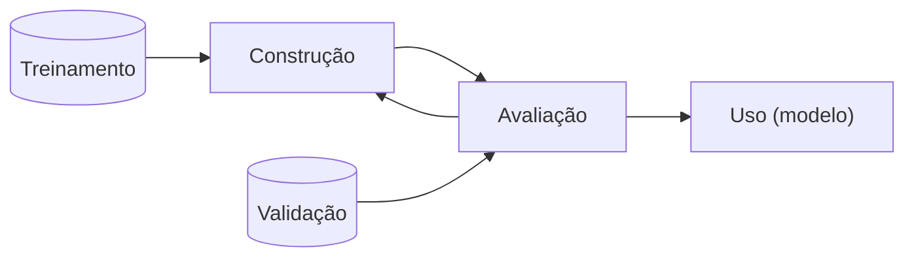
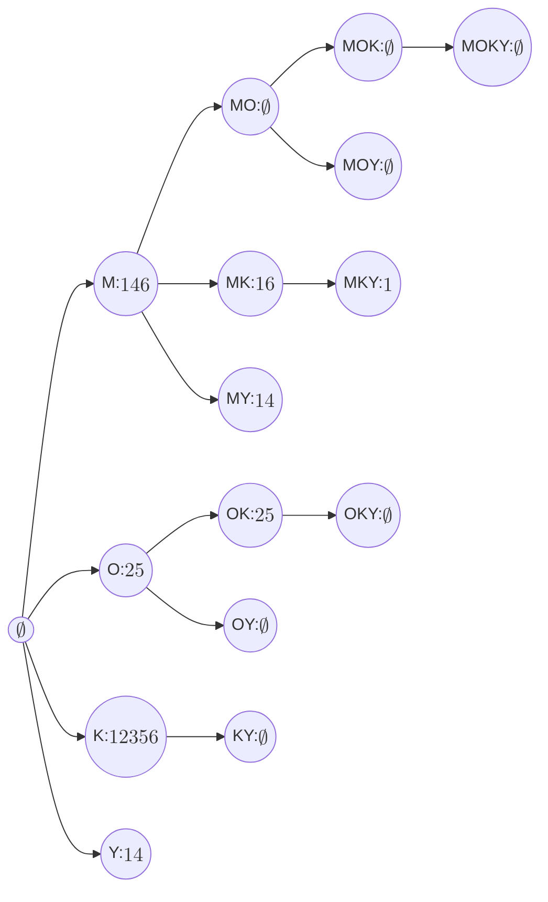

# Estudo individual

## Slide 1 - Introdução

- Aprendizado de Máquina (AM) e Mineração de Dados (MD) geralmente estão associadas a predição de valores
- Para entrada X, encontrar a função f(X) que gera a saída Y
  - Se Y é categórica, é um problema de classificação
  - Se Y é contínua, é um problema de regressão
- Esse é o aprendizado PREDITIVO

### Aprendizado Preditivo

- Para aprender essa função, primeiro o algoritmo é treinado ao receber um conjunto de pares $(X, l(X))$, onde $l(X)$ é a saída correta para a entrada X
- Esse conjunto é chamado de conjunto de treinamento. E como a função $l(X)$ retorna valores conhecidos, essa tarefa é classificada como supervisionada.

---

- Para avaliar o desempenho do aprendizado, comparam-se os valores preditos com os verdadeiros. Esse conjunto é chamado de conjunto de validação.

- **Fluxo**

---

- Outras abordagens preditivas que não necessitem da variável alvo sõ as não-supervisionadas
- Um exemplo desse caso é o agrupamento (clustering): busca encontrar subgrupos de elementos homogêneos nos dados.

---

- Visa buscar grupos que sejam mais parecidas entre si do que com os outros grupos.
- O contradomínio é o conjunto de grupos (clusters)
- Um exemplo é o k-Meanss.

### Concluindo

- Aprendizado Preditivo é o que busca conseguir prever um certo valor ou categoria para um novo dado
- Supervisionado: ocorre quando exite um conjunto de dados de treinamento já rotulados e que podem veficar a precisão do modelo
- Não-supervisionado: não existe um conjunto de dados rotulados, e o algoritmo deve encontrar padrões nos dados sem supervisão

### Aprendizado Descritivo

- Busca obter uma descrição (modelo descritivo) para os dados
- Uma das disferenças pro preditivo: não distingue o conjunto de instâncias em treinamento e validação.
- Avaliação dificultada por não haver um conjunto de validação

---

- "Aprendizado descritivo leva à descoberta genuína de novos conhecimentos, e, dessa forma, está situado entre as áreas de mineração de dados e aprendizado de máquina."
- Os Descritivos explicam situações passadas, "o que aconteceu", assim auxiliando na tomada de decisões

---

- Caso de uso: Market Place deseja distribuir produtos em seus centros de distribuição regionais. Para isso estuda de que forma os produtos historicamente têm sido comprados, para que sejam distribuídos de forma mais eficiente.

---

- Wal-Mart: verificou o histórico das lojas por onde passou o furacão e percebeu que as vendas de cerveja e Pop Tarts aumentavam logo antes. Logo, são esses que devem ser reestocados.

---

- "Aprendizado Descritivo Supervisionado"
  - Dúvida: Se pra ser supervisionado ele precisa dos dados rotulados, ou seja, já pertencentes a grupos, o algoritmo partiria de um conjunto de grupos já criados?
- O caso do Wal-Mart foi um exemplo de uso do Excepcional Model Mining, buscando padrões de vendas não usuais correlacionados a um evento.

### Aprendizado Descritivo VS Preditivo

- Descritivo: revela ocorridos passados e auxiliam em decisões futuras
- Preditivo: prevê comportamento de dados futuros
- Diferença tênue, porém mais evidenciada pela necessidade de intervenção humana no primeiro.

## Slide 2 - Mineração de Itens Frequentes

- **Vocabulário**
  - **Itens:** elementos pertencentes ao conjunto: $I = \lbrace x_1, x_2, \dots, x_m \rbrace$
  - **Itemset:** subconjunto de elementos contidos em $I$
  - **k-itemset:** |itemset| = k
  - **k-itemsets:** todos os itemsets de tamanho $k = I^{(k)}$
  - **ID:** Identificador referente a um itemset
  - **TID:** Transaction ID; ID de uma transação de items $T = \lbrace t_1, t_2, \dots, t_n \rbrace$
  - **Tidset:** conjunto de parte das transações
  - **Transação:** um par $(t, X)$ onde $t \in T$ e $X \subseteq I$
  - **Cobertura** ou **Extensão:** conjunto de transações em que determinado conjunto de itens está presente
    - Ex.: $c(\lbrace A, B, C \rbrace) = \lbrace 1, 3 \rbrace$
    - Explicação: os itens A, B e C aparecem simultaneamente nas transações 1 e 3
  - **Intensão:** o maior conjunto de itens comuns à um conjunto de transações
    - Ex.: $i(\lbrace 1, 3 \rbrace) = \lbrace A, B, C \rbrace$
    - Explicação: as transações 1 e 3 têm simultaneamente os itens A, B e C
  - **Representação Horizontal:** Col1: transações; Col2: intensões
    - $(t, i(\{t\}))$
  - **Representação Vertical:** Col1: itens; Col2: coberturas
    - $(x, c(\{x\}))$
  - **Suporte:** tamanho da cobertura
    - $sup(X) = |c(X)|$
  - **Minsup:** suporte mínimo para que determinado conjunto de itens seja considerado frequente
    - $minsup = 2: sup(X) \geq 2?$
  - **Suporte Relativo:** suporte relativo à quantidade de transações
    - $rsup(X) = |c(X)|/|T|$
  - **Conjunto Potência:** todos os potenciais subconjuntos de um conjunto
    - Ex.: $\mathcal{P}(\lbrace A, B, C \rbrace) = \lbrace \emptyset, \lbrace A \rbrace, \lbrace B \rbrace, \lbrace C \rbrace, \lbrace A, B \rbrace, \lbrace A, C \rbrace, \lbrace B, C \rbrace, \lbrace A, B, C \rbrace \rbrace$
  - **Reticulado:** grafo representando todos os itens do conjunto potência, onde cada nível é composto por um **k-itemset**, onde $0 \leq k \leq |X|$;
    - cada nó é direcionado a outro somente se
      1. o primeiro é subconjunto do segundo
      2. o tamanho do primeiro é menor em uma unidade em comparação ao segundo.

## Slide 3 - Mineração de itens frequentes: Apriori e Eclat

- **Anti-monotonicidade** ou **Propriedade do Apriori:** à medida em que o número de itens aumenta o suporte sempre irá se manter ou reduzir, nunca aumentar. "cobertura de conjuntos de itens é, no máximo, tão grande quanto a de seus subconjuntos"
  - Se $A \subseteq B$, então $sup(A) \geq sup(B)$.
  - "Todo superconjunto de um con"
  - **Todo superconjunto de um conjunto infrequente é infrequente**
  - **Todo subconjunto de um conjunto frequente é frequente**

### Apriori

- Busca em largura (level-wise approach): os conjuntos de tamanho k são explorados antes dos de tamanho k+1

  - Identifica os itens frequentes
  - Calcula suporte
  - Elimina infrequentes
  - Gera candidatos de tamanho k+1 a partir dos conjuntos frequentes que compartilham prefixo de tamanho k-1.

- Duas maiores influências no desempenho:
  1. minsup baixo
  2. Transações largas/BD denso

### Eclat (Equivalence Class Transformation)

- Visa o uso da Representação Vertical $(x, c(x))$ dos dados
- **Relação de Equivalência:** dois itemsets são equivalentes se o prefixo deles é igual.
  - Com isso, geram-se projeções de conjuntos de dados em que apenas transações com determinado prefixo serão consideradas.
  - Matematicamente
    - Seja $p: P(I) \times \mathbb{N} \rightarrow P(I)$ uma função prefixo. $p(X, k) = X[1:k]$.
    - A relação $\theta_k \subseteq P(I) \times P(I), A \theta_k B \equiv p(A, k) = p(B, k)$, é uma relação de equivalência
- Consideremos que temos o seguinte conjunto potência: $\mathcal{P}(I) = \lbrace \emptyset, A, B, C, AB, AC, BC, ABC \rbrace$.
  - Na forma de representação, seria como se agrupássemos os dados em grupos de prefixos:
    - $\emptyset: \lbrace \emptyset, A, B, C, AB, AC, BC, ABC \rbrace$
    - $A: \lbrace A, AB, AC, ABC \rbrace$
    - $B: \lbrace B, BC \rbrace$
    - $C: \lbrace C \rbrace$
  - E então seriam varridos de C para A (não consideramos o $\emptyset$) usando DFS
  - Poderia-se também fazer subgrupos de subgrupos, dependendo do tamanho do conjunto de prefixos.

#### Entendendo o algoritmo ECLAT

- Começamos com todos os itens frequentes de tamanho 1 e seu conjunto de transações;
- Para cada item e suas transações:
  - Esse item é adicionado à lista global de frequentes
  - Os novos frequentes são vazios.
  - Para cada outro item maior que o primeiro e suas respectivas transações:
    - Une os dois à partir de um mesmo prefixo.
    - A transação desse novo item é a interseção entre as transações de ambos
    - Se o suporte desse novo item é maior ou igual ao minsup
      - Adiciona essa dupla (item, transações) à lista dos novos frequentes
  - Se novos itens frequentes foram encontrados, chama recursivamente

#### Análises sobre o Algoritmo ECLAT

- **Custo computacional:** depende do tamanho dos tidsets e seu cálculo de interseção.
- **Custo de espaço:** depende do tamanho dos tidsets
- Pode ser implementado como vetor de bits ou ids
  - **Bits:**
    - **Benefício:** cálculo de interseção rápido; tamanho do tidset em tabela auxiliar
    - **Desvantagem:** se esparso, muito desperdício de espaço.
  - **Ids:**
    - **Benefício:** melhor para esparsos.

### Diffsets + Eclat = dEclat

- **Diffsets:** diferença entre os TIDs dos membros e o prefixo que as define

  - Ex.:

    - $\lbrace P, PX, PX, PX, P, X \rbrace$
    - $c(P) = \lbrace  1, 2, 3, 4, 5 \rbrace$
    - $c(X) = \lbrace 2, 3, 4, 6 \rbrace$
    - $c(PX) = \lbrace  2, 3, 4 \rbrace$
    - $d(PX) = c(P) - c(PX)$
      - $d(PX) = \lbrace  1, 2, 3, 4, 5 \rbrace - \lbrace  2, 3, 4 \rbrace$
      - $d(PX) = \lbrace 1, 5 \rbrace$

  - **Problema:** suporte não é mais calculado pela cardinalidade do conjunto.
  - **Novo cálculo de suporte:**
    - $sup(PX) = sup(P) - |d(PX)|$
      - **Explicação:** a ideia é que quantos elementos temos em P menos o que tem apenas apenas em P e não em X.
      - $sup(PXY) = sup(PX) - |d(PXY)|$
      - $sup(PXY) = (sup(P) - |d(PX)|) - |d(PXY)|$
        - **Explicação:** o $sup(PXY)$ será basicamente o tamanho de P, tirado o que `tem no P e não no X`, também tirado o que `tem no P e não no XY`
    - **Conclusão:** podemos usar os diffsets dos conjuntos bases para gerar os diffsets dos novos candidatos.

#### Entendendo o algoritmo dEclat

- Começa pegando todos os itens, seus diffsets e suportes caso tenham suporte mínimo.
- Para cada tripla (Item ($X_a$), diffset, suporte):
  - Adiciona aos itens frequentes globais ($\mathcal{F}$)
  - Define os novos frequentes como vazio
  - Para cada um dos outros itens ($X_b$) maiores que o atual
    - Gera o novo candidato ($X_{ab}$)
    - Seu diffset ($d(X_{ab})$) será o diffset do segundo menos o diffset do primeiro
    - Se tiver suporte mínimo, adiciona essa tripa aos novos requentes
  - Se houver novos frequentes, chama dEclat recursivamente.

#### Comparativo entre Eclat e dEclat

- dEclat é melhor para bases densas; para esparsos Eclat ganha.

## Slide 4 - FP-Growth

- Usa divisão e conquista
- Não gera candidatos desnecessários
- DFS
- Mais eficiente que os anteriores. [Em complexidade e armazenamento?]

- Similaridades com Eclat:
  - DFS
  - Projeções dos dados para reduzir memória e custo
- Diferença
  - Usa FP-Tree (uma árvore de prefixos que armazena o suporte)

### Geração da FP-Tree

- Computa suporte dos itens
- Descarta itens infrequentes (das transações)
- Ordena os itens das transações do mais frequente pro menos frequente
- As transações são inseridas na árvore sequencialmente
- Sempre que uma transação é inserida na árvore, uma estrutura auxiliar armazena uma lista encadeada para poder percorrer cada um dos itens.

### Mineração de Padrões

- Agora, criaremos os padrões frequentes crescendo em valor de suporte
- Para cada novo prefixo, criaremos uma nova árvore
- Na nova árvore, itens infrequentes serão descartados
- Os padrões dessa árvore incluem o prefixo que as gerou.
- Segue recursivamente até que um só ramo seja obtido.
- Os padrões obteníveis são todas as combinações dos nós.

### Implementação

- Se não couber na memória: partir a base de dados
- Como construir de forma eficiente?
  - Dados: Lista de vetores de inteiros
  - Primeiro ordena as transações, depois, recursivamente agrupa elas pelo prefixo inicial (Similar ao Eclat), Isso até que não haja mais sufixo ou caiba na memória
- Originalmente:
  - Nós de tamanho variável que desperdiçam memória
  - Melhora gerenciamento de memória (?)
  - Ponteiros aos pais são mais úteis que ponteiros aos filhos
- Projeções ocorrem em dois laços:
  - O primeiro percorre as folhas
  - A segunda vai das folhas à raiz
- A frequência de um nó é pelo menos tão grande quanto a soma das frequências de seus filhos.
- Nós infrequentes são removidos e nós com mesmo rótulo são mesclados

### Entendimento do Algoritmo

- Gera árvore
  - Calcula suporte dos itens
  - Remove infrequentes
  - Ordena os itens nas transações do maior pro menor suporte (removendo os itens infrequentes)
  - Insere os itens na árvore
    - A raiz é o $\emptyset$ e cada pai é prefixo dos seus filhos
- Minera Padrões
  - Itera entre os itens com suporte mínimo do menor suporte pro maior suporte
  - Para cada item Percorre a lista encadeada desses itens
    - Para cada nó da lista:
      - Percorre até a raiz
      - Partindo da raiz, mescla todos os filhos de mesmo rótulo
      - Projeta essa nova árvore.
      - Se a árvore é um ramo, para e gera todas as combinações entre os nós
      - Senão: Executa novamente "Minera Padrões"

## Slide 5 - Representações Compactas

### Representações Compactas

- **Representações Compactas:** Subconjuntos a partir dos quais é possível derivar todos os conjuntos de itens frequentes.
  - Ex.:
    - $D = \lbrace (0, a_{1}, a_{2}, \dots, a_{50}), (1, a_{1}, a_{2}, \dots, a_{100}) \rbrace$
    - Se considerarmos que $X = a_{1} a_{2} \dots a_{50}$ e que $Y = a_{1} a_{2} \dots a_{100}$, poderíamos representar os conjuntos de $minsup=1$ como sendo $Y$ e os conjuntos de $minsup = 2$ como sendo $X$.
    - Podem ser subdivididos em:
      - **Conjuntos Fechados:** é o maior item dentro de uma mesma classe de equivalência; É uma **Representação Completa**
      - **Conjuntos Máximos:** é o maior item dentre todos os **Conjuntos Fechados**. Eles definem a borda entre o que é frequente e o que é infrequente.
        - **Intuição:** entenda que, se eu tenho um item frequente $ABC$ e que, qualquer novo item que eu adicionar a esse conjunto o tornará infrequente, logo, ele é máximo. Sendo assim, todos os subconjuntos que podem ser gerados usando os itens presentes em $ABC$ também serão frequentes.
        - **Limitação no cálculo do suporte:** não dá para calcular o suporte através deles. Será necessário varrer novamente o BD. Isso a torna **incompleta**
  - Ambos não geram ganhos computacionais se usados nos algoritmos anteriores.
- **Geradores Mínimos:** os menores itens de uma classe de equivalência. Geralmente serão os itens unitários.
- **Classe de Equivalência:** conjunto de itemsets que possuem o mesmo suporte.

#### Relação entre Classe de Equivalência e Conjunto Fechado

- Considere o seguinte banco de dados com transações:

| TID | Itens |
| --- | ----- |
| 1   | A B C |
| 2   | A B C |
| 3   | A B   |
| 4   | A C   |

- Cálculo dos suportes:

| Itemset | Suporte |
| ------- | ------- |
| A       | 4       |
| B       | 3       |
| C       | 3       |
| AB      | 3       |
| AC      | 3       |
| BC      | 2       |
| ABC     | 2       |

- Classes de equivalência:

| Suporte | Classe de Equivalência | Conjuntos Fechados |
| ------- | ---------------------- | ------------------ |
| 2       | $\{ABC, BC\}$          | ABC                |
| 3       | $\{AB, AC, B, C\}$     | AB, AC             |
| 4       | $\{A\}$                | A                  |

- Conjuntos fechados
  - **Classe com suporte 2:**
    - {ABC, BC}
    - `ABC` ⊃ `BC` e ambos têm suporte 2 → ✅ **ABC é o conjunto fechado**
  - **Classe com suporte 3:**
    - {AB, AC, B, C}
    - `AB` ⊃ `B`, `AC` ⊃ `C` e todos têm suporte 3 → ✅ **AB e AC são fechados**
    - `B` e `C` **não** são fechados pois podem ser estendidos sem perda de suporte.
- **Classe com suporte 4:**
  - {A}
  - `A` não pode ser estendido sem perder suporte → ✅ **A é fechado**

### DCI_Closed

- Adota representação vertical, ou seja: $(item, c(\{item\}))$
- Divisão e Conquista
- **Ideia:** escalar reticulado percorrendo cada Classe de Equivalência uma só vez.
- Na base, assume-se a ordem lexicográfica.
- No geral, qualquer ordem serve, e essa ordem é definida por $\prec$
- Para os fechados encontrados, expande-os com itens ainda não investigados
  - Esses candidatos são chamados de **geradores**
  - Esse **gerador** é um conjunto $X = Yi$ onde $Y$ é um conjunto fechado e $i$ é um item.
  - Esse **gerador** é ordem-conservante se $i$ for anterior aos itens já pertencentes a $Y$
  - Essa sequência é única
- **Intuição:** Se todos os itens adicionados sempre são colocados no topo, assim ficando organizados em ordem crescente, então ele é ordem-conservante.

- Para garantir durante a execução que o gerador é ordem-conservante, mantenhamos uma **pre-set** que contém todos os itens não pertencentes ao gerador que sejam menores que $i$.

- Geradores são avaliados em ordem lexicográfica
- Se encontrar gerador não **ordem-conservante**: poda o ramo

#### Exemplo de geradores ordem-conservantes.

### Entendendo o algoritmo DCI_Closed

- Falando muito por alto:
- Vai gerando uma árvore de geradores organizadinhos do menor pro maior.
 
### MAFIA - Maximal Frequent Itemset Algorithm

- Best-First/Branch-and-bound
- Representação vertical ou seja: $(item, c(\{item\}))$
- Vetores de Bits
    - Para calcular rapidamente o suporte basta ter uma estrutura auxiliar que conta a quantidade de bits ativos.
- Assume ordem lexicográfica entre itens e entre itemsets.

- Separa os itens em dois:
    - **Head:** rótulo do nó atual
    - **Tail:** Itens maiores que o maior do Head
- **HUT:** Head Union Tail - Conjunto de todos os itens que podem aparecer em dada sub-árvore.

- Algoritmo:
    - Percorre a árvore de geradores ordem-conservantes
    - No nível que tô:
        - Calcula o suporte dos filhos
        - Poda infrequentes
        - Percorre filhos.
    - Se o HUT encontrado é subconjunto de outro itemset encontrado, pode-se podar todo esse HUT.

- Sempre que uma folha é visitada, um candidato a itemset máximo é encontrado.
- **Parent Equivalence Pruning (PEP):** se os TIDs do item $y$ que está no tail contém as transações de $X$ (head), então, $y$ é adicionado ao head e removido do tail.

- Se o HUT é subconjunto de um máximo já descoberto, então ele é frequente e pode ser podado.

#### Entendendo o Algoritmo MAFIA

- Algoritmo (Pre-escrito em aula. Não rodei o algoritmo na cabeça pra explicar)
    - Faz o HUT
    - Faz a poda do apriori
    - Faz a poda do PEP para poder o Tail
    - E para cada item vai procurando usando o Best-First
- No artigo tem os pseudo-códigos dos outros sub-códigos.

## Slide 6 - Mineração de sequências

- GSP (baseado no apriori) 
- SPADE (Eclat): Pos(item); Px, Py e Pxy

## Slide 7 - Mineração de grafos

- **Isomorfo:** mapeia tanto vértice quanto rótulo.
- Baseado no apriori e no FP-Growth
    - Apriori: Número de vértices ou Número de arestas

- AGM: Apriori-based Graph Mining
    - Compara matrizes de adjacência, remove última linha e coluna;
    - Se forem isomorfas, re-adiciona e os dois itens que faltaram cria todos os candidatos possíveis dentre as labels
- FSG - Arestas
    - dado uma mesma base:
        1. adiciona os dois em nós diferentes
        2. Nós diferentes ou mesmo nó
        3. Os dois nós num mesmo novo vértice
        4. Dois diferentes; um nos dois; dois em um
    - Vários possíveis mesmo núcleo
- gSpan
    - definição da aresta (idx 1, idx 2, lb1, lb2, arco)
    - Definição de prioridade ao percorrer.
    - Representação canônica: é a menor.