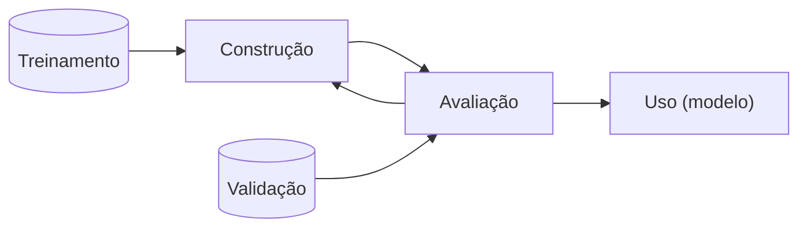

# Estudo individual

## Slide 1 - Introdução

- Aprendizado de Máquina (AM) e Mineração de Dados (MD) geralmente estão associadas a predição de valores
- Para entrada X, encontrar a função f(X) que gera a saída Y
  - Se Y é categórica, é um problema de classificação
  - Se Y é contínua, é um problema de regressão
- Esse é o aprendizado PREDITIVO

### Aprendizado Preditivo

- Para aprender essa função, primeiro o algoritmo é treinado ao receber um conjunto de pares $(X, l(X))$, onde $l(X)$ é a saída correta para a entrada X
- Esse conjunto é chamado de conjunto de treinamento. E como a função $l(X)$ retorna valores conhecidos, essa tarefa é classificada como supervisionada.

---

- Para avaliar o desempenho do aprendizado, comparam-se os valores preditos com os verdadeiros. Esse conjunto é chamado de conjunto de validação.

- **Fluxo**

---

- Outras abordagens preditivas que não necessitem da variável alvo sõ as não-supervisionadas
- Um exemplo desse caso é o agrupamento (clustering): busca encontrar subgrupos de elementos homogêneos nos dados.

---

- Visa buscar grupos que sejam mais parecidas entre si do que com os outros grupos.
- O contradomínio é o conjunto de grupos (clusters)
- Um exemplo é o k-Meanss.

### Concluindo

- Aprendizado Preditivo é o que busca conseguir prever um certo valor ou categoria para um novo dado
- Supervisionado: ocorre quando exite um conjunto de dados de treinamento já rotulados e que podem veficar a precisão do modelo
- Não-supervisionado: não existe um conjunto de dados rotulados, e o algoritmo deve encontrar padrões nos dados sem supervisão

### Aprendizado Descritivo

- Busca obter uma descrição (modelo descritivo) para os dados
- Uma das disferenças pro preditivo: não distingue o conjunto de instâncias em treinamento e validação.
- Avaliação dificultada por não haver um conjunto de validação

---

- "Aprendizado descritivo leva à descoberta genuína de novos conhecimentos, e, dessa forma, está situado entre as áreas de mineração de dados e aprendizado de máquina."
- Os Descritivos explicam situações passadas, "o que aconteceu", assim auxiliando na tomada de decisões

---

- Caso de uso: Market Place deseja distribuir produtos em seus centros de distribuição regionais. Para isso estuda de que forma os produtos historicamente têm sido comprados, para que sejam distribuídos de forma mais eficiente.

---

- Wal-Mart: verificou o histórico das lojas por onde passou o furacão e percebeu que as vendas de cerveja e Pop Tarts aumentavam logo antes. Logo, são esses que devem ser reestocados.

---

- "Aprendizado Descritivo Supervisionado"
  - Dúvida: Se pra ser supervisionado ele precisa dos dados rotulados, ou seja, já pertencentes a grupos, o algoritmo partiria de um conjunto de grupos já criados?
- O caso do Wal-Mart foi um exemplo de uso do Excepcional Model Mining, buscando padrões de vendas não usuais correlacionados a um evento.

### Aprendizado Descritivo VS Preditivo

- Descritivo: revela ocorridos passados e auxiliam em decisões futuras
- Preditivo: prevê comportamento de dados futuros
- Diferença tênue, porém mais evidenciada pela necessidade de intervenção humana no primeiro.

## Slide 2 - Mineração de Itens Frequentes

- **Vocabulário**
  - **Itens:** elementos pertencentes ao conjunto: $I = \{x_1, x_2, \dots, x_m\}$
  - **Itemset:** subconjunto de elementos contidos em $I$
  - **k-itemset:** |itemset| = k
  - **k-itemsets:** todos os itemsets de tamanho $k = I^{(k)}$
  - **ID:** Identificador referente a um itemset
  - **TID:** Transaction ID; ID de uma transação de items $T = \{t_1, t_2, \dots, t_n\}$
  - **Tidset:** conjunto de parte das transações
  - **Transação:** um par $(t, X)$ onde $t \in T$ e $X \subseteq I$
  - **Cobertura** ou **Extensão:** conjunto de transações em que determinado conjunto de itens está presente
    - Ex.: $c(\{A, B, C\}) = \{1, 3\}$
    - Explicação: os itens A, B e C aparecem simultaneamente nas transações 1 e 3
  - **Intensão:** o maior conjunto de itens comuns à um conjunto de transações
    - Ex.: $i(\{1, 3\}) = \{A, B, C\}$
    - Explicação: as transações 1 e 3 têm simultaneamente os itens A, B e C
  - **Representação Horizontal:** Col1: transações; Col2: intensões
    - $(t, i(t))$
  - **Representação Vertical:** Col1: itens; Col2: coberturas
    - $(x, c(x))$
  - **Suporte:** tamanho da cobertura
    - $sup(X) = |c(X)|$
  - **Minsup:** suporte mínimo para que determinado conjunto de itens seja considerado frequente
    - $minsup = 2: sup(X) \geq 2?$
  - **Suporte Relativo:** suporte relativo à quantidade de transações
    - $rsup(X) = |c(X)|/|T|$
  - **Conjunto Potência:** todos os potenciais subconjuntos de um conjunto
    - Ex.: $\mathcal{P}(\{A, B, C\}) = \{\emptyset, \{A\}, \{B\}, \{C\}, \{A, B\}, \{A, C\}, \{B, C\}, \{A, B, C\}\}$
  - **Reticulado:** grafo representando todos os itens do conjunto potência, onde cada nível é composto por um **k-itemset**, onde $0 \leq k \leq |X|$;
    - cada nó é direcionado a outro somente se
      1. o primeiro é subconjunto do segundo
      2. o tamanho do primeiro é menor em uma unidade em comparação ao segundo.

## Slide 3 - Mineração de itens frequentes: Apriori e Eclat

- **Anti-monotonicidade** ou **Propriedade do Apriori:** à medida em que o número de itens aumenta o suporte sempre irá se manter ou reduzir, nunca aumentar. "cobertura de conjuntos de itens é, no máximo, tão grande quanto a de seus subconjuntos"
  - Se $A \subseteq B$, então $sup(A) \geq sup(B)$.
  - "Todo superconjunto de um con"
  - **Todo superconjunto de um conjunto infrequente é infrequente**
  - **Todo subconjunto de um conjunto frequente é frequente**

### Apriori

- Busca em largura (level-wise approach): os conjuntos de tamanho k são explorados antes dos de tamanho k+1

  - Identifica os itens frequentes
  - Calcula suporte
  - Elimina infrequentes
  - Gera candidatos de tamanho k+1 a partir dos conjuntos frequentes que compartilham prefixo de tamanho k-1.

- Duas maiores influências no desempenho:
  1. minsup baixo
  2. Transações largas/BD denso

### Eclat (Equivalence Class Transformation)

- Visa o uso da Representação Vertical $(x, c(x))$ dos dados
- **Relação de Equivalência:** dois itemsets são equivalentes se o prefixo deles é igual.
  - Com isso, geram-se projeções de conjuntos de dados em que apenas transações com determinado prefixo serão consideradas.
  - Matematicamente
    - Seja $p: P(I) \times \mathbb{N} \rightarrow P(I)$ uma função prefixo. $p(X, k) = X[1:k]$.
    - A relação $\theta_k \subseteq P(I) \times P(I), A \theta_k B \equiv p(A, k) = p(B, k)$, é uma relação de equivalência
- Consideremos que temos o seguinte conjunto potência: $\mathcal{P}(I) = \{\emptyset, A, B, C, AB, AC, BC, ABC\}$.
  - Na forma de representação, seria como se agrupássemos os dados em grupos de prefixos:
    - $\emptyset: \{\emptyset, A, B, C, AB, AC, BC, ABC\}$
    - $A: \{A, AB, AC, ABC\}$
    - $B: \{B, BC\}$
    - $C: \{C\}$
  - E então seriam varridos de C para A (não consideramos o $\emptyset$) usando DFS
  - Poderia-se também fazer subgrupos de subgrupos, dependendo do tamanho do conjunto de prefixos.

#### Entendendo o algoritmo ECLAT

- Começamos com todos os itens frequentes de tamanho 1 e seu conjunto de transações;
- Para cada item e suas transações:
  - Esse item é adicionado à lista global de frequentes
  - Os novos frequentes são vazios.
  - Para cada outro item maior que o primeiro e suas respectivas transações:
    - Une os dois à partir de um mesmo prefixo.
    - A transação desse novo item é a interseção entre as transações de ambos
    - Se o suporte desse novo item é maior ou igual ao minsup
      - Adiciona essa dupla (item, transações) à lista dos novos frequentes
  - Se novos itens frequentes foram encontrados, chama recursivamente

#### Análises sobre o Algoritmo ECLAT

- **Custo computacional:** depende do tamanho dos tidsets e seu cálculo de interseção.
- **Custo de espaço:** depende do tamanho dos tidsets
- Pode ser implementado como vetor de bits ou ids
  - **Bits:**
    - **Benefício:** cálculo de interseção rápido; tamanho do tidset em tabela auxiliar
    - **Desvantagem:** se esparso, muito desperdício de espaço.
  - **Ids:**
    - **Benefício:** melhor para esparsos.

### Diffsets + Eclat = dEclat

- **Diffsets:** diferença entre os TIDs dos membros e o prefixo que as define

  - Ex.:

    - $\{P, PX, PX, PX, P, X\}$
    - $c(P) = \{ 1, 2, 3, 4, 5\}$
    - $c(X) = \{2, 3, 4, 6\}$
    - $c(PX) = \{ 2, 3, 4\}$
    - $d(PX) = c(P) - c(PX)$
      - $d(PX) = \{ 1, 2, 3, 4, 5\} - \{ 2, 3, 4\}$
      - $d(PX) = \{1, 5\}$

  - **Problema:** suporte não é mais calculado pela cardinalidade do conjunto.
  - **Novo cálculo de suporte:**
    - $sup(PX) = sup(P) - |d(PX)|$
      - **Explicação:** a ideia é que quantos elementos temos em P menos o que tem apenas apenas em P e não em X.
      - $sup(PXY) = sup(PX) - |d(PXY)|$
      - $sup(PXY) = (sup(P) - |d(PX)|) - |d(PXY)|$
        - **Explicação:** o $sup(PXY)$ será basicamente o tamanho de P, tirado o que `tem no P e não no X`, também tirado o que `tem no P e não no XY`
    - **Conclusão:** podemos usar os diffsets dos conjuntos bases para gerar os diffsets dos novos candidatos.

#### Entendendo o algoritmo dEclat

- Começa pegando todos os itens, seus diffsets e suportes caso tenham suporte mínimo.
- Para cada tripla (Item ($X_a$), diffset, suporte):
    - Adiciona aos itens frequentes globais ($\mathcal{F}$)
    - Define os novos frequentes como vazio
    - Para cada um dos outros itens ($X_b$) maiores que o atual
        - Gera o novo candidato ($X_{ab}$)
        - Seu diffset ($d(X_{ab})$) será o diffset do segundo menos o diffset do primeiro
        - Se tiver suporte mínimo, adiciona essa tripa aos novos requentes
    - Se houver novos frequentes, chama dEclat recursivamente.

#### Comparativo entre Eclat e dEclat

- dEclat é melhor para bases densas; para esparsos Eclat ganha.

## Slide 5 - Representações compactas

###
