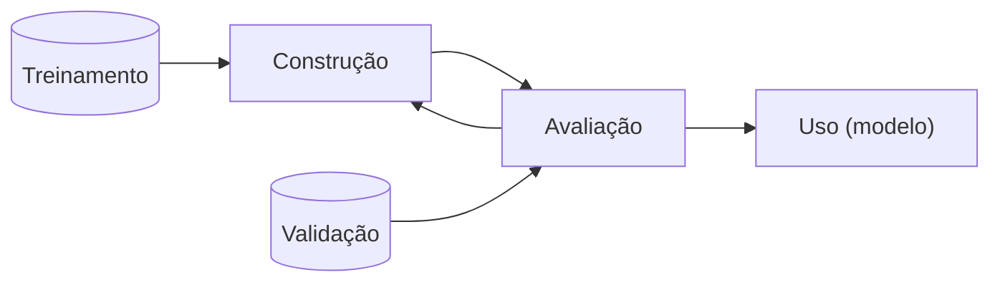

# Estudo individual

## Slide 1 - Introdução

- Aprendizado de Máquina (AM) e Mineda de Dados (MD) geralmente estão associadas a predição de valores
- Para entrada X, encontrar a função f(X) que gera a saída Y
  - Se Y é categórica, é um problema de classificação
  - Se Y é contínua, é um problema de regressão
- Esse é o aprendizado PREDITIVO

### Aprendizado Preditivo

- Para aprender essa função, primeiro o algoritmo é treinado ao receber um conjunto de pares $(X, l(X))$, onde $l(X)$ é a saída correta para a entrada X
- Esse conjunto é chamado de conjunto de treinamento. E como a função $l(X)$ retorna valores conhecidos, essa tarefa é classificada como supervisionada.

---

- Para avaliar o desempenho do aprendizado, comparam-se os valores preditos com os verdadeiros. Esse conjunto é chamado de conjunto de validação.

- **Fluxo**

---

- Outras abordagens preditivas que não necessitem da variável alvo sõ as não-supervisionadas
- Um exemplo desse caso é o agrupamento (clustering): busca encontrar subgrupos de elementos homogêneos nos dados.

---

- Visa buscar grupos que sejam mais parecidas entre si do que com os outros grupos.
- O contradomínio é o conjunto de grupos (clusters)
- Um exemplo é o k-Meanss.

### Concluindo

- Aprendizado Preditivo é o que busca conseguir prever um certo valor ou categoria para um novo dado
- Supervisionado: ocorre quando exite um conjunto de dados de treinamento já rotulados e que podem veficar a precisão do modelo
- Não-supervisionado: não existe um conjunto de dados rotulados, e o algoritmo deve encontrar padrões nos dados sem supervisão

### Aprendizado Descritivo

- Busca obter uma descrição (modelo descritivo) para os dados
- Uma das disferenças pro preditivo: não distingue o conjunto de instâncias em treinamento e validação.
- Avaliação dificultada por não haver um conjunto de validação

---

- "Aprendizado descritivo leva à descoberta genuína de novos conhecimentos, e, dessa forma, está situado entre as áreas de mineração de dados e aprendizado de máquina."
- Os Descritivos explicam situações passadas, "o que aconteceu", assim auxiliando na tomada de decisões

---

- Caso de uso: Market Place deseja distribuir produtos em seus centros de distribuição regionais. Para isso estuda de que forma os produtos historicamente têm sido comprados, para que sejam distribuídos de forma mais eficiente.

---

- Wal-Mart: verificou o histórico das lojas por onde passou o furacão e percebeu que as vendas de cerveja e Pop Tarts aumentavam logo antes. Logo, são esses que devem ser reestocados.

---

- "Aprendizado Descritivo Supervisionado"
  - Dúvida: Se pra ser supervisionado ele precisa dos dados rotulados, ou seja, já pertencentes a grupos, o algoritmo partiria de um conjunto de grupos já criados?
- O caso do Wal-Mart foi um exemplo de uso do Excepcional Model Mining, buscando padrões de vendas não usuais correlacionados a um evento.

### Aprendizado Descritivo VS Preditivo

- Descritivo: revela ocorridos passados e auxiliam em decisões futuras
- Preditivo: prevê comportamento de dados futuros
- Diferença tênue, porém mais evidenciada pela necessidade de intervenção humana no primeiro.
