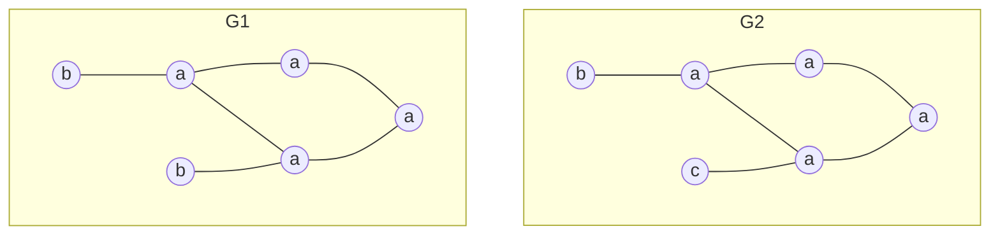
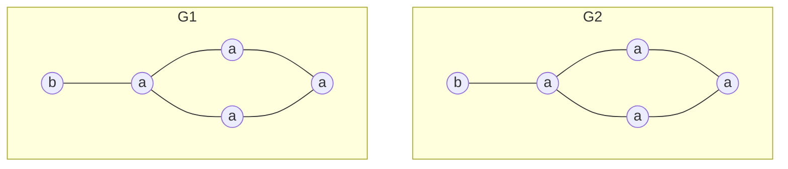
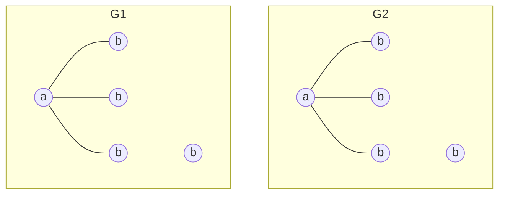
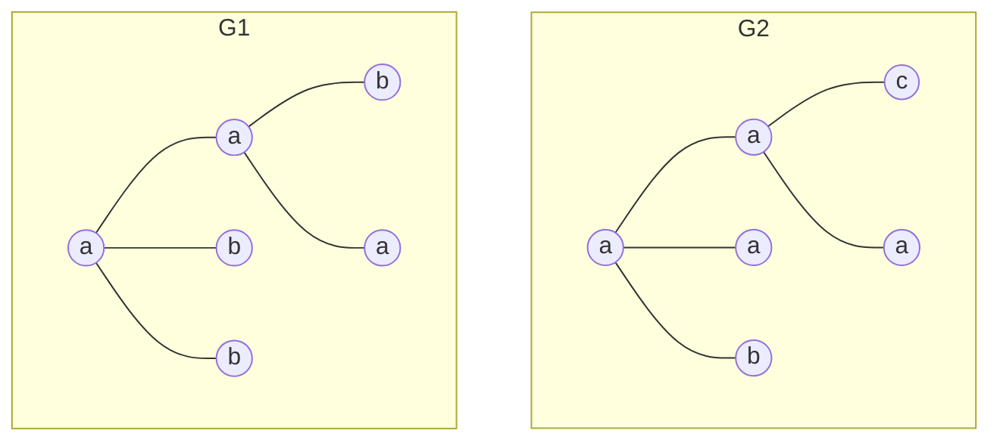

# Lista de exercícios 01 – Mineração de padrões frequentes

## Cabeçalho

UNIVERSIDADE FEDERAL DE MINAS GERAIS – UFMG
Instituto de Ciências Exatas – ICEx
Departamento de Ciência da Computação – DCC
Disciplina: DCC831 – Aprendizado Descritivo – 2025/1
Prof. Renato Vimieiro

## Questões

### 1. Obtenha a representação vertical da seguinte base de dados

| TID  | Itens          |
| ---- | :------------- |
| T100 | I1, I2, I5     |
| T200 | I2, I4         |
| T300 | I2, I3         |
| T400 | I1, I2, I4     |
| T500 | I1, I3         |
| T600 | I2, I3         |
| T700 | I1, I3         |
| T800 | I1, I2, I3, I5 |
| T900 | I1, I2, I3     |

#### Resposta Q1

### 2. Considerando os dados do exercício anterior, responda

#### a. Qual é a intenção do conjunto $\{T300, T600, T800\}$?

#### b. Qual a cobertura do conjunto de itens resultante do item anterior?

### 3. Quantos candidatos de tamanho 2 são avaliados pelo Apriori considerando os dados do exercício 01 e um suporte mínimo de 20%?

### 4. Mostre a execução do Apriori para obter os candidatos e itemsets frequentes de tamanho 3 para o exemplo acima

### 5. Desenhe a FP-tree referente à tabela do exercício 01 com um suporte mínimo de 20%

### 6. Projete a FP-tree para o item I3 a partir da árvore obtida acima

### 7. Execute 3 níveis (chamadas recursivas) do DCI_Closed com a base de dados do exercício 01 e suporte mínimo de 20%

### 8. (Adaptado de Zaki e Meira 10.5 Q5) Considerando a tabela abaixo, execute as três primeiras chamadas recursivas do Spade. Assuma $minsup=3$

| ID  | Time | Itens   |
| --- | ---- | ------- |
| S1  | 10   | A, B    |
| S1  | 20   | B       |
| S1  | 30   | A, B    |
| S1  | 40   | A, C    |
| S2  | 20   | A, C    |
| S2  | 30   | A, B, C |
| S2  | 50   | B       |
| S3  | 10   | A       |
| S3  | 30   | B       |
| S3  | 40   | A       |
| S3  | 50   | C       |
| S3  | 60   | B       |
| S4  | 30   | A, B    |
| S4  | 40   | A       |
| S4  | 50   | B       |
| S4  | 60   | C       |

#### a. Obtenha a representação vertical da base de dados

#### b. Execute os 3 primeiros níveis do Spade para essa base. Deixe claro quais são as sequências frequentes encontradas e o seu suporte

### 9. Considerando os grafos abaixo, mostre como novos candidatos são gerados pelo AGM. Deixe explícito o núcleo compartilhado pelos grafos e dos resultantes.

### 10. Mostre os novos candidatos que serão gerados pelo FSG a partir da combinação dos seguintes grafos

#### a

#### b

#### c

#### d

