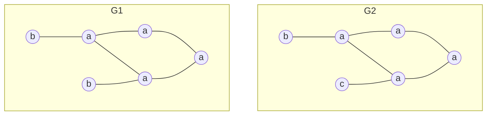
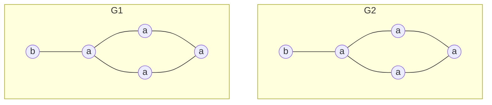
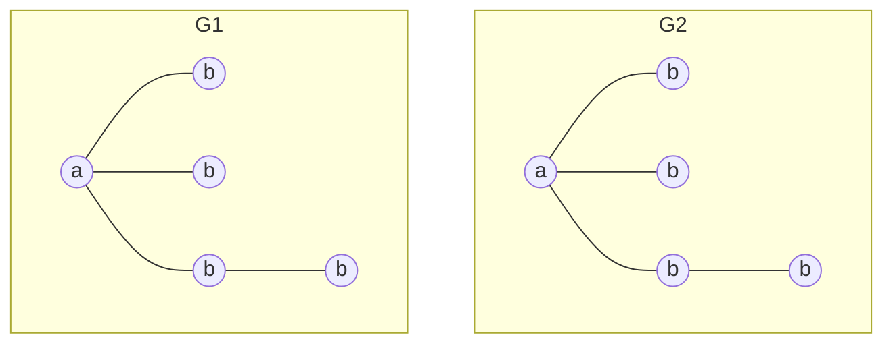
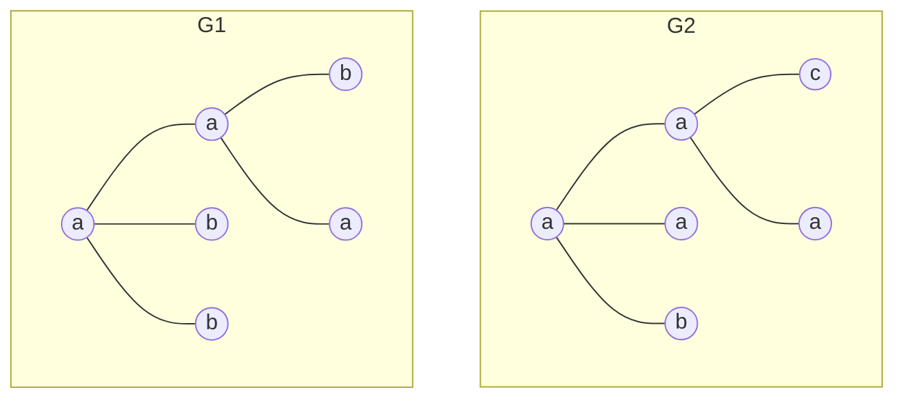

# Lista de exercícios 01 – Mineração de padrões frequentes

## Cabeçalho

UNIVERSIDADE FEDERAL DE MINAS GERAIS – UFMG
Instituto de Ciências Exatas – ICEx
Departamento de Ciência da Computação – DCC
Disciplina: DCC831 – Aprendizado Descritivo – 2025/1
Prof. Renato Vimieiro

## Questões

### 1. Obtenha a representação vertical da seguinte base de dados

| TID  | Itens          |
| ---- | :------------- |
| T100 | I1, I2, I5     |
| T200 | I2, I4         |
| T300 | I2, I3         |
| T400 | I1, I2, I4     |
| T500 | I1, I3         |
| T600 | I2, I3         |
| T700 | I1, I3         |
| T800 | I1, I2, I3, I5 |
| T900 | I1, I2, I3     |

#### Resposta Q1

Reescrevendo TIDs e Itens para facilitar a leitura:

| TID | Itens |
| --- | :---- |
| 1   | ABE   |
| 2   | BD    |
| 3   | BC    |
| 4   | ABD   |
| 5   | AC    |
| 6   | BC    |
| 7   | AC    |
| 8   | ABCE  |
| 9   | ABC   |

Representação vertical:

| Item | TIDs                |
| ---- | :------------------ |
| A    | 1, 4, 5, 7, 8, 9    |
| B    | 1, 2, 3, 4, 6, 8, 9 |
| C    | 3, 5, 6, 7, 8, 9    |
| D    | 2, 4                |
| E    | 1, 8                |

### 2. Considerando os dados do exercício anterior, responda

#### a. Qual é a intenção do conjunto $\{T300, T600, T800\}$?

Convertendo para a nova notação:

- **Qual é a intenção do conjunto $\{3, 6, 8\}$?**

Revisitando: Intensão é o conjunto de itens que são comuns a todos os TIDs do conjunto. Sendo assim...

- **Cobertura das transações:**

  - $c(3) = \{B, C\}$
  - $c(6) = \{B, C\}$
  - $c(8) = \{A, B, C, E\}$

- **Resposta:** $i(\{3, 6, 8\}) = c(3) \cap c(6) \cap c(8) = \{B, C\}$.

#### b. Qual a cobertura do conjunto de itens resultante do item anterior?

Considerando as coberturas dos itens encontrados pela intensão:

- $c(i(\{3, 6, 8\})) = c(\{B, C\}) = c(B) \cap c(C) = \{3, 6, 8, 9\}$.

### 3. Quantos candidatos de tamanho 2 são avaliados pelo Apriori considerando os dados do exercício 01 e um suporte mínimo de 20%?

- Recapitulando a sequência do Apriori:
  - Percorre todos os itens e calcula seu suporte.
  - Todos os que forem frequentes são combinados para gerar os candidatos de tamanho 2.
  - Cálculo de candidatos:
    - Junta dois itens de tamanho $k$ para gerar candidatos de tamanho $k+1$
      - onde $C = Prefixo + Sufixo$, onde $|Prefixo| \geq 0$ e $|Sufixo| = 1$,
      - E $C_{1}^{k} = P + S_1$ e $C_{2}^{k} = P + S_2$ geram $C_{3}^{k+1} = P + S_1 + S_2$.
  - Assim que um candidato cujo suporte é menor que o mínimo, ele é descartado e não é considerado para a próxima iteração.

Resposta:

Número de transações: 9

| $Itens^1$ | Suporte | Suporte Relativo ($sup(i)/ \mid TID \mid )$ | Frequente? |
| --------- | ------- | ------------------------------------------- | ---------- |
| A         | 6       | $6/9 = 0.\bar{6}$                           | Sim        |
| B         | 7       | $7/9 = 0.\bar{7}$                           | Sim        |
| C         | 6       | $6/9 = 0.\bar{6}$                           | Sim        |
| D         | 2       | $2/9 = 0.\bar{2}$                           | Sim        |
| E         | 2       | $2/9 = 0.\bar{2}$                           | Sim        |

- Geração de candidatos de tamanho 2:
  - Item $A: \{B, C, D, E\} = \{AB, AC, AD, AE\}$
  - Item $B: \{C, D, E\} = \{BC, BD, BE\}$
  - Item $C: \{D, E\} = \{CD, CE\}$
  - Item $D: \{E\} = \{DE\}$
  - Item $E: \{\}$

| $Itens^2$ | Suporte | Suporte Relativo $(suprel(i) = sup(i)/ \mid TID \mid )$ | Frequente? $(suprel(i) \geq 0.2)$ |
| --------- | ------- | ------------------------------------------------------- | --------------------------------- |
| AB        | 4       | $4/9 = 0.\bar{4}$                                       | Sim                               |
| AC        | 3       | $3/9 = 0.\bar{3}$                                       | Sim                               |
| AD        | 1       | $1/9 = 0.\bar{1}$                                       | Não                               |
| AE        | 2       | $2/9 = 0.\bar{2}$                                       | Sim                               |
| BC        | 4       | $4/9 = 0.\bar{4}$                                       | Sim                               |
| BD        | 2       | $2/9 = 0.\bar{2}$                                       | Sim                               |
| BE        | 2       | $2/9 = 0.\bar{2}$                                       | Sim                               |
| CD        | 0       | $0/9 = 0.\bar{0}$                                       | Não                               |
| CE        | 1       | $1/9 = 0.\bar{1}$                                       | Não                               |
| DE        | 0       | $0/9 = 0.\bar{0}$                                       | Não                               |

- Candidatos de tamanho 2: 10
- **Candidatos frequentes de tamanho 2: 6**

### 4. Mostre a execução do Apriori para obter os candidatos e itemsets frequentes de tamanho 3 para o exemplo acima

### 5. Desenhe a FP-tree referente à tabela do exercício 01 com um suporte mínimo de 20%

### 6. Projete a FP-tree para o item I3 a partir da árvore obtida acima

### 7. Execute 3 níveis (chamadas recursivas) do DCI_Closed com a base de dados do exercício 01 e suporte mínimo de 20%

### 8. (Adaptado de Zaki e Meira 10.5 Q5) Considerando a tabela abaixo, execute as três primeiras chamadas recursivas do Spade. Assuma $minsup=3$

| ID  | Time | Itens   |
| --- | ---- | ------- |
| S1  | 10   | A, B    |
| S1  | 20   | B       |
| S1  | 30   | A, B    |
| S1  | 40   | A, C    |
| S2  | 20   | A, C    |
| S2  | 30   | A, B, C |
| S2  | 50   | B       |
| S3  | 10   | A       |
| S3  | 30   | B       |
| S3  | 40   | A       |
| S3  | 50   | C       |
| S3  | 60   | B       |
| S4  | 30   | A, B    |
| S4  | 40   | A       |
| S4  | 50   | B       |
| S4  | 60   | C       |

#### a. Obtenha a representação vertical da base de dados

#### b. Execute os 3 primeiros níveis do Spade para essa base. Deixe claro quais são as sequências frequentes encontradas e o seu suporte

### 9. Considerando os grafos abaixo, mostre como novos candidatos são gerados pelo AGM. Deixe explícito o núcleo compartilhado pelos grafos e dos resultantes

### 10. Mostre os novos candidatos que serão gerados pelo FSG a partir da combinação dos seguintes grafos

#### a

#### b

#### c

#### d

