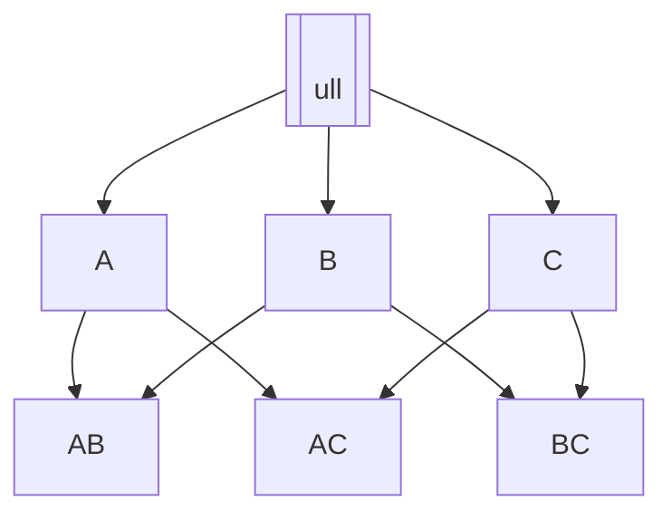

# Aprendizado Descritivo - Renato Vimieiro - 2025

## Aula 1 - 18/03/2025 - [JV: Cheguei atrasado]

### Slide 1

#### Introdução

...

#### Aprendizado Preditivo

- O que desejamos é receber informações e conseguir retornar um rótulo.
- Nem todos de aprendizado de máquina levam em consideração os rótulos.
- Aprendizado supervisionado preditivo
- [JV: não anotei sobre o que seria o supervisionado]
- Se tiver que explicar como funciona, aí é a área de Explanable AI.
- Aqui é mais importante o resultado do que o processo.

---

- Queremos um modelo que seja fiel à realidade.

---

[(Tratamento)] --> Contrução --> Avaliação --> Uso (Modelo)
Avaliação --> [(Validação)]

```mermaid
flowchart TD
  Trat[(Tratamento)]
  Cons[Construção]
  Ava[Avaliação]
  Uso[Uso (Modelo)]
  Val[(Validação)]
  Trat --> Cons
  Cons --> Ava
  Ava --> Uso
  Ava --> Val
```

- Aqui, não queremos obter nenhum entendimento sobre o que já vimos antes, mas sim, ter meios de prever como serão classificados os próximos itens que veremos.

---

- Exemplo: câncer de mama
  - Separando mulheres cuja quimioterapia foram eficazes e as que não foram.
  - Analisar quais os mapeamentos genéticos delas
  - Verificar de que forma há uma relação entre os mapeamentos genéticos e a eficácia da quimioterapia.
  - E com isso, tentar predizer se a quimioterapia será eficaz ou não para uma nova paciente.
- No aprendizado não supervisionado não há rótulos.
- Uma tarefa de aprendizado não-supervisionado bastante popular é a de agrupamento (clustering)
  - Um dos mais conhecidos é o k-menas

#### Aprendizado Descritivo

- > A premissa é "eu não sei nada sobre os dados", "então preciso encontrar um modelo que descreva os dados"
- "Estatística não é boa para descrever grafos"
- O Descritivo é tão importante quanto prever coisas, mas atuam em momentos diferentes.

---

- O aprendizado descritivo leva a descoberta en ovos conhecimentos. Estando entre mineração de dados e aprendizado de máquina.
- Busca responder "o quê aconteceu?"
- Descrevem situações passadas e com isso auxiliam no processo de **tomada de decisão**.

- 4 paradigmas científicos
  - Indução, teórico, ...
- Antes viam o fenômenos, criavam teorias, tentavam provar que as teorias se aplicavam.
- Atualmente usamos um modelo baseado em dados
  - Veem como os dados se comportas, criam teorias e tentam provar que os dados se comportam de acordo com a teoria.

---

- Uma das coisas feitas nessa disciplina é a busca por regularidades de acontecimentos em conjuntos.
- Há uma interseção bem grande entre aprendizado descritivo e Mineração de Dados.

---

- > What Wal-Mart knows about Customers' Habits
- Eles avaliaram de que forma os usuários se comportavam em relação a desastres naturais e o que compravam nas cidades que tavam para ser afetadas.
  - A decisão trivial era considerar que faria sentido estocar pilha, água mineral, lanterna e produtos não específicos.
  - Eles descobriram que houve um aumento de 7x nas vendas de Pop Tarts sabor morando, e o campeão dos aumentos foi a cerveja.
  - Nessa situação eles mais queriam descrever o passado do que predizer o futuro.
- Embora seja abordado como preditivo, na prática seria um exemplo de aprendizado descritivo supervisionado.
- Exceptional Model Mining
  - Busca-se encontrar quais conjuntos de itens são não-usualmente comprados qunado algum evento ocorre.

Dúvida: Como fazer para discernimos se um aumento, como no caso do Pop Tarts foi de fato devido aos furacões ou se calhou de, nesses dois mesmos intervalos de tempo, foram veículados anúncios desse produto; sendo então apenas uma coincidência?

Resposta: Dá para tentar refinar a forma de análise e o cálculo da função objetivo. Porém, devido ao caráter qualitativo, é difícil de se ter certeza de que essa atipicidade nessa busca por padrões atípicos sejam separados.

#### Aprendizado Descritivo X Preditivo

...

---

...

---

No modelo Preditivo, tenta-se definir limites para que próximos itens sejam classificados de acordo com o que foi visto anteriormente.

Já no Descritivo, tenta-se encontrar padrões que descrevam o que foi visto anteriormente.

---

No exemplo apontado pode-se separar as distribuições dos pontos em 4 quadrantes, isso baseado na estimativa do que já ocorreu antes, busca então estimar onde estarão posicionados os quadradinhos azuis e as bolinhas vermelhas.

É importante também identificar quais são as regularidades existentes em certos padrões irregulares.

---

Às vezes usa-se o mesmo modelo entre preditivo e descritivo, porém, um pra descrever e o outro pra predizer.

---

#### Comentários sobre o curso

Nesse curso busca-se a parte teoria dos algoritmos, não necessariamente em sua aplicação.

Ela é teórica, densa em algoritmo, e a aplicação em código é mínimo.

Busca-se "botar uma lupa" sobre a descoberta de padrões.

A primeira parte será toda não-supervisionada.

A busca de padrões em grafos pode ser usada na área de fármacos para encontrar quais sub-estruturas são as mais frequentes em determinados remédios para determinada infermidade?

A segunda parte será de aprendizado supervisionado.

Por volta de 20 de maio tem uma prova.

Haverá um tipo de "roleplaying" das atividades. Ele separou as salas em 8 grupos. Um grupo era o "historiador" (buscava entender qual era o contexto), o outro era o "metodologista" (tentatva entender como o algoritmo funcionava), "Aplicações", "Coletar as apresentações e redigir", "Publicar o resumo em um site da turma". O "hacker" é quem busca os códigos existentes, tenta entender, fazer funcionar e documentar como fez funcionar.

"Daqui para baixo é a parte mais recente, talvez mais pós graduação, ou coisas que não estão nos livros".

Cada grupo vai rotacionar em cada uma das tarefas. Serão 9 artigos no total que leremos.

Os Seminários (aplicações), veremos de fato aplicações

O que ele quer com o projeto? Uma interação maior com o professor. A parte mais prática da disciplina.

Na parte de ... será o ... que foi quem inventou.

Na parte de supervisionado: Sebastian Ventura e José Maria Luna 2018; Guozhu Dong and James Bailey 2012;

## Aula 2 - 20/03/2025

### Slide - Aprendizado Descritivo

#### Introdução - Aula 2

- Mineração de itens alguma coisa

---

- Kosinski (2013) coletavam dados das personalidades através do MyPersonality.
  - Escândalo do Cambridge Analytica
- Buscava predizer a personalidade baseado nas curtidas feitas no Facebook

---

- Provost e Foster (2013) utilizaram os dados para demonstrar a modelagem descritiva e as informações úteis.
- Alguns exemplos de regras:
  - Selena Gomez -> Demi Lovato
  - Linking Park & Disturbed & System of a Down & Korn -> Slipknot
  - SpongeBob SquarePants & Converse [JV: empresa do All Stars] -> Patrick Star
  - Skittles & Mountain Dew -> Gatorade

[JV: Offtopic: o diretor da Google daqui fez doutorado no PPGCC]

---

- A ideia de itens em cesta de compra pode ser generalizada para itens virtuais
- Busca-se encontrar co-ocorrências de itens de análise
- Dados os limites éticos, pode-se usar essa análise para se atingir diversos objetivos.

##### Itemset e Tidsets

- Os "produtos" da cesta de compras são chamados de "Itens".
  - $I = {x_1, x_2, \dots, x_m}$
- Esses elementos serão as **variáveis de análise**
- Um conjunto $X \subseteq I$ é chamado de **Itemset**
- Um itemset de tamanho $k$ é chamado de **k-itemset**
- Denotamos o conjunto de todos os **k-itemsets** por $I^(k)$
- Todas as "Transações" serão identificadas por IDs, ou então, **TID** (Transaction ID)
- O conjunto $T = {t_1, t_2, \dots, t_n}$ é o conjunto das transações.

---

- O Conjunto $Y \subseteq T$ é chamado de **Tidset**
- É válido assumir que _itemsets_ e _tidsets_ são ordenados por ordem lexicográfica dos itens e transações. (Não importa qual ordem, mas estão de algum modo ordenados)
- Cada transação consiste de um identificador (TID) e um conjunto de itens
  - Então, cada transação é um par $(t, X)$ em que $t \in T$ e $X \subseteq I$
- Formalmente, um conjunto de dados será uma tripla $(T, I, D)$
  - T: Transações ou objetos
  - I: Atributos ou itens
  - D: Relação binária entre eles.
  - $T$ e $I$ são os conjuntos de tids e itens
  - $D \subsetq T \times I$ é a relação binária em que $(t, i) \in D$...

---

- Podemos estender a definição também para conjuntos de itens
- Dizemos que $t$ contém um itemset X sse $\forall i \in X (t, i) \in D$

Ou seja: $t$ contém $X$ se $|X - t| = 0$

---

- Dado um itemset $X$, podemos querer saber o conjunto de transações que o contém.
- Esse conjunto é chamado de **extensão** ou **cobertura** de $X$
- Ele é definido pela seguinte função:
  - $c: P(I) \to P(T)$
  - $c(X) = {t \in T | \forall i \in X(t, i) \in D}$
- Dado um tidset Y, podemos querer saber o maior conjunto de itens comuns às transações de Y.
- Esse conjunto é chamado de **intensão** (Não é intenção!) de Y.
- Ele é definido por
  - $i: P(T) \to P(I)$
  - $i(Y) = {x \in I | \forall t \in Y(t, x) \in D}$

O uso de extensão e intensão vêm da ideia filosófica e semiótica de que a extensão é o conjunto de coisas que se encaixam em uma definição, enquanto a intensão é a definição em si.

---

|  TID | Muesli | Oats | Milk | Yoghut | BIscuits |  Tea |
| ---: | -----: | ---: | ---: | -----: | -------: | ---: |
|    1 |      1 |    0 |      |        |          |    1 |
|    2 |      0 |    1 |      |        |          |    0 |
|    3 |      0 |    0 |      |        |          |    1 |
|    4 |      1 |    0 |      |        |          |    0 |
|    5 |      0 |    1 |      |        |          |    1 |
|    6 |      1 |    0 |      |        |          |    1 |

Intensão: conjunto de itens comuns a todos os elementos de um determinado conjunto de transações.

Extensão: o conjunto de transações que contenham um determinado conjunto de itens.

Intensão: a interseção das linhas
Extensão: a interseção das colunas

##### Representações de conjuntos de dados

- Podemos enxergar o conjunto de dados como um conjunto de transações e suas respectivas intensões
  - Conjunto de $(t, i(t))$
  - Essa representação é chamada de **Horizontal**
- Similarmente podemos enxergar o conjunto de dados como um conjunto de itens e suas cobrerturas
  - Conjunto de $(x, c(x))$
  - Essa representação é chamada de **Vertical**

---

- Horizontal

|    t |                       i(t) |
| ---: | -------------------------: |
|    1 | Muesli, Milk, Yoghurt, Tea |
|    2 |                 Oats, Milk |
|    3 |        Milk, Biscuits, Tea |
|    4 |            Muesli, Yoghurt |
|    5 |            Oats, Milk, Tea |
|    6 |          Muesli, Milk, Tea |

- Vertical

|    x |  Muesli | Oats |          Milk | Yoghurt | Biscuits |        Tea |
| ---: | ------: | ---: | ------------: | ------: | -------: | ---------: |
| t(x) | 1, 4, 6 | 2, 5 | 1, 2, 3, 5, 6 |    1, 4 |        3 | 1, 3, 5, 6 |

|        x |          t(x) |
| -------: | ------------: |
|   Muesli |       1, 4, 6 |
|     Oats |          2, 5 |
|     Milk | 1, 2, 3, 5, 6 |
|  Yoghurt |          1, 4 |
| Biscuits |             3 |
|      Tea |    1, 3, 5, 6 |

##### Conjuntos de itens frequentes e Regras de Associação

- A identificação de regras tais como as que vimos no exemplo no início da aula, em geral, envolvem duas etapas
  - Mineração de conjuntos de itens frequentes
  - Descoberta de regras de associações interessantes
- A primeira tende a ser computacionalmente mais intensa. Por este motivo recebe mais atenção dos pesquisadores.
- Nos concentraremos nessa tarefa.

##### Mineração de Conjuntos de itens frequentes

- Uma definição de "regra interessante" é ela ocorrer com certa frequência.
- Então é necessário definir um limiar entre o que é frequente e o que é infrequente
  - Esse limiar é chamado de suporte mínimo (minsup)
- O suporte de um itemset é o tamanho de sua cobertura
  - sup(X) = |c(X)|
- Como essa definição é dependente do contexto, admite-se também a definição do suporte relativo
  - rsup(X) = |c(X)| / |T|

---

Dessa forma, dizemos que um itemset é frequente sse $sup(X) \geq minsup$

---

Relação de ordem parcial: $X \subseteq Y \leftrightarrow X \leq Y$

Conjunto potência: é o conjunto de todos os possíveis subconjuntos de um conjunto.



- O espaço de busca do problema é o conjunto potência do conjunto de itens
- Se considerarmos a relação de subconjuntos como uma relação de ordem parcial, temos que o espaço de busca é estruturado como um reticulado
  - Esse reticulado pode ser visualizado como um grafo, onde somente as relações diretas são representadas
  - Ou seja, se $A \subseteq B \land |A| = |B| - 1$, então existe uma aresta entre A e B no diagrama

Aquele diagrama explica bastante o que que isso quis dizer. Basicamente, no conjunto potência, cada nível vai ter um elemento a mais que o nível anterior.

- ...

###### Algoritmo Ingênuo

Complexidade do algoritmo: $O(2^I \cdot T \cdot I)$

- // ALGORITHM 8.1. Algoritm BruteForce
- int BruteForce(D, I, minsup):
  - F \leftarrow // set of frequent itemsets
    - for each X \subseteq I do
      - sup(X) \leftarrow ComputeSupport (X, D)
      - if sup(X) \leq minsup then
        - F \leftarrow F \cup {(X, sup(X))}
    - return F

- ComputeSupport(X, D):
  - sup(X) \leftarrow 0
  - for each (t, i(t)) \in D do
    - if X \subseteq i(t) then
      - sup(X) \leftarrow sup(X) + 1
- return sup(X)

---

...

---

- A complexidade do espaço de busca é inerente ao problema. Contudo o algoritmo é ineficiente mesmo em espaços pequenos
- Note que o conjunto de dados não é mantido em memória, portanto a computação do suporte torna o algoritmo impraticável
- Os algoritmos mais "sofisticados" atacam majoritariamente o problema de computação de suporte, evitando computações desnecessáris, e/ou adotando estratégias mais eficientes para computá-lo.

Então temos dois problemas principais: reduzir o espaço de busca e reduzir a complexidade para calcular o suporte.

##### Leitura

- Seções 8.1 e 8.2 Zaki e Meira
- Seções 6.1 e 5.2 (Introduction to Data Mining)
