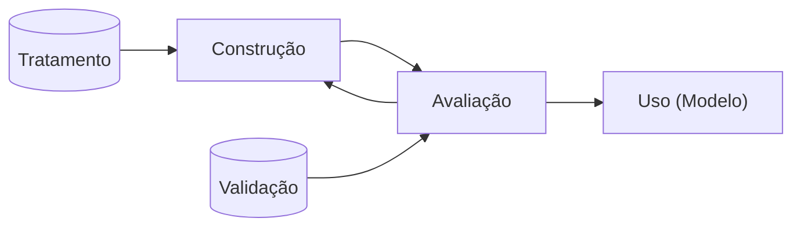
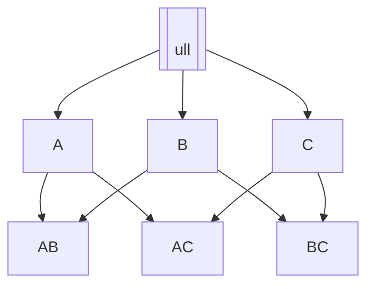
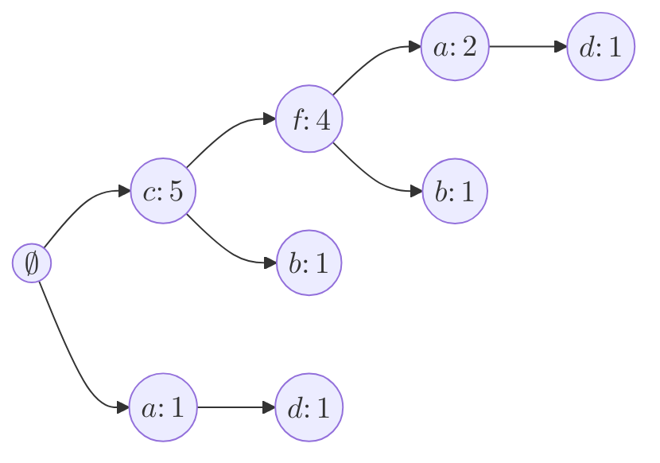
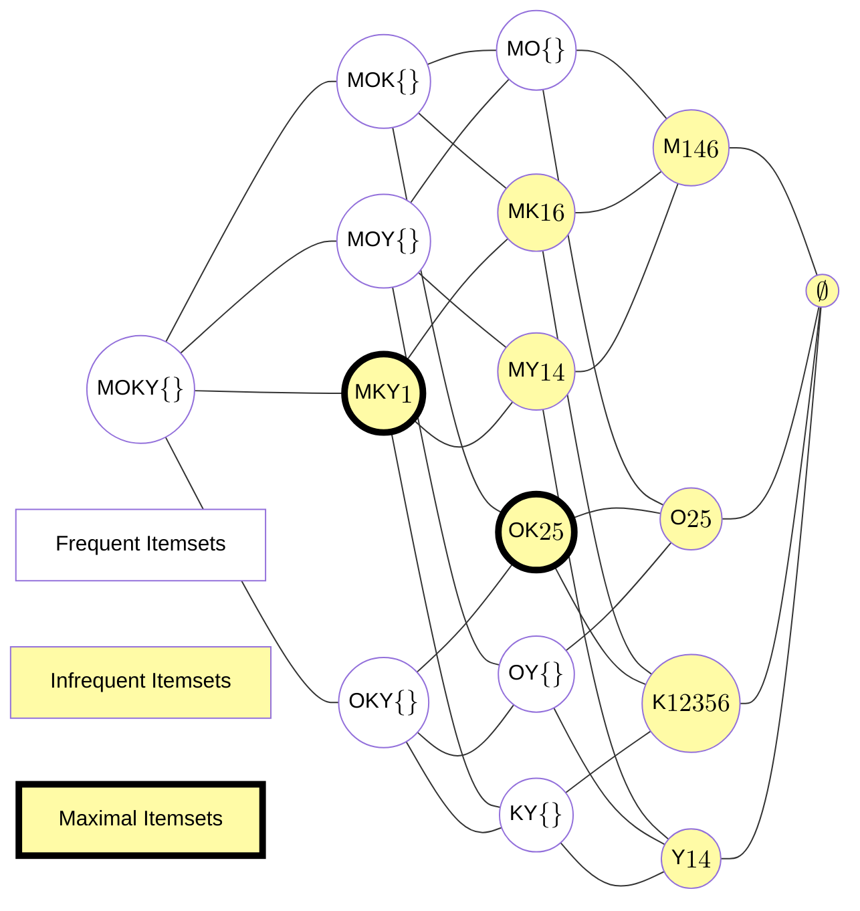
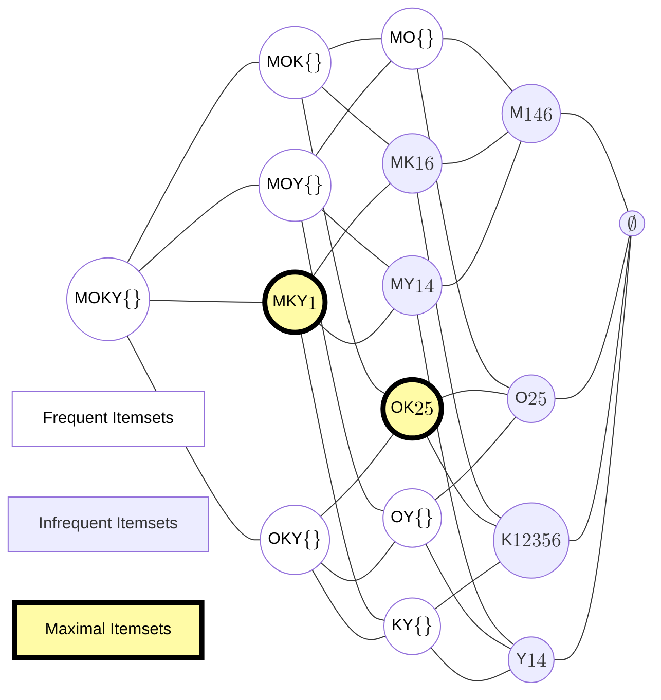

# Aprendizado Descritivo - Renato Vimieiro - 2025

‘’

## Aula 01 | 18/03/2025 | Apresentação do curso - [JV: Cheguei atrasado]

### Slide 1 - aula01-intro

#### Introdução

- Quando falamos sobre aprendizado de máquina e mineração de dados, frequentemente associamos essas expressões a predição de valores
- Mais especificamente, temos a ideia de que aprendizado de máquina (AM) se resume a, dada uma entrada X, encontrar uma função f(X) que retorne o valor de uma variável alvo Y
  - Quando a variável alvo Y é categórica, chamamos o problema de **classificação**
  - Quando a variável alvo Y é contínua, chamamos o problema de **regressão**
- Assim, o senso comum define AM como aprender uma função f capaz de predizer valores para dados ainda não coletados
- Essa definição, embora restritiva, é correta para a classe de tarefas elencadas acima, chamadas de **aprendizado preditivo**

#### Aprendizado Preditivo

- Mais especificamente ainda, esse imaginário popular define o que conhecemos por aprendizado supervisionado de modelos preditivos
- De maneira mais formal, o objetivo dessas técnicas é aprender uma função cujo domínio é um conjunto de instâncias $\mathcal{X}$, e contradomínio um conjunto de saídas $\mathcal{Y}$
- Para tal, o algoritmo recebe um conjunto de pares $(x, l(x)) \in \mathcal{X} \times \mathcal{L}$
  - A função $l(x)$ retorna o valor de saída esperado para a instância x
- Como o algoritmo obtém o modelo guiado por esse conjunto de entrada (treinamento), a tarefa é classificada como 'supervisionada', já que $l(x)$ faz o papel de 'professor'
- Da mesma forma, como o modelo aprendido é usado para predizer valores de saída de novas instâncias, ele é chamado de preditivo

- JV
  - O que desejamos é receber informações e conseguir retornar um rótulo.
  - Nem todos de aprendizado de máquina levam em consideração os rótulos.
  - Aprendizado supervisionado preditivo
  - [JV: não anotei sobre o que seria o supervisionado]
  - Se tiver que explicar como funciona, aí é a área de Explanable AI.
  - Aqui é mais importante o resultado do que o processo.

---

- Como queremos que o modelo seja fiel à realidade e, portanto, consiga capturar a relação entre instância (entrada) e saída, é comum, nesse cenário, avaliarmos sua qualidade comparando os valores obtidos com os verdadeiros para um conjunto de instâncias chamado de conjunto de validação
- Ou seja, nesse tipo de tarefa temos o seguinte fluxo de trabalho:

---

Aqui, não queremos obter nenhum entendimento sobre o que já vimos antes, mas sim, ter meios de prever como serão classificados os próximos itens que veremos.

---

- Embora métodos de regressão e classificação (aprendizado supervisionado) sejam os -ais populares em AM, existem outras abordagens preditivas que não requerem a variável -lvo para ajustarem modelos
- Técnicas que não utilizam essas variáveis são classificadas como **não-supervisionadas**
- Uma tarefa de aprendizado não-supervisionado bastante popular é a de agrupamento (clustering)
- Essa tarefa consiste em encontrar subgrupos de elementos homogêneos nos dados

---
---

- [JV]
  - Exemplo: câncer de mama
    - Separando mulheres cuja quimioterapia foram eficazes e as que não foram.
    - Analisar quais os mapeamentos genéticos delas
    - Verificar de que forma há uma relação entre os mapeamentos genéticos e a eficácia da quimioterapia.
    - E com isso, tentar predizer se a quimioterapia será eficaz ou não para uma nova paciente.
  - No aprendizado não supervisionado não há rótulos.
  - Uma tarefa de aprendizado não-supervisionado bastante popular é a de agrupamento (clustering)
    - Um dos mais conhecidos é o k-menas

---

- Em outras palavras, a tarefa de agrupamento consiste em detectar grupos de instâncias que sejam mais parecidas entre si do que com as de outros grupos
- Sob a ótica de aprendizado preditivo, a tarefa consiste em encontrar uma função $q: \mathcal{X} \rightarrow \mathcal{C}$, cujo domínio $\mathcal{X}$ é um conjunto de instâncias, e o contradomínio 𝒞 um conjunto de grupos (clusters)
- Note que a tarefa se assemelha à de classificação (já que os rótulos dos grupos são categóricos), porém o ajuste do modelo não leva em consideração rótulos pré-definidos
- Um exemplo de método aprendizado preditivo não-supervisionado é o K-Means
  - O modelo são os centroides e a distância euclidiana
  - Novas instâncias são alocadas nos clusters de cujos centroides elas sejam mais próximas de acordo com a distância euclidiana

#### Aprendizado Descritivo

- Aprendizado descritivo tem como objetivo central obter uma descrição para os dados
  - Isto é, o objetivo é encontrar um **modelo descritivo** para os dados
- Dessa forma, podemos apontar a primeira diferença para aprendizado preditivo:
  - Não temos mais a necessidade de dividir o conjunto de instâncias em treinamento e validação
- A divisão entre treinamento e validação não faz mais sentido, pois queremos obter um modelo para os dados que temos em mãos
- Consequentemente, a avaliação dos resultados (modelos) se torna mais difícil, já que não temos mais uma ‘verdade absoluta’ para compararmos as saídas

- JV
  - > A premissa é "eu não sei nada sobre os dados", "então preciso encontrar um modelo que descreva os dados"
  - "Estatística não é boa para descrever grafos"
  - O Descritivo é tão importante quanto prever coisas, mas atuam em momentos diferentes.

---

- Por outro lado, segundo Flach (2012), *o aprendizado descritivo leva à descoberta genuína de novos conhecimentos, e, dessa forma, está situado entre as áreas de mineração de dados e aprendizado de máquina*
- O objetivo de se buscar um modelo descritivo dos dados se justifica nas situações em que se quer responder perguntas do tipo “o quê aconteceu?”
- Ou seja, esses modelos descrevem situações passadas e, assim, auxiliam no processo de tomada de decisão Aprendizado

- JV
  - O aprendizado descritivo leva a descoberta e novos conhecimentos. Estando entre mineração de dados e aprendizado de máquina.
  - Busca responder "o quê aconteceu?"
  - Descrevem situações passadas e com isso auxiliam no processo de **tomada de decisão**.

  - 4 paradigmas científicos
    - Indução, teórico, ...
  - Antes viam o fenômenos, criavam teorias, tentavam provar que as teorias se aplicavam.
  - Atualmente usamos um modelo baseado em dados
    - Veem como os dados se comportas, criam teorias e tentam provar que os dados se comportam de acordo com a teoria.

---

- Considere a seguinte situação em que um grande *Market place* deseja reduzir os custos de distribuição dos produtos que ele vende
- Uma prática muito utilizada atualmente é manter centros de distribuição regionais para estocar produtos vendidos frequentemente, reduzindo o custo e tempo de transporte, e, consequentemente, aumentando a satisfação dos clientes
- Apesar da estocagem de produtos populares nas regionais ser uma decisão trivial, ela pode ser aprimorada analisando-se o histórico de vendas
- Nesse histórico, podemos encontrar itens menos populares que, com certa frequência, são adquiridos junto com os mais populares
  - Isso nos permite decidir estocar também esses produtos menos populares, em menor quantidade, mas evitando, assim, um custo maior de se enviar tais produtos individualmente de centros mais distantes

- JV
  - Uma das coisas feitas nessa disciplina é a busca por regularidades de acontecimentos em conjuntos.
  - Há uma interseção bem grande entre aprendizado descritivo e Mineração de Dados.

---

- Considere um segundo caso real em que executivos do Wal-Mart utilizaram de AM para aumentar as vendas diante da ameaça do furação Frances em 2004
- Enquanto o furacão atravessava o Caribe, os executivos queriam prever os produtos que seus clientes consumiam diante de catástrofes

- JV
  - > What Wal-Mart knows about Customers' Habits
  - Eles avaliaram de que forma os usuários se comportavam em relação a desastres naturais e o que compravam nas cidades que tavam para ser afetadas.
    - A decisão trivial era considerar que faria sentido estocar pilha, água mineral, lanterna e produtos não específicos.
    - Eles descobriram que houve um aumento de 7x nas vendas de Pop Tarts sabor morando, e o campeão dos aumentos foi a cerveja.
    - Nessa situação eles mais queriam descrever o passado do que predizer o futuro.
  - Embora seja abordado como preditivo, na prática seria um exemplo de aprendizado descritivo supervisionado.
  - Exceptional Model Mining
    - Busca-se encontrar quais conjuntos de itens são não-usualmente comprados qunado algum evento ocorre.

Dúvida: Como fazer para discernimos se um aumento, como no caso do Pop Tarts foi de fato devido aos furacões ou se calhou de, nesses dois mesmos intervalos de tempo, foram veículados anúncios desse produto; sendo então apenas uma coincidência?

Resposta: Dá para tentar refinar a forma de análise e o cálculo da função objetivo. Porém, devido ao caráter qualitativo, é difícil de se ter certeza de que essa atipicidade nessa busca por padrões atípicos sejam separados.

---

- O objetivo dos executivos do Wal-Mart era abastecer as lojas da Flórida, que estava no caminho do furacão, e assim aumentar as vendas
- Novamente, a decisão trivial seria aumentar o estoque de pilhas, água mineral, lanternas, e produtos não perecíveis
- A análise do histórico de vendas, nesse caso, poderia retornar que as lojas venderam todo o estoque de DVDs de um gênero específico de filmes
- No entanto, ao analisar os dados, eles chegaram à conclusão de que havia um aumento de 7x nas vendas de Pop Tarts sabor morango, e o campeão do aumento de vendas era cerveja

---

- Apesar do caso ter sido abordado como um exemplo de aprendizado preditivo na matéria, ele é um exemplo claro de aprendizado descritivo supervisionado
- Especificamente, ele é um caso claro da aplicação de excepcional model mining
  - Queremos encontrar padrões de vendas não usuais, isto é, detectar aumento da venda de produtos que esteja correlacionado positivamente a um evento de interesse
- O único porém é que essa tarefa foi inicialmente proposta somente em 2008, 4 anos após o evento!

#### Aprendizado Descritivo X Preditivo

- Os exemplos ilustram bem a aplicabilidade do aprendizado descritivo:
  - Como dito, eles revelam o que ocorreu no passado e auxiliam na tomada de decisão de eventos futuros
- De forma análoga, os modelos preditivos utilizam dados históricos para prever o comportamento de dados futuros
- Note que a diferença, portanto, é bem tênue entre as duas abordagens
  - A diferença mais aparente é a intervenção humana no primeiro, contra um certo automatismo da segunda

---

- Um exemplo dessa diferença tênue entre as duas abordagens é justamente a tarefa de agrupamento
- Incialmente apresentamos clustering como uma tarefa de aprendizado preditivo não-supervisionado
- A mesma tarefa, porém, pode ser apresentada como descritiva
- O objetivo no agrupamento descritivo é obter uma função $q: \mathcal{D} \to \mathcal{C}$, que mapeia as instâncias coletadas no conjunto de dados $\mathcal{D}$ a grupos específicos (clusters) $\mathcal{C}$
  - A diferença aqui é que assumimos como domínio apenas o conjunto de instâncias em mãos, e não toda população de instâncias possíveis
  - Ou seja, o resultado do nosso agrupamento é ‘apenas’ uma divisão das instâncias em grupos, permitindo a análise de similaridade entre elas; não estamos interessados em alocar novas instâncias aos grupos encontrados

---

[Imagem: Agrupamento preditivo//Agrupamento Descritivo]

No modelo Preditivo, tenta-se definir limites para que próximos itens sejam classificados de acordo com o que foi visto anteriormente.

Já no Descritivo, tenta-se encontrar padrões que descrevam o que foi visto anteriormente.

---

- Considere agora um exemplo mais relacionado ao segundo estudo de caso discutido anteriormente
- Suponha que nosso conjunto de entrada rotulado seja o seguinte
- Podemos traçar dois objetivos aqui:
  - Separar círculos de quadrados, para classificar novos pontos como um ou outro
  - Buscar padrões nos dados para entender as diferenças entre círculos e quadrados

[Imagem: Distribuição de quadrados azuis e círculos vermelhos]

No exemplo apontado pode-se separar as distribuições dos pontos em 4 quadrantes, isso baseado na estimativa do que já ocorreu antes, busca então estimar onde estarão posicionados os quadradinhos azuis e as bolinhas vermelhas.

É importante também identificar quais são as regularidades existentes em certos padrões irregulares.

---

- O primeiro objetivo induz uma abordagem preditiva
- Logo, o abordamos como um problema de classificação

Às vezes usa-se o mesmo modelo entre preditivo e descritivo, porém, um pra descrever e o outro pra predizer.

[Imagem: Distribuição dos pontos]

---

- O segundo objetivo induz a uma abordagem descritiva
- Logo, abordamos o problema como uma tarefa de descoberta de subgrupos
- [JV]
  - $\sigma_1 \equiv x_1 \in [0.3, 0.7) \wedge x_2 \geq 0.9$
  - $\sigma_2 \equiv x_1 \in [0.275, 0.7) \wedge x_2 \leq 0.1$

[Imagem: Definindo grupo independente]

---

- Esse último exemplo mostra uma característica que frequentemente diferencia as duas abordagens
- As abordagens preditivas buscam ajustar modelos que aprendam as regularidades globais dos dados
  - No exemplo, encontrar as fronteiras que separam círculos de quadrados
- As abordagens descritivas, por outro lado, ajustam modelos que aprendam regularidades locais dos dados, i.e., padrões válidos apenas a subgrupos específicos
  - No exemplo, intervalos das variáveis que descrevem subgrupos com uma distribuição não usual de círculos e quadrados Leitura

#### Leitura - Aula 01

- Capítulo 3, Flach (2012)

#### Comentários sobre o curso

Nesse curso busca-se a parte teoria dos algoritmos, não necessariamente em sua aplicação.

Ela é teórica, densa em algoritmo, e a aplicação em código é mínimo.

Busca-se "botar uma lupa" sobre a descoberta de padrões.

A primeira parte será toda não-supervisionada.

A busca de padrões em grafos pode ser usada na área de fármacos para encontrar quais sub-estruturas são as mais frequentes em determinados remédios para determinada infermidade?

A segunda parte será de aprendizado supervisionado.

Por volta de 20 de maio tem uma prova.

Haverá um tipo de "roleplaying" das atividades. Ele separou as salas em 8 grupos. Um grupo era o "historiador" (buscava entender qual era o contexto), o outro era o "metodologista" (tentatva entender como o algoritmo funcionava), "Aplicações", "Coletar as apresentações e redigir", "Publicar o resumo em um site da turma". O "hacker" é quem busca os códigos existentes, tenta entender, fazer funcionar e documentar como fez funcionar.

"Daqui para baixo é a parte mais recente, talvez mais pós graduação, ou coisas que não estão nos livros".

Cada grupo vai rotacionar em cada uma das tarefas. Serão 9 artigos no total que leremos.

Os Seminários (aplicações), veremos de fato aplicações

O que ele quer com o projeto? Uma interação maior com o professor. A parte mais prática da disciplina.

Na parte de ... será o ... que foi quem inventou.

Na parte de supervisionado: Sebastian Ventura e José Maria Luna 2018; Guozhu Dong and James Bailey 2012;

## Aula 02 | 20/03/2025 | Aprendizado descritivo x preditivo

### Slide - Aprendizado Descritivo

#### Introdução - Aula 2

- Mineração de itens alguma coisa

---

- Kosinski (2013) coletavam dados das personalidades através do MyPersonality.
  - Escândalo do Cambridge Analytica
- Buscava predizer a personalidade baseado nas curtidas feitas no Facebook

---

- Provost e Foster (2013) utilizaram os dados para demonstrar a modelagem descritiva e as informações úteis.
- Alguns exemplos de regras:
  - Selena Gomez -> Demi Lovato
  - Linking Park & Disturbed & System of a Down & Korn -> Slipknot
  - SpongeBob SquarePants & Converse [JV: empresa do All Stars] -> Patrick Star
  - Skittles & Mountain Dew -> Gatorade

[JV: Offtopic: o diretor da Google daqui fez doutorado no PPGCC]

---

- A ideia de itens em cesta de compra pode ser generalizada para itens virtuais
- Busca-se encontrar co-ocorrências de itens de análise
- Dados os limites éticos, pode-se usar essa análise para se atingir diversos objetivos.

##### Itemset e Tidsets

- Os "produtos" da cesta de compras são chamados de "Itens".
  - $I = {x_1, x_2, \dots, x_m}$
- Esses elementos serão as **variáveis de análise**
- Um conjunto $X \subseteq I$ é chamado de **Itemset**
- Um itemset de tamanho $k$ é chamado de **k-itemset**
- Denotamos o conjunto de todos os **k-itemsets** por $I^(k)$
- Todas as "Transações" serão identificadas por IDs, ou então, **TID** (Transaction ID)
- O conjunto $T = {t_1, t_2, \dots, t_n}$ é o conjunto das transações.

---

- O Conjunto $Y \subseteq T$ é chamado de **Tidset**
- É válido assumir que _itemsets_ e _tidsets_ são ordenados por ordem lexicográfica dos itens e transações. (Não importa qual ordem, mas estão de algum modo ordenados)
- Cada transação consiste de um identificador (TID) e um conjunto de itens
  - Então, cada transação é um par $(t, X)$ em que $t \in T$ e $X \subseteq I$
- Formalmente, um conjunto de dados será uma tripla $(T, I, D)$
  - T: Transações ou objetos
  - I: Atributos ou itens
  - D: Relação binária entre eles.
  - $T$ e $I$ são os conjuntos de tids e itens
  - $D \subsetq T \times I$ é a relação binária em que $(t, i) \in D$...

---

- Podemos estender a definição também para conjuntos de itens
- Dizemos que $t$ contém um itemset X sse $\forall i \in X (t, i) \in D$

Ou seja: $t$ contém $X$ se $|X - t| = 0$

---

- Dado um itemset $X$, podemos querer saber o conjunto de transações que o contém.
- Esse conjunto é chamado de **extensão** ou **cobertura** de $X$
- Ele é definido pela seguinte função:
  - $c: P(I) \to P(T)$
  - $c(X) = {t \in T | \forall i \in X(t, i) \in D}$
- Dado um tidset Y, podemos querer saber o maior conjunto de itens comuns às transações de Y.
- Esse conjunto é chamado de **intensão** (Não é intenção!) de Y.
- Ele é definido por
  - $i: P(T) \to P(I)$
  - $i(Y) = {x \in I | \forall t \in Y(t, x) \in D}$

O uso de extensão e intensão vêm da ideia filosófica e semiótica de que a extensão é o conjunto de coisas que se encaixam em uma definição, enquanto a intensão é a definição em si.

---

|  TID | Muesli | Oats | Milk | Yoghut | BIscuits |  Tea |
| ---: | -----: | ---: | ---: | -----: | -------: | ---: |
|    1 |      1 |    0 |      |        |          |    1 |
|    2 |      0 |    1 |      |        |          |    0 |
|    3 |      0 |    0 |      |        |          |    1 |
|    4 |      1 |    0 |      |        |          |    0 |
|    5 |      0 |    1 |      |        |          |    1 |
|    6 |      1 |    0 |      |        |          |    1 |

Intensão: conjunto de itens comuns a todos os elementos de um determinado conjunto de transações.

Extensão: o conjunto de transações que contenham um determinado conjunto de itens.

Intensão: a interseção das linhas
Extensão: a interseção das colunas

##### Representações de conjuntos de dados

- Podemos enxergar o conjunto de dados como um conjunto de transações e suas respectivas intensões
  - Conjunto de $(t, i(t))$
  - Essa representação é chamada de **Horizontal**
- Similarmente podemos enxergar o conjunto de dados como um conjunto de itens e suas cobrerturas
  - Conjunto de $(x, c(x))$
  - Essa representação é chamada de **Vertical**

---

- Horizontal

|    t |                       i(t) |
| ---: | -------------------------: |
|    1 | Muesli, Milk, Yoghurt, Tea |
|    2 |                 Oats, Milk |
|    3 |        Milk, Biscuits, Tea |
|    4 |            Muesli, Yoghurt |
|    5 |            Oats, Milk, Tea |
|    6 |          Muesli, Milk, Tea |

- Vertical

|    x |  Muesli | Oats |          Milk | Yoghurt | Biscuits |        Tea |
| ---: | ------: | ---: | ------------: | ------: | -------: | ---------: |
| t(x) | 1, 4, 6 | 2, 5 | 1, 2, 3, 5, 6 |    1, 4 |        3 | 1, 3, 5, 6 |

|        x |          t(x) |
| -------: | ------------: |
|   Muesli |       1, 4, 6 |
|     Oats |          2, 5 |
|     Milk | 1, 2, 3, 5, 6 |
|  Yoghurt |          1, 4 |
| Biscuits |             3 |
|      Tea |    1, 3, 5, 6 |

##### Conjuntos de itens frequentes e Regras de Associação

- A identificação de regras tais como as que vimos no exemplo no início da aula, em geral, envolvem duas etapas
  - Mineração de conjuntos de itens frequentes
  - Descoberta de regras de associações interessantes
- A primeira tende a ser computacionalmente mais intensa. Por este motivo recebe mais atenção dos pesquisadores.
- Nos concentraremos nessa tarefa.

##### Mineração de Conjuntos de itens frequentes

- Uma definição de "regra interessante" é ela ocorrer com certa frequência.
- Então é necessário definir um limiar entre o que é frequente e o que é infrequente
  - Esse limiar é chamado de suporte mínimo (minsup)
- O suporte de um itemset é o tamanho de sua cobertura
  - sup(X) = |c(X)|
- Como essa definição é dependente do contexto, admite-se também a definição do suporte relativo
  - rsup(X) = |c(X)| / |T|

---

Dessa forma, dizemos que um itemset é frequente sse $sup(X) \geq minsup$

---

Relação de ordem parcial: $X \subseteq Y \leftrightarrow X \leq Y$

Conjunto potência: é o conjunto de todos os possíveis subconjuntos de um conjunto.

- O espaço de busca do problema é o conjunto potência do conjunto de itens
- Se considerarmos a relação de subconjuntos como uma relação de ordem parcial, temos que o espaço de busca é estruturado como um reticulado
  - Esse reticulado pode ser visualizado como um grafo, onde somente as relações diretas são representadas
  - Ou seja, se $A \subseteq B \land |A| = |B| - 1$, então existe uma aresta entre A e B no diagrama

Aquele diagrama explica bastante o que que isso quis dizer. Basicamente, no conjunto potência, cada nível vai ter um elemento a mais que o nível anterior.

- ...

###### Algoritmo Ingênuo

Complexidade do algoritmo: $O(2^I \cdot T \cdot I)$

- **// ALGORITHM 8.1. Algoritm BruteForce**
  - **BruteForce** $(D, \mathcal{I}, minsup)$:
    - $\mathcal{F} \leftarrow \emptyset$ // set of frequent itemsets
      - **foreach** $X \subseteq \mathcal{I}$ **do**
        - $sup(X) \leftarrow ComputeSupport (X, D)$
        - **if** $sup(X) \leq minsup$ **then**
          - $\mathcal{F} \leftarrow \mathcal{F} \cup {(X, sup(X))}$
      - **return** $\mathcal{F}$

  - **ComputeSupport** $(X, D)$:
    - $sup(X) \leftarrow 0$
    - **foreach** $\langle t, i(t) \rangle \in D$ **do**
      - **if** $X \subseteq i(t)$ **then**
        - $sup(X) \leftarrow sup(X) + 1$
  - **return** $sup(X)$

---

- A computação do suporte de um itemset requer uma passada sobre o conjunto de dados, ou seja, requer tempo $O(|T|)$
- Verificar se uma dada transação contém um itemset requer tempo $O(|I|)$
- Portanto, o custo total de computação do suporte é $O(IT)$
- O espaço de busca, por sua vez, é o conjunto potência de $I$. Logo, a complexidade do algoritmo ingênuo é $O(2^I I T)$

---

- A complexidade do espaço de busca é inerente ao problema. Contudo o algoritmo é ineficiente mesmo em espaços pequenos
- Note que o conjunto de dados não é mantido em memória, portanto a computação do suporte torna o algoritmo impraticável
- Os algoritmos mais "sofisticados" atacam majoritariamente o problema de computação de suporte, evitando computações desnecessáris, e/ou adotando estratégias mais eficientes para computá-lo.

Então temos dois problemas principais: reduzir o espaço de busca e reduzir a complexidade para calcular o suporte.

##### Leitura

- Seções 8.1 e 8.2 Zaki e Meira
- Seções 6.1 e 5.2 (Introduction to Data Mining)

## Aula 03 | 25/03/2025 | Mineração de conjuntos de itens - Faltei - Mineração de itens frequentes: Apriori e Eclat

### Slide: aula03-apriori_eclat (Aula 03)

#### Introdução (Aula 03)

- Como vimos na aula anterior, o principal problema do algoritmo ingênuo para mineração de conjuntos de itens frequentes era a replicação de esforços para avaliar o suporte dos candidatos
- As múltiplas passadas no conjunto de dados (armazenado em memória secundária) torna o algoritmo impraticável até mesmo para pequenos volumes
- Os algoritmos que veremos hoje exploram propriedades do problema para amortizar o custo da computação de suporte, e evitar retrabalho na avaliação dos candidatos

---
---

O que é mesmo o suporte? 🤔

- Recapitulando da aula anterior, o Suporte aparantemente é um encurtamento para o "Suporte Mínimo" (minsup) que é o limiar que define se determinado item é frequente o bastante ou não.
  - Esse valor é dado pela seguinte fórmula:
    - $sup(X) = |c(X)|$, onde $c(X)$ é a cobertura do itemset $X$.

Mas o que é mesmo a cobertura?

- A cobertura é o conjunto de transações que contém um itemset $X$. Ou seja, é o conjunto de transações que contém todos os itens do itemset $X$.

#### Apriori

- O Apriori foi proposto por Rakesh Agrawal e Ramakrishnan Srikant em 1994
  - O artigo possui mais de 30K citações
- Os autores à época trabalhavam no projeto da IBM para o Wal-Mart
- A ideia central é evitar computações desnecessárias para candidatos infrequentes
- Isso é viabilizado pela propriedade de **anti-monotonicidade** da função suporte
- Essa é uma das propriedades mais importantes para a área

##### Anti-monotonicidade do suporte

- Considere dois itemsets $A$ e $B$ quaisquer. Se $A \subseteq B$, então $sup(A) \geq sup(B)$.
- Essa observação nos diz que a cobertura de conjuntos de itens é, no máximo, tão grande quanto a de seus subconjuntos
  - No caso mais simples, um conjunto de dois itens não pode ocorrer em mais transações que cada um dos itens individualmente
- Consequentemente, se o itemset A é infrequente, B também será.
- Isso define a propriedade de anti-monotonicidade da função suporte, também conhecida como a propriedade do Apriori
  - **Todo superconjunto de um conjunto infrequente é infrequente**
  - **Todo subconjunto de um conjunto frequente é frequente**

---
---

Muito interessante isso daí de cima.

Basicamente entendemos que $sup(X=\{A, B\}) \geq sup(Y=\{A, B, C\})$ com isso, se X é frequente, nada garante que Y também seja. Porém, se Y é frequente, isso garante que todos os possíveis subconjuntos de Y também serão frequentes.

#### Apriori [2]

- O Apriori utiliza uma busca em largura no espaço de busca para minerar os padrões
  - Frequentemente, o termo usado na literatura é abordagem por níveis (level-wise approach)
- A busca inicia com a identificação dos itens frequentes
- Depois, os conjuntos de tamanho $k$ são explorados antes dos de tamanho $k+1$
- Assim como o algoritmo ingênuo, ele também opera em duas etapas:
  - Geração de candidatos
  - Cômputo do suporte e eliminação dos infrequentes

---

- A geração dos candidatos é feita a partir dos conjuntos frequentes encontrados na fase anterior
- Conjuntos compartilhando um prefixo de $k-1$ itens são combinados para gerar candidatos de tamanho $k+1$
  - Novamente, assume-se que eles são ordenados pela ordem lexicográfica
- Candidatos que possuam algum subconjunto infrequente são descartados imediatamente
  - A propriedade do Apriori é empregada
- Os suportes dos candidatos são atualizados com uma única passada no conjunto de dados
  - Subconjuntos de tamanho $k$ de cada transação são usados para atualizar o suporte dos candidatos

---

- **APRIORI** $(D, \mathcal{I}, minsup)$:
  - $\mathcal{F} \leftarrow \emptyset$
  - $\mathcal{C}^{(1)} \leftarrow \{\emptyset\}$ `// Initial prefix tree with single items`
  - **foreach** $i \in \mathcal{I}$ **do** Add $i$ as child of $\emptyset$ in $\mathcal{C}^{(1)}$ with $sup(i) \leftarrow 0$
  - $k \leftarrow 1$ `// k denotes the level`
  - **while** $\mathcal{C}^{(k)} \neq \emptyset$ **do**
    - ComputeSupport $(\mathcal{C}^{(k)}, D)$
    - **foreach** _leaf_ $X \in \mathcal{C}^{(k)}$ **do**
      - **if** $sup(X) \geq minsup$ **then** $\mathcal{F} \leftarrow \mathcal{F} \cup \{(X, sup(X))\}$
      - **else** remove $X$ from $\mathcal{C}^{(k)}$
    - $\mathcal{C}^{(k+1)} \leftarrow$ ExtendPrefixTree($\mathcal{C}^{(k)}$)
    - $k \leftarrow k+1$
  - **return** $\mathcal{F}^{(k)}$

---

- ComputeSupport $(\mathcal{C}^{(k)}, D)$:
  - **foreach** $\langle t, i(t) \rangle \in D$ **do**
    - **foreach** k-subset $X \subseteq i(t)$ **do**
      - **if** $X \in \mathcal{C}^{(k)}$ **then** $sup(X) \leftarrow sup(X) + 1$

- ExtendPrefixTree $(\mathcal{C}^{(k)})$:
  - **foreach** leaf $X_a \in \mathcal{C}^{(k)}$ **do**
    - **foreach** leaf $X_b \in SIBLING(X_a)$, such that $b > a$ **do**
      - $X_{ab} \leftarrow X_a \cup X_b$ `// prune candidate if there are any infrequent subsets`
      - **if** $X_j \in \mathcal{C}^{(k)}$, **for all** $X_j \subset X_{ab}$, such that $|X_j| = |X_{ab}|-1$ **then**
        - Add $X_{ab}$ as child of $X_a$ with $sup(X_{ab}) \leftarrow 0$
    - **if** _no extensions from_ $X_a$ **then**
      - Remove $X_a$, and all ancestors of $X_a with no extensions, from $\mathcal{C}^{(k)}$
  - **return** $\mathcal{C}^{(k)}$

---

- Exemplo (minsup=3):

$$
\begin{bmatrix}
  TID & Muesli & Oats & Milk & Yoghurt & Biscuits & Tea \\
  1 & 1 & 0 & 1 & 1 & 0 & 1 \\
  2 & 0 & 1 & 1 & 0 & 0 & 0 \\
  3 & 0 & 0 & 1 & 0 & 1 & 1 \\
  4 & 1 & 0 & 0 & 1 & 0 & 0 \\
  5 & 0 & 1 & 1 & 0 & 0 & 1 \\
  6 & 1 & 0 & 1 & 0 & 0 & 1 \\
\end{bmatrix}
\Rightarrow
\begin{bmatrix}
  TID & Muesli & Milk & Tea \\
  1 & 1 & 1 & 1 \\
  2 & 0 & 1 & 0 \\
  3 & 0 & 1 & 1 \\
  4 & 1 & 0 & 0 \\
  5 & 0 & 1 & 1 \\
  6 & 1 & 1 & 1 \\
\end{bmatrix}
$$

---

- O número de passadas é drasticamente reduzido em relação ao algoritmo ingênuo
  - $O(2^I) \rightarrow O(I)$
- As podas baseadas na anti-monotonicidade do suporte também são bastante efetivas na prática
- O algoritmo também apresenta alguns problemas:
  - Busca em largura requer que todos os candidatos de um nível sejam mantidos em memória. Esse custo é proibitivo em alguns (muitos) casos
  - Tanto a contagem do suporte quanto a poda do Apriori podem ser consideravelmente caras, dependendo da implementação

---

- O custo de memória é inerente à abordagem, e não podemos fazer muita coisa para melhorá-lo
- O custo da contagem e verificação pode ser atenuado, usando estruturas de dados mais 'sofisticadas'
- Existem duas abordagens mais comuns:
  - Usar uma árvore hash
  - Usar uma árvore de prefixos (Trie)
- Na primeira abordagem, cada nó folha armazena um conjunto de candidatos/conjuntos frequentes
  - O número de comparações é reduzido
- Na segunda abordagem, os nós da Trie armazenam os candidatos/conjuntos frequentes. Os subconjuntos das transações são usadas para indexá-la e atualizar o suporte

---

- A redução do suporte mínimo tem um impacto muito grande no custo computacional do algoritmo
  - O tamanho dos candidatos aumenta -> Mais candidatos são avaliados em cada nível -> o tamanho dos conjuntos frequentes aumenta -> mais níveis são explorados

[Imagem(a): Number of candidate itemsets]

[Imagem(b): Number of frequent itemsets]

---

- A densidade da base de dados também tem muito impacto no custo
  - Transações passam a ter mais itens
  - Isso tem duas implicações: tamanho médio dos itemsets aumentam; mais subconjuntos são gerados durante a contagem do suporte $\binom{|t|}{k}$

[Imagem(a): Number of candidate itemsets]

[Imagem(b): Number of frequent itemsets]

## Aula 04 | 27/03/2025 | Mineração de conjuntos de itens

### Aula passada

- Algoritmo apriori
- Frequente, infrequente.
- Como calcula o suporte
  - A partir dos itens frequentes: tabelas de 0 e 1.
  - Pra isso usaca árvore de ???
  - Para cada transação gerava os itemsets de tamanho k, ia na árvore ???
  - E incrementava o suporte daquela chave

[JV: escrevi o que ele tá falando, mas não tô entendendo]

- Duas coisas influenciam o desempenho do algoritmo
  1. Ele falou algo
  2. Se o BD é denso, as transações são mais largas.
- $\binom{|t|}{k}$
- Quando é esparso, funciona bem. Quando é denso que começa a dar problema.

Eu tô achando que se eu compro $J = \{A, B, C\}$, Então o conjunto potência dele é $P(J) = \{\emptyset, A, B, C, AB, AC, BC, ABC\}$, e então, incrementaria 1 para um desses grupos

- Cálculo de suporte:
  - Para cada um dos itemsets tem que verificar se ele tá na árvore K(?)

- Se os itemsets estão em memória...
- Se quero gerar o itemset $XY$ partindo de $X \cup Y$, posso dizer que o suporte será $|c(X) \cap c(Y)|$

### Slide: aula03-apriori_eclat (Aula 04)

#### Eclat (Equivalence Class Transformation)

Dada a representação vertical dos dados, consigo calcular o suporte por essa intercessão.

- Dadas as deficiências do Apriori, M. Zaki propôs, em 2000, o algoritmo Equivalence Class Transformation (Eclat)
- A proposta do algoritmo é 'eliminar' a necessidade de passadas no conjunto de dados para computar o suporte
- Para isso, ele parte de uma representação vertical dos dados, e se baseia no fato de que a cobertura da união de dois itemsets é a interseção de suas coberturas

Problema: como mantenho todos os itemsets gerados em memória?

---

- Ou seja, a ideia central do algoritmo tentar manter os tidsets em memória principal para computar o suporte dos itemsets através de interseções desses conjuntos
- Contudo, todos os tidsets podem não caber na memória principal. Assim, é necessário algum mecanismo que possibilite a divisão do espaço de busca em subproblemas independentes que caibam na memória
- A divisão é feita conforme uma relação de equivalência estabelecida sobre os candidatos

Tenta manter tudo na memória principal

A ideia é partir o problema em subproblemas e trazer esses subproblemas pra memória.

Surgiu através da criação de uma relação de equivalência entre os itemsets

---

- Seja $p: P(I) \times \mathbb{N} \rightarrow P(I)$ uma função prefixo. $p(X, k) = X[1:k]$.
- A relação $\theta_k \subseteq P(I) \times P(I), A \theta_k B \equiv p(A, k) = p(B, k)$, é uma relação de equivalência
- Dessa forma, ela induz uma partição dos conjuntos de itens em classes de equivalência, onde todos os elementos compartilham um certo prefixo
- Por exemplo, todos os conjuntos que contêm o item Muesli pertencem à classe de equivalência $[Muesli]_{\theta_1}$
- Intuitivamente, essas classes servem como projeções do conjunto de dados, em que somente as transações contendo aquele prefixo são consideradas

Cria-se uma relação de equivalência pelos prefixos.

Diz-se que dois itemsets são equivalentes se o prefixos dos dois são iguais.

Consideremos que temos o seguinte conjunto potência: $P(I) = \{\emptyset, A, B, C, AB, AC, BC, ABC\}$. Na forma de representação, seria como se agrupássemos os dados em grupos de prefixos:

- $A: \{A, AB, AC, ABC\}$
- $B: \{B, BC\}$
- $C: \{C\}$

E então seriam varridos de C para A.

Poderia-se também fazer subgrupos de subgrupos, dependendo do tamanho do conjunto de prefixos.

---

Ele faz uma busca em profundidade (DFS)

Ele faz subpartições até que o número de transações seja pequeno o suficiente para caber na memória.

---

- **Algoritmo 8.3 - Algoritmo ECLAT**
- // Initial Call: $\mathcal{F} \leftarrow \emptyset, P \leftarrow \{ \langle i, t(i) \rangle | i \in \mathcal{I}, |t(i)| \geq minsup \} $
- ECLAT $(P, minsup, \mathcal{F})$:
  - **foreach** $\langle X_a, t(X_a) \rangle \in P$ **do**
    - $\mathcal{F} \leftarrow \mathcal{F} \cup \{(X_a, sup(X_a))\}$
    - $P_a \leftarrow \emptyset$
    - **foreach** $\langle X_b, t(X_b) \rangle \in P$, with $X_b > X_a$ **do**
      - $X_{ab} = X_a \cup X_b$
      - $t(X_{ab}) = t(X_a) \cap t(X_b)$
      - **if** $sup(X_{ab}) \geq minsup$ **then**
        - $P_a \leftarrow P_a \cup \{ \langle X_{ab}, t(X_{ab}) \rangle \}$
    - **if** $P_a \neq \emptyset$ **then** ECLAT $(P_a, minsup, \mathcal{F})$

[JV: Droga, foquei em transcrever brevemente e esqueci de prestar atenção na explicação do professor]

P guarda todos os frequentes da chamada anterior. porque ele filtro toudos que são infrequentes pelo minsup

para cada um dos frequentes dos candidatos, armazena no ocnjunto de itens frequentes globais

e a partir dele gera em profundidade a combinação dele com todos os outros que vêm pra frente.

Evitam redundância: 1. partições; 2. Ordem sistemática de combinação dos itens.

1. A B C
2. A com B e C: AB AC
3. AB com AC: ABC
4. B com C: BC

##### Representações de conjuntos de dados (Aula 4)

$$
\begin{bmatrix}
  TID & Muesli & Oats & Milk & Yoghurt & Biscuits & Tea \\
  1 & 1 & 0 & 1 & 1 & 0 & 1\\
  2 & 0 & 1 & 1 & 0 & 0 & 0\\
  3 & 0 & 0 & 1 & 0 & 1 & 1\\
  4 & 1 & 0 & 0 & 1 & 0 & 0\\
  5 & 0 & 1 & 1 & 0 & 0 & 1\\
  6 & 1 & 0 & 1 & 0 & 0 & 1\\
\end{bmatrix}
\Rightarrow
[\emptyset]_{\theta_0}
\begin{bmatrix}
  X      & c(x)  \\
  Muesli & 146   \\
  Milk   & 12356 \\
  Tea    & 1356  \\
\end{bmatrix}
$$

Pelo que eu tô entendendo:

1. Começa pegando todos os itens que tenham uma quantidade de transações maior que o minsup (o valor mínimo aceitável para que consideremos relevante)
2. Depois disso, começamos fazendo a intercessão das transações entre o primeiro conjunto de itens que passou pela comparação com o segundo conjunto.
3. Depois disso, vê se o resultado dessas intercessões é grande o bastante.

Se $A \subseteq B$, então $c(B) \subseteq c(A)$ (Cobertura)

---

#### Eclat (Equivalence Class Transformation) [2]

- O custo computacional do algoritmo está diretamente relacionado ao tamanho dos tidsets
  - O tempo de execução depende do cálculo da interseção dos tidsets
- O custo de espaço também é dependente do tamanho. Quanto mais denso o conjunto de dados, mais largos serão os tidsets
- Há duas formas de se implementar o algoritmo:
  - Usando vetores de bits
  - Usando vetores de Ids
- Os vetores de bits são interessantes para o cálculo do suporte
  - Eles facilitam a computação da interseção e o cálculo do tamanho do tidset pode ser feito usando uma tabela auxiliar (palavras de 16bits mapeadas para valores)
- Contudo, se o conjunto for esparso, isso representará um desperdício muito grande de espaço. Então vetores de Ids se tornam mais interessantes.
  - As computações de interseção são feitas como na função merge do mergesort

##### Diffsets e dEclat

Em bases de dados densos, varia bem pouco o suporte entre os itens. Então, faria mais sentido guardar só a diferença ao invés de guardar o todo.

Ao invés de chamar de tidset, passaram a chamar de diffset.

...

Pode-se armazenar em vetores de bits ao invés de vetores de inteiros.

Usando o vetor de bits, é como se fosse:

A = [00110, 01001, 01100, 00011]

E para calcular o suporte (?) cobetura(?)

basta fazer um cálculo rápido de 0 a 255 para dizer quantos bits estão ativos, e então fazer a contagem de bits ativos somando esses valores.

0 -> 1
1 -> 1
2 -> 1
...
255 -> ...

Outra forma de condensar é: Se sei que um determinado conjunto é grande o bastante, posso inferir que todos os que são menores que eles também são grandes o bastante.

Se só é guardado o valor das diferenças, acaba sendo um problema fazer as intercessões.

---

- $C(PX) - C(PY)$
- $C(PX) - C(PY) \cup C(P) - C(P)$
- $C(PX) \cap \overline{C(PY)} \cup C(P) \cap \overline{C(P)}$
- $C(PX) \cup \overline{C(P)} \cap C(P) \cup \overline{C(P)}$

## Aula 05 | 01/04/2025 | Mineração de conjuntos de itens

### Slide: aula03-apriori_eclat (Aula 05)

#### Diffsets e dEclat [Aula 05]

- Percebendo o problema de se manter os tidsets em memória, Zaki e Gouda propuseram em 2001 (o artigo só foi publicado em 2003) uma solução alternativa
- Eles propuseram armazenar as diferenças entre os tidsets dos membros de uma classe e dos prefixos que a definem
- Eles chamaram esse conjunto de **diffset**
- Formalmente, para um prefixo $P$ e um itemset $PX$, o diffset de $X$, $d(PX) = c(P) - c(PX)$
- Seriam armazenados, portanto, o suporte do itemset e seu diffset

---

- O fato é que, se somente os diffsets são armazenados, o suporte não é mais obtido como a cardinalidade desse conjunto
- Dessa forma, como calcular o suporte de um itemset $PXY$ obtido a partir de outros dois $PX$ e $PY$, usando somente seus diffsets?
- O suporte de $PX$ é calculado pela diferença entre o suporte de $P$ e o diffset de $PX$, $sup(PX) = sup(PX) - |d(PXY)|$
  - Portanto, $sup(PXY) = sup(PX) - |d(PXY)|$
- A solução passa por computar o diffset de $PXY$. Porém, temos somente os diffsets de $PX$ e $PY$

---

- Por definição, $d(PXY) = c(PX) - c(PXY) = c(PX) - c(PY)$
- Podemos adicionar, ao conjunto acima, o conjunto vazio $(c(P) - c(P))$ sem alterá-lo
- Logo, $d(PXY) = c(PX) - c(PY) + c(P) - c(P) - c(P) = (c(P)-c(PY)) - (c(P) - c(PX)) = d(PY) - d(PX)$
- Em outras palavras, podemos usar os diffsets dos conjuntos base para calcular o diffset do novo candidato
- A variante do Eclat que usa diffsets ficou conhecida como dEclat

---
---

- $d(PXY) = c(PX) - c(PY) = c(PX) - c(PXY)$
- $c(PXY) = c(PX) \cap c(PY)$

"Diferença é a mesma coisa que interseção com complemento"

- $d(PXY) = ...$

Ele fez um monte de igualdades com operações de conjuntos.

- $d(PXY) =$
- $c(PX) - c(PY) =$
- $c(PX) - c(PXY) =$
- $[c(PX) - c(PXY)] \cup [c(P) - c(P)] =$
- $[c(PX) \cap \overline{c(PXY)}] \cup [c(P) \cap \overline{c(P)}]$
- $[c(PX) \cup c(P)] \cap [\overline{c(PY)} \cup \overline{c(P)}] \cap \overline{d(PX)}$
- $(c(PX) \cap \overline{c(PY)}) \cup (c(P) \cap \overline{c(P)}) \cup (c(P) \cap \overline{c(PY)}) \cup (c(P) \cap \overline{c(P)} \cap \overline{d(PX)})$
- $(Q \subseteq d(PY)) \cup (\emptyset) \cup (d(PY)) \cup (\emptyset) \cap (\overline{d(PX)})$
- $d(PY) \cap \overline{d(PX)} =$
- $d(PY) - d(PX)$

---

- $d(PX) = ...$

---

- $P = \{1, 2, 3, 4, 5\}$
- $X = \{1, 3, 5\}$
- $Y = \{2, 3, 4\}$
- $PX = \{1, 3, 5\}$
- $PY = \{2, 3, 4\}$
- $\overline{PY} = \{1, 5\}$
- $PX \cap \overline{PY} = \{1, 5\}$

---
---

- **ALGORITHM 8.4. Algorithm dEclat**
  - ...

---

- Essa abordagem se mostrou muito eficiente para conjuntos densos
- Porém, em conjuntos esparsos, o algoritmo original é a melhor opção

Para bases esparsas: eClat; para bases densas: dEclat

#### Leitura (Aula 05)

- Seções 8.1, 8.2 (Zaki e Meira)
- Seções 6.1, 6.2 (Introduction to Data Mining)
- Mohammed Javeed Zaki: Scalable Algorithms for Association Mining. IEEE Trans. Knowl. Data Eng. 12(3): 372-390 (2000)
- Zaki, M.J., Gouda, K.: Fast vertical mining using diffsets. Technical Report 01-1, Computer Science Dept., Rensselaer Polytechnic Institute (March 2001) 10
- Christian Borgelt. Efficient Implementations of Apriori and Eclat. Workshop of Frequent Item Set Mining Implementations (FIMI 2003, Melbourne, FL, USA).

Boa parte da explicação estão nos artigos. A implementação tá no Borgelt.

### Slide: aula04-FPGrowth (Aula 05)

#### Recapitulando

- Apriori: reduzir o número de passsadas em disco
- Eclat: trazer pra memória e assim reduzir o número de passadas em disco, tendendo a zero.

#### Introdução (Aula 05)

- Nessa aula, veremos outro algoritmo que usa projeções para reduzir o número de passadas para computação dos conjuntos de itens frequentes
- O algoritmo FP-Growth (Frequent Pattern Growth) adota uma estratégia dividir-e-conquistar para reduzir o custo computacional
- Ele, ao contrário do Apriori, não se baseia na geração de candidatos
- Os padrões são construídos ao longo do processamento em profundidade
- Esse algoritmo é, talvez, o algoritmo sequencial mais eficiente para busca de conjuntos de itens frequentes

A ideia é evitar ter que computar os candidatos.

#### FP-Growth

- O FP-Growth foi proposto em 2000 por Jiawei Han, Jian Pei e Yiwen Yin
- O algoritmo atacou dois problemas presentes nas abordagens iniciais:
  1. Repetidas passadas sobre a base de dados; e
  2. Geração de candidatos [Mais crítico]
- O primeiro problema, como já discutimos, é crítico pelo custo computacional inerente à leitura em memória secundária
- O segundo problema está relacionado à geração de candidatos desnecessários
  - Muitos são descartados pela propriedade do Apriori

##### FP-Tree [Árvore de Prefixos]

- O FP-Growth possui algumas similaridades ao Eclat:
  - Ambos adotam a estratégia de busca em profundidade
  - Ambos adotam projeções dos dados com o intuito de trazê-los para memória principal e reduzir o custo computacional
- O FP-Growth, no entanto, usa uma estrutura de dados diferente para suportar a busca pelos padrões
  - Uma árvore de prefixos chamada FP-Tree
- A busca pelos padrões se dá inteiramente através da árvore sem a necessidade de se voltar à base de dados
- Dessa forma, a primeira tarefa do algoritmo é construir essa estrutura

"A partir da Base de Dados, como fazer a árvore de prefixos?"

---

- A construção da FP-Tree ocorre em duas fases
- Primeiro, o algoritmo varre a base de dados para computar a frequência individual de cada item
  - Itens infrequentes são descartados, uma vez que não podem formar padrões frequentes
- Segundo, o algoritmo percorre novamente a base processando as transações ordenadas pela frequência dos itens
  - Os itens nas transações são ordenados em ordem decrescente de frequência e os infrequentes são filtrados
- As transações são então inseridas na árvore enquanto processadas
  - Itens são nós da árvore
  - Cada nó armazena um item e sua frequência (número de transações que o contém)

Basicamente, ele limpa os infrequentes, e depois disso, vai inserindo as transações em uma árvore.

---

- Para facilitar a busca pelos padrões, a árvore é equipada com uma estrutura adicional para localizar a ocorrência dos itens e sua frequência
- Exemplo

$$
\begin{bmatrix}
  TID & Muesli (a) & Oats (b) & Milk (c) & Yoghurt (d) & Biscuits (e) & Tea (f) \\
  1 & 1 & 0 & 1 & 1 & 0 & 1\\
  2 & 0 & 1 & 1 & 0 & 0 & 0\\
  3 & 0 & 0 & 1 & 0 & 1 & 1\\
  4 & 1 & 0 & 0 & 1 & 0 & 0\\
  5 & 0 & 1 & 1 & 0 & 0 & 1\\
  6 & 1 & 0 & 1 & 0 & 0 & 1\\
\end{bmatrix}
$$

minsup = 2

Em ordem de maior suporte pra menor suporte: cfabd

1. cfad
2. cb
3. cf
4. ad
5. cfb
6. cfa

Obs.: Ignoram-se os itens infrequentes.

#### Mineração dos padrões [Aula 05]

- A mineração dos padrões se inicia uma vez que a FP-Tree tenha sido construída
- A construção agora ocorre aumentando-se prefixos dos padrões em ordem crescente de suporte
- As transações que satisfaçam (contém) o padrão sendo construído são projetadas em uma nova árvore
- Itens podem se tornar infrequentes nessa nova base e são descartados
- Os padrões encontrados nessa nova árvore devem incluir o prefixo que a gerou
- O algoritmo segue com as extensões recursivamente até que um único ramo seja obtido
  - Se a árvore possui um único ramo, os padrões obteníveis são todas as combinações dos nós

Para se minerar as transações de volta, percorremos a lista de itens e então subimos dele até a raiz.

Partindo do item menos frequente e indo pro item mais frequente, fazemos projeções da árvore.

Essas projeções são sub-árvores da árvore original.

No caso do d, percorrerei todos os nós da lista encadeada de de d's, indo dele até a raiz. A junção de todos os nós que eu passar, formará uma nova árvore. E essa será a projeção do item d.

Mas ainda não entendi o que precisa ser feito após essa primeira projeção.

---

- Exemplo

$$
\begin{bmatrix}
  Item & Freq & Link \\
  c & 5 & \\
  f & 4 & \\
  a & 3 & \\
  b & 2 & \\
  d & 2 & \\
\end{bmatrix}
$$

Há também uma lista encadeada para todos os nós com ocorrências de um mesmo item.

A lista encadeada serve para podermos percorrer todos os nós de um mesmo item e calcularmos sua frequência.

#### Continua na próxima aula

## Aula 06 | 03/04/2025 | Mineração de conjuntos de itens

### Slide: aula04-FPGrowth (Aula 06)

#### FP-Growth (Aula 06)

- O FP-Growth foi proposto em 2000 por Jiawei Han, Jian Pei e Yiwen Yin
- O algoritmo atacou dois problemas presentes nas abordagens iniciais:
  1. Repetidas passadas sobre a base de dados; e
  2. Geração de candidatos [Mais crítico]
- O primeiro problema, como já discutimos, é crítico pelo custo computacional inerente à leitura em memória secundária
- O segundo problema está relacionado à geração de candidatos desnecessários
  - Muitos são descartados pela propriedade do Apriori

##### FP-Tree [Árvore de Prefixos] (Aula 06)

- O FP-Growth possui algumas similaridades ao Eclat:
  - Ambos adotam a estratégia de busca em profundidade
  - Ambos adotam projeções dos dados com o intuito de trazê-los para memória principal e reduzir o custo computacional
- O FP-Growth, no entanto, usa uma estrutura de dados diferente para suportar a busca pelos padrões
  - Uma árvore de prefixos chamada FP-Tree
- A busca pelos padrões se dá inteiramente através da árvore sem a necessidade de se voltar à base de dados
- Dessa forma, a primeira tarefa do algoritmo é construir essa estrutura

"A partir da Base de Dados, como fazer a árvore de prefixos?"

---

- A construção da FP-Tree ocorre em duas fases
- Primeiro, o algoritmo varre a base de dados para computar a frequência individual de cada item
  - Itens infrequentes são descartados, uma vez que não podem formar padrões frequentes
- Segundo, o algoritmo percorre novamente a base processando as transações ordenadas pela frequência dos itens
  - Os itens nas transações são ordenados em ordem decrescente de frequência e os infrequentes são filtrados
- As transações são então inseridas na árvore enquanto processadas
  - Itens são nós da árvore
  - Cada nó armazena um item e sua frequência (número de transações que o contém)

Basicamente, ele limpa os infrequentes, e depois disso, vai inserindo as transações em uma árvore.

---

- Para facilitar a busca pelos padrões, a árvore é equipada com uma estrutura adicional para localizar a ocorrência dos itens e sua frequência
- Exemplo

$$
\begin{bmatrix}
  TID & Muesli (a) & Oats (b) & Milk (c) & Yoghurt (d) & Biscuits (e) & Tea (f) \\
  1 & 1 & 0 & 1 & 1 & 0 & 1\\
  2 & 0 & 1 & 1 & 0 & 0 & 0\\
  3 & 0 & 0 & 1 & 0 & 1 & 1\\
  4 & 1 & 0 & 0 & 1 & 0 & 0\\
  5 & 0 & 1 & 1 & 0 & 0 & 1\\
  6 & 1 & 0 & 1 & 0 & 0 & 1\\
\end{bmatrix}
$$

#### Mineração dos padrões [Aula 05] (Aula 06)

- A mineração dos padrões se inicia uma vez que a FP-Tree tenha sido construída
- A construção agora ocorre aumentando-se prefixos dos padrões em ordem crescente de suporte
- As transações que satisfaçam (contém) o padrão sendo construído são projetadas em uma nova árvore
- Itens podem se tornar infrequentes nessa nova base e são descartados
- Os padrões encontrados nessa nova árvore devem incluir o prefixo que a gerou
- O algoritmo segue com as extensões recursivamente até que um único ramo seja obtido
  - Se a árvore possui um único ramo, os padrões obteníveis são todas as combinações dos nós

---

- Exemplo

$$
\begin{bmatrix}
  Item & Freq & Link \\
  c & 5 & \\
  f & 4 & \\
  a & 3 & \\
  b & 2 & \\
  d & 2 & \\
\end{bmatrix}
$$

Há também uma lista encadeada para todos os nós com ocorrências de um mesmo item.

A lista encadeada serve para podermos percorrer todos os nós de um mesmo item e calcularmos sua frequência.

- [JV] Explicação do Algoritmo
  - Para se minerar as transações de volta, percorremos a lista de itens e então subimos dele até a raiz.
  - Partindo do item menos frequente e indo pro item mais frequente, fazemos projeções da árvore.
  - Essas projeções são sub-árvores da árvore original.
  - No caso do d, percorrerei todos os nós da lista encadeada de de d's, indo dele até a raiz. A junção de todos os nós que eu passar, formará uma nova árvore. E essa será a projeção do item d.
  - Mas ainda não entendi o que precisa ser feito após essa primeira projeção.
- [JV] Explicação 2
  - Primeiro filtra pelos itens frequentes, removendo os infrenquentes.
    - Ex: minsup = 2
  - Depois disso, ele faz a... "transposição horizontal(?)", ou seja, para cara transação, ele lista todos os itens frequentes que estão presentes nela.
  - Então ordena cada um desses itens por seu suporte.
    - Ex:
      - Em ordem de maior suporte pra menor suporte: cfabd; Obs.: Ignoram-se os itens infrequentes.
      1. cfad
      2. cb
      3. cf
      4. ad
      5. cfb
      6. cfa
  - Depois disso, ele vai inserindo esses itens em uma árvore de prefixos, em sequência: do primeiro TID até o último TID, depois do primeiro item até o último item.
  - Dúvida JV: Qual é a sequência para se percorrer as transações? Da primeira pra última? Poderíamos ordenar as transações por suporte, e depois fazer a inserção na árvore? Haveria benefício ao fazermos isso?
    - Resposta: Sim, a ideia é percorrer as transações na ordem em que elas aparecem. Porém, existe sim benefício em ordenar, mas não direi agora.
  - À medida em que insere, atualiza a tabela de frequência dos itens.
  - Depois de todos preenchidos, ele percorrerá a tabela das frequências, partindo do item menos frequente
  - Agora, percorrendo a lista encadeada do item menos frequente, ele vai subindo até a raiz, e então vai criando uma nova árvore de prefixos, que será a projeção dos sufixos do item menos frequente.
  - Porém, ao invés de fazer uma lista dos sufixos, ele faz uma sub-árvore que representa todos os sufixos do item que estamos percorrendo. Porém, omitindo o item em si.
  - Após criada essa sub-árvore, podaremos os itens que não são frequentes, segundo a sub-tabela de frequências dessas sub-árvores.
  - Então é feito um merge dos ramos que sobraram, somando os suportes dos itens que sobraram.
    - Eu estimo que esse merge seja feito partindo da raiz, e conferindo se todos os seus filhos não diferentes entre si. Caso sejam iguais, eles são mesclados e seus filhos também, assim somando e unindo recursivamente.
  - Agora sim são gerados os itemsets de padrões frequentes ao gerar todas as possibilidades partindo do conjunto vazio que é a raiz, e parando em cada um dos nós que sobraram.
    - **OBS.: ESSA ETAPA SÓ OCORRE CASO A ÁRVORE TENHA SOMENTE UM RAMO. SE A ÁRVORE TIVER MAIS DE UM RAMO, O ALGORITMO SE REPETE RECURSIVAMENTE, ATÉ QUE A ÁRVORE TENHA SOMENTE UM RAMO.**
    - Suponho também que, na última recursão, o algoritmo, mesmo que sejam podados todos os nós visíveis (não considerando o $\emptyset$), ele ainda assim gere os padrões frequentes, sendo ele o item da qual a árvore é projeção.

#### Questões de implementação

- E se a FP-tree não couber na memória?
  - A solução é particionar/projetar a base de dados em memória secundária antes de iniciar a construção da árvore
- Como construir a FP-tree de forma eficiente?
  - Solução proposta por Christian Borgelt otimiza memória e tempo
  - Representação básica dos dados: lista de vetores de inteiros
  - Dados (projeções) são carregados inteiramente para memória
  - Lista é seccionada com base no k-ésimo item; um nó é criado para cada seção
  - Nós têm tamanho fixo (20 bytes em 32bits; 40 em 64bits)
    - 1x identificador de item
    - 1x contador de frequência
    - 1x ponteiro para nó pai
    - 1x ponteiro para próxima ocorrência do item
    - 1x ponteiro para nó auxiliar

- [JV] Explicação da criação
  - Ao invés de fazer a FP-Tree, ele primeiro ordena todos as transações, ele, recursivamente:
    - agrupa elas pelo prefixo inicial. Cada prefixo inicial será um nó apontando ao seu pai. Inicialmente sendo o pai o nó raiz, o $\emptyset$.
    - E então repete isso para cada um dos sufixos que sobraram, até que não haja mais sufixos.

---

- Implementação tradicional, conforme descrição do algoritmo, evita carregar dados para memória
  - Porém, nós terão tamanho variável ou desperdiçam memória (ponteiros para filhos que nunca ocorrem)
  - Melhora gerenciamento de memória; grandes blocos podem ser alocados de uma vez e gerenciados internamente
  - Além disso, ponteiros para pais são mais úteis que ponteiros para filhos durante execução

---

- Projeções são executadas com dois laços
  - Um laço externo percorre o nível mais baixo (elemento condicionante da projeção)
  - Laço interno percorre a os ramos originários do nó folha
- A nova árvore é construída como uma 'sombra da original
  - Nós são duplicados conforme são visitados (ponteiro auxiliar mantém elo de ligação entre original e cópia para atualizações necessárias durante construção)
  - Frequência do nó folha é propagada para cima
- A sombra é destacada da árvore original em uma segunda passada pelos nós
- Nós infrequentes podem ser removidos e nós com mesmo rótulo mesclados

---

[Duas imagens do comparativo das eficiências do FP-Growth, Eclat e Apriori]

---

#### Leitura [Aula 05]

- Seção 6.6 Intro to Data Mining
- Seção 8.2.3 Zaki e Meira
- [Borgelt, C. (2005) An Implementation of the FP-growth Algorithm][LinkFPGrowth]

[LinkFPGrowth]: <https://borgelt.net/papers/fpgrowth.pdf>

### Slide: aula05-repr-compactadas (Aula 06)

#### Introdução (Aula 06)

- Nessa aula, vamos discutir representações compactas para o conjunto de todos os conjuntos de itens frequentes de uma base de dados
- Representações compactas são subconjuntos a partir dos quais é possível derivar todos os conjuntos de itens frequentes
- Para motivar a necessidade dessas representações, considere uma base de dados com somente duas transações e 100 itens:
  - $D = \{(0, a_{1}, a_{2}, \dots, a_{50}), (1, a_{1}, a_{2}, \dots, a_{100})\}$
- Se considerarmos um minsup=1, essa base terá
  - $\binom{100}{1} + \binom{100}{2} + \dots + \binom{100}{100} = 2^{100} - 1 \equiv 1.27E^{30}$

- [JV]
  - Podemos considerar que:
    - $01 = a_{1}a_{2}\dots a_{50}$
    - $ 1 = a_{1}a_{2}\dots a_{100}$
  - O que seriam representações compactas do conjunto de itemsets frequentes

---

- Nesse caso, o problema se torna incomputável por qualquer das abordagens que vimos anteriormente
- Embora esse seja um caso extremo, não é raro que situações similares a essa ocorram na prática
  - É possível, por exemplo, que um subconjunto das transações e itens apresentem esse comportamento em uma base de dados maior
- Note que podemos particionar os itemsets frequentes em duas classes de equivalência:
  - Os que ocorrem em ambas as transações; e
  - Os que ocorrem somente na segunda

---

- Os que ocorrem em ambas as transações, possuem cobertura $c(X)=01$, e, portanto, são equivalentes a $a_{1}a_{2}\dots a_{50}$
- Os que ocorrem somente na segunda transação, possuem cobertura $c(X)=1$, e, portanto, são equivalentes a $a_{1}a_{2}\dots a_{100}$
  - Além disso, se estivéssemos somente interessados nos itemsets frequentes sem a informação da frequência, todos seriam equivalentes a esse itemset
- Em outras palavras, os mais de $10^{30}$ itemsets que seriam retornados por qualquer dos algoritmos vistos poderiam ser representados somente por esses dois conjuntos
- Esses conjuntos formam, dessa forma, uma representação compacta de todo o conjunto de itemsets frequentes
- Em particular, eles estão relacionados a dois tipos de representações compactas que veremos nessa aula
  - Conjuntos frequentes **máximos**
  - Conjuntos frequentes **fechados**

#### Representações compactas

- O particionamento dos itemsets no exemplo anterior se deu pelos tidsets que compunham suas extensões
- De fato, o raciocínio se aplica a qualquer base de dados. Ou seja, podemos particionar os itemsets conforme sua cobertura
- Dentro de cada classe de equivalência, podemos ordenar os elementos conforme a relação de subconjunto
  - O maior elemento da classe é chamado de conjunto fechado ou **closed itemset**
    - [JV:] O maior item possível dos itemsets. Exemplo: $a_{1}a_{2}\dots a_{50}$ || $P = c(i(P))$
  - Os menores elementos da classe são chamados de **minimal generators**
    - [JV:] Exemplo: cada um dos itenzinhos que foram concatenados. ($a_{1}, a_{2}, \dots, a_{50}$) || $X = i(c(X))$
- Os maiores elementos entre todos os conjuntos fechados são chamados de conjuntos frequentes máximos (**maximal itemsets**)
  - [JV:] O maior itemset possível entre todos os conjuntos fechados. Exemplo: $a_{1}a_{2}\dots a_{100}$ || "São os maiores itemsets frequentes"

---

- Os conjuntos máximos são os maiores itemsets frequentes
- Eles definem a 'borda entre o que é frequente e infrequente
- Como, por definição, não existem conjuntos frequentes maiores que eles, **todos os conjuntos frequentes podem ser derivados a partir dos conjuntos máximos**
- No entanto, o cálculo do suporte não pode ser obtido diretamente desses itemsets, sendo necessária uma nova passada na base de dados para computá-lo
- O itemset $a_{1}a_{2} \dots a_{100}$ no nosso exemplo inicial é um conjunto frequente máximo

---

- Essa necessidade de novas passadas na base de dados para computar o suporte dos itemsets frequentes a partir dos máximos torna a representação incompleta
- Os conjuntos fechados, por outro lado, são uma representação completa, já que tanto os itemsets quanto seu suporte podem ser derivados desses conjuntos
- Como dito, todo conjunto fechado dá origem a uma classe de equivalência
  - $[X] = \{Y \subseteq I | c(Y) = c(X)\} = \{Y \subseteq I | i(c(Y)) = X\}$
- Assim, podemos verificar o suporte de um itemset frequente a partir dos conjuntos fechados da seguinte forma
  - $sup(𝑋) = max \{sup(Y) | Y \in \mathcal{C} \wedge X \subseteq Y\}$
  - Em outras palavras, basta encontrarmos a classe de equivalência à qual o itemset pertence; todo itemset frequente ou é fechado ou pertence à classe de equivalência de algum conjunto fechado, como o suporte é anti-monotônico, se ele não for fechado, ele pertence à classe do de maior suporte.

---

- Exemplo: minsup=1

|  TID | Muesli (m) | Oats (o) | Milk (m) | Yoghurt (y) |
| ---: | ---------: | -------: | -------: | ----------: |
|    1 |          1 |        0 |        1 |           1 |
|    2 |          0 |        1 |        1 |           0 |
|    3 |          0 |        0 |        1 |           0 |
|    4 |          1 |        0 |        0 |           1 |
|    5 |          0 |        1 |        1 |           0 |
|    6 |          1 |        0 |        1 |           0 |

---

---

Os azuis e verdes são classes de equivalência.

#### Algoritmos para encontrar representações compactas

- Os exemplos mostram que as representações compactas apresentam vantagens sobre o conjunto de todos os itemsets frequentes
- No entanto, se usarmos os algoritmos vistos anteriormente para encontrar essas representações, não temos ganho computacional algum em relação ao problema anterior
  - Pode ser que a mineração desses padrões continue inviável
- Existem diversos algoritmos específicos para mineração de itemsets máximos e fechados
- Veremos um representante de cada desses algoritmos

"Você consegue encontrar todos ..."

##### DCI_Closed

- O algoritmo DCI_Closed foi proposto em 2004 por C. Lucchese, S. Orlando e R. Perego
- Ele também adota uma representação vertical da base de dados para facilitar a verificação dos conjuntos fechados
- O algoritmo explora o espaço de busca usando uma estratégia dividir- e-conquistar
- Os autores demonstraram que o problema pode ser decomposto em subproblemas independentes, permitindo inclusive uma solução paralela

---

- A ideia central do algoritmo é 'escalar' o reticulado de itemsets, percorrendo cada classe de equivalência uma única vez
- Somente um candidato de cada classe é avaliado para computar o seu conjunto fechado
- Novamente, assume-se uma ordem lexicográfica sobre os itens da base, e sua extensão sobre os itemsets
  - Qualquer ordem serve, inclusive a ordem sobre os rótulos dos itens
  - Essa ordem será representado por $\prec$
- Novos candidatos são gerados a partir dos conjuntos fechados obtidos, estendendo-os com itens ainda não investigados
  - Esses candidatos são chamados de **geradores**
  - Formalmente, um gerador é um conjunto $X = Y_i$, para um conjunto fechado $Y$ e um item $i$

---

- Um gerador $X = Y_i$ é dito ordem-conservante sse $i \prec (i(c(X)) - X)$
  - Em palavras, $X$ é ordem-conservante se todo item que tiver que ser adicionado a X para obter o conjunto fechado for maior que $i$
- Teorema 1: Para todo conjunto fechado $Y \neq i(c(\emptyset))$, existe uma sequência de $n \geq 1$ extensões (items) $i_0 \prec i_1 \prec \dots \prec i_{n-1}$ tais que $gen_0 = Y_0i_0$, $gen_1 = Y_1i_1$, $gen_{n-1} = Y_{n-1}i_{n-1}$, em que todos os $gen_k$ são ordem- conservantes, $Y_0 = i(c(\emptyset))$, $Y_{j+1} = i(c(Y_ji_j))$ e $Y_n=Y$.
- Corolário: Essa sequência é única.

---

- O problema agora é verificar se um gerador é ordem-conservante
- Lema 1: Seja $gen = Y_i$, para um conjunto fechado $Y$ e item $i$. Se $\exists j $\prec$ i [j \notin gen \wedge c(gen) \subseteq c(j)]$, então $gen$ não é ordem-conservante.
  - Intuitivamente, $c(gen) \subseteq c(j)$ implica em $j \in i(c(gen))$, e como $j \notin gen$, $j \in i(c(gen)) - gen$; ou seja, $i \nprec i(c(gen)) - gen$
- Sendo assim, basta mantermos uma lista de elementos menores que $i$ não pertencentes a $gen$ para verificarmos se ele é ordem-conservante durante a execução do algoritmo
  - Essa lista é chamada de **pre-set**
  - Não há necessidade de manter os conjuntos fechados em memória!
- O espaço de busca pode ser percorrido a partir de $i(c(\emptyset))$ e todos os itens frequentes como possíveis extensões
  - Os geradores são avaliados conforme a ordem lexicográfica
  - Se encontrarmos um gerador não ordem-conservante, podamos o ramo
  - Após explorar o ramo com um item $i$, ele é colocado no **pre-set**

---

- **procedure** $DCI\_Closed_d$ (CLOSED_SET, PRE_SET, POST_SET)
  - **while** POST_SET $neq \emptyset$ **do**
    - $i \leftarrow min_{\prec}$ (POST_SET)
    - POST_SET $leftarrow$ POST_SET \ $i$
    - $new\_gen \leftarrow$ CLOSED_SET $\cup i$ \\\\ Build a new generator
    - **if** $supp(new\_gen) \geq minsupp$ **then**
      - $\neg$ is_dup (new_gen, PRE_SET) **then** \\\\ if $new\_gen$ is both frequent and order preserving
      - CLOSED_SET $_{New} \leftarrow new\_gen$
      - POST_SET $_{New} \leftarrow \emptyset$
      - **for all** $j \in$ POST_SET **do** \\\\ Compute closure of $new\_gen$
        - **if** $g(new\_gen) \subseteq g(j)$ **then**
          - CLOSED_SET $_{New} \leftarrow$ CLOSED_SET $_{New} \cup j$
        - **else**
          - POST_SET $_{New} \leftarrow$ POST_SET$_{New} \cup j$
        - **end if**
      - **end for**
      - **Write Out** CLOSED_SET $_{New}$ _and its support_
      - DCI_Closed $_d$ CLOSED_SET $_{New}$, PRE_SET, POST_SET $_{New}$
      - PRE_SET $leftarrow$ PRE_SET $\cup i$
    - **end if**
  - **end while**
- **end procedure**

---

- **function** $is\_dup$ ($new\_gen$, PRE_SET) \\ Duplicate check
  - **for all** $j \in$ PRE_SET **do**
    - **if** $g(new\_gen) \subseteq g(j)$ **then**
      - **return** TRUE \\ $new\_gen$ is not order preserving
    - **end if**
  - **end for**
  - **return** FALSE
- **end function**

---

- Exemplo: minsup = 2

$$
\begin{bmatrix}
  TID & Muesli (a) & Oats (b) & Milk (c) & Yoghurt (d) & Biscuits (e) & Tea (f) \\
  1 & 1 & 0 & 1 & 1 & 0 & 1\\
  2 & 0 & 1 & 1 & 0 & 0 & 0\\
  3 & 0 & 0 & 1 & 0 & 1 & 1\\
  4 & 1 & 0 & 0 & 1 & 0 & 0\\
  5 & 0 & 1 & 1 & 0 & 0 & 1\\
  6 & 1 & 0 & 1 & 0 & 0 & 1\\
\end{bmatrix}
$$

##### MAFIA: Maximal Frequent Itemset Algorithm

- O algoritmo MAFIA foi proposto em 2001 por D. Burdick, M. Calimlim e J. Gehrke
- A ideia geral do algoritmo é a de explorar o reticulado de itemsets com uma abordagem best-first/branch-and-bound
- Assim como o Eclat, o MAFIA também assume uma representação vertical dos dados usando vetores de bits
- O algoritmo também assume uma ordem lexicográfica sobre os itens e a ordem parcial de subconjuntos entre os itemsets durante a exploração

---

- Durante a exploração do espaço de busca, o algoritmo divide os itens em dois grupos
  - **Head**: contendo o rótulo do nó corrente (itemset) na exploração
  - **Tail**: os itens que são maiores que o maior elemento do Head (possíveis extensões para o itemset)
- O conjunto de todos os itens que podem aparecer numa dada subárvore é a união entre o head e o tail (chamado de **HUT** - head union tail - pelos autores)
- Ao invés de adotar uma exploração puramente em profundidade, em cada nó, o algoritmo avalia os filhos imediatos para remover possíveis extensões do tail
  - Eles chamam essa estratégia de **reordenamento dinâmico (dynamic reordering)**

---

- Ao explorar o nó P na figura ao lado
  - Head = 1
  - Tail = 234
  - HUT = 1234
- Antes de explorar em profundidade o nó, o algoritmo avalia os filhos 12, 13 e 14
- Como só 12 é frequente, 3 e 4 podem ser removidos do tail porque qualquer candidato dessa subárvore que inclua esses itens será infrequente
  - O ramo de 12 é podado

---

- Note que, sempre que uma folha é visitada, um candidato a itemset máximo é encontrado
  - Ele será incluído na solução final somente se não possuir um superconjunto já incluído
  - A visitação em ordem lexicográfica em profundidade garante que conjuntos não tenham que ser removidos da solução final
- Outra poda vem do fato de que itemsets máximos são também fechados e que, portanto, para um itemset $X$ (head) e $y \in X.tail$:
  - Se $c(X) \subseteq c(y)$, então $X_y \subseteq i(c(X))$ (isto é, $y$ pertence ao conjunto fechado da classe à qual $X$ pertence)
  - Nesse caso, $y$ pode ser incorporado ao head e removido do tail
- Essa poda é chamada de Parent Equivalence Pruning (PEP)

---

- Finalmente, podemos usar a propriedade do Apriori para descartar um ramo baseado no HUT
  - Lembrando que HUT é a união do head com o tail e representa o maior itemset que pode ser obtido a partir dessa subárvore
- Se o HUT for subconjunto de algum itemset máximo já descoberto anteriormente, sabemos que ele e todos os seus subconjuntos são frequentes, e, além disso, não podem ser máximos. Portanto, podemos podar a subárvore.

---

- Pseudocode: _MAFIA_ (**C**, **MFI**, Boolean **IsHUT**)
  - name **HUT** = **C**.head $\cup$ **C**.tail
  - if **HUT** is in **MFI**
    - Stop generation of children and return
  - Count all children, use PEP to trim the tail, and reorder by increasing support
    - For each item **i** in **C**.trimmed_tail
      - **IsHUT** = whether **i** is in the first item in the trail
      - **newNode** = **C** $\cup$ **I**
      - _MAFIA_ (**newNode, MFI, IsHUT**)
    - if (**IsHUT** and all extensions are frequent)
      - Stop search and go back up subtree
    - if (**C** is a leaf and **C**.head is not in **MFI**)
      - Add **C**.head to **MFI**

---

- Exemplo: minsup = 2

| **TID** | **Muesli (a)** | **Oats (b)** | **Milk (c)** | **Yoghurt (d)** | **Biscuits (e)** | **Tea (f)** |
| ------: | -------------: | -----------: | -----------: | --------------: | ---------------: | ----------: |
|       1 |              1 |            0 |            1 |               1 |                0 |           1 |
|       2 |              0 |            1 |            1 |               0 |                0 |           0 |
|       3 |              0 |            0 |            1 |               0 |                1 |           1 |
|       4 |              1 |            0 |            0 |               1 |                0 |           0 |
|       5 |              0 |            1 |            1 |               0 |                0 |           1 |
|       6 |              1 |            0 |            1 |               0 |                0 |           1 |

##### Leitura (Aula 06)

- Seção 9.1 Zaki e Meira
- Seção 6.2.6 Han et al.
- Burdick, D., Calimlim, M., & Gehrke, J. (2001, April). Mafia: A maximal frequent itemset algorithm for transactional databases. In Proceedings 17th international conference on data engineering (pp. 443-452). IEEE.
- Lucchese, C., Orlando, S., & Perego, R. (2004, November). DCI Closed: A Fast and Memory Efficient Algorithm to Mine Frequent Closed Itemsets. In FIMI.

## Aula 07 | 08/04/2025 | Mineração de sequências

### Aula 08 | 10/04/2025 | Mineração de sequências

### Aula 09 | 15/04/2025 | Mineração de grafos

### Aula 10 | 17/04/2025 | Mineração de grafos

### Aula 11 | 22/04/2025 | Regras de associação e métricas de qualidade

### Aula 12 | 24/04/2025 | Aprendizado descritivo supervisionado: padrões emergentes, contrastantes e descoberta de subgrupos

### Aula 13 | 29/04/2025 | Descoberta de subgrupos

### Aula 14 | 06/05/2025 | Descoberta de subgrupos

### Aula 15 | 08/05/2025 | Descoberta de subgrupos

### Aula 16 | 13/05/2025 | Mineração de modelos excepcionais

### Aula 17 | 15/05/2025 | Mineração de modelos excepcionais

### Aula 18 | 20/05/2025 | Mineração de modelos excepcionais

### Aula 19 | 22/05/2025 | Seminários (Padrões Frequentes)

### Aula 20 | 27/05/2025 | Seminários (Padrões Frequentes)

### Aula 21 | 29/05/2025 | Seminários (Padrões Frequentes)

### Aula 22 | 03/06/2025 | Seminários (SD)

### Aula 23 | 05/06/2025 | Seminários (SD)

### Aula 24 | 10/06/2025 | Seminários (SD)

### Aula 25 | 12/06/2025 | Seminários (aplicações)

### Aula 26 | 17/06/2025 | Seminários (aplicações)

### Aula 27 | 24/06/2025 | Seminários (aplicações)

### Aula 28 | 26/06/2025 | Projeto

### Aula 29 | 01/07/2025 | Projeto

### Aula 30 | 03/07/2025 | Projeto
