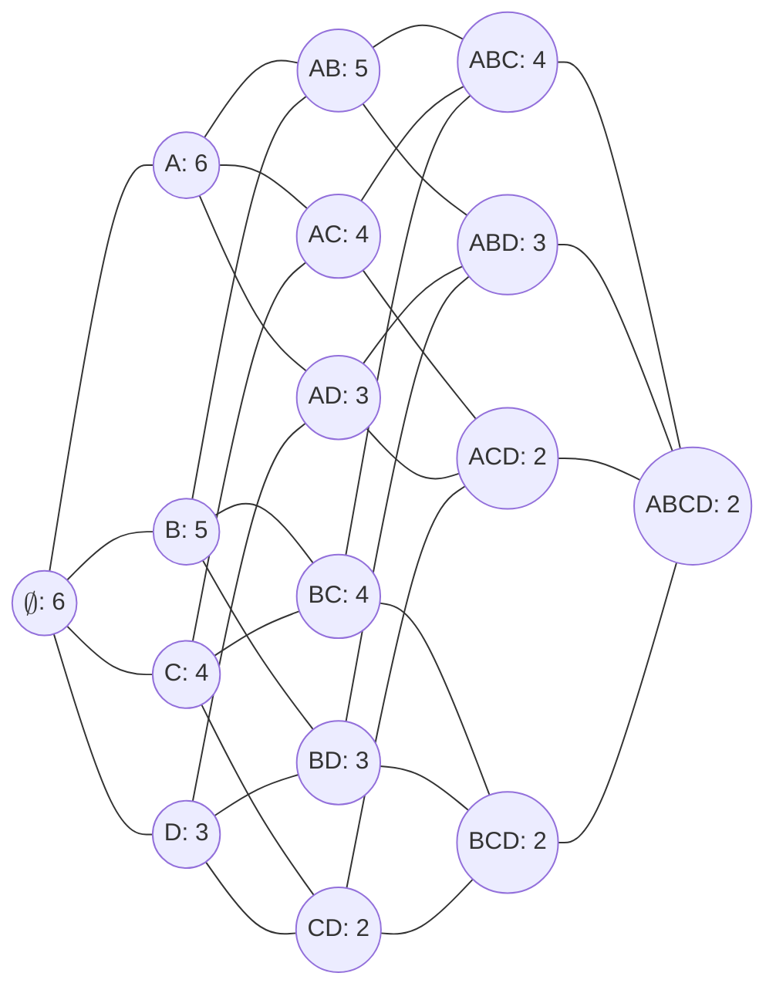
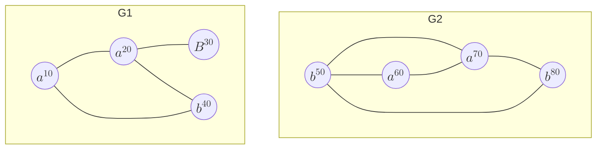

# Prova 1

1. (7 Pontos) Historinha em que uma empresa queria analisar padrões frequentes de compra de produtos. A gerente sugeriu armazenar a quantidade dos itens compradas e o preço de cada item. Um funcionário sugeriu armazenar o preço total da compra e disse que isso faria com que o apriori rodasse com mesma complexidade e sem modificar o código. O que você acha?
2. (10 Pontos) Considerando o seguinte reticulado de itens e $minsup = 3$:
   1. A. Quais seriam os conjuntos fechados encontrados pelo algoritmo SPADE? (?)
   2. B. ?
   3. C. Qual a maior classe de equivalência considerando o número de itens?
   4. D. Como seria a primeira chamada do DCI_Closed?

3. (8 Pontos) Considerando que percorrendo um grafo, passou-se pelos vértices: $C = ((0, 1, a, a, 1), (1, 2, a, b, 1))$, ilustre quais são as expansões possíveis para os seguintes grafos:

