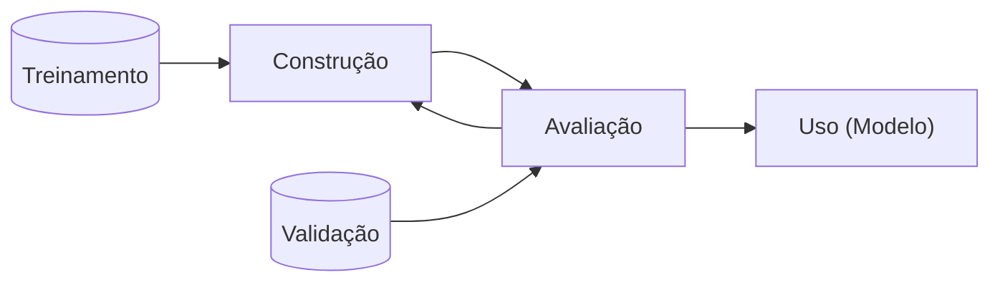

# Slide 1 - aula01-intro - Introdução: aprendizado descritivo x preditivo

## Aula 01 | 18/03/2025 | Apresentação do curso - [JV: Cheguei atrasado]

### Introdução

- Quando falamos sobre aprendizado de máquina e mineração de dados, frequentemente associamos essas expressões a predição de valores
- Mais especificamente, temos a ideia de que aprendizado de máquina (AM) se resume a, dada uma entrada $X$, encontrar uma função $f(X)$ que retorne o valor de uma variável alvo $Y$
  - Quando a variável alvo $Y$ é categórica, chamamos o problema de **classificação**
  - Quando a variável alvo $Y$ é contínua, chamamos o problema de **regressão**
- Assim, o senso comum define AM como aprender uma função $f$ capaz de predizer valores para dados ainda não coletados
- Essa definição, embora restritiva, é correta para a classe de tarefas elencadas acima, chamadas de **aprendizado preditivo**

### Aprendizado Preditivo

- Mais especificamente ainda, esse imaginário popular define o que conhecemos por aprendizado supervisionado de modelos preditivos
- De maneira mais formal, o objetivo dessas técnicas é aprender uma função cujo domínio é um conjunto de instâncias $\mathcal{X}$, e contradomínio um conjunto de saídas $\mathcal{Y}$
- Para tal, o algoritmo recebe um conjunto de pares $(x, l(x)) \in \mathcal{X} \times \mathcal{L}$
  - A função $l(x)$ retorna o valor de saída esperado para a instância x
- Como o algoritmo obtém o modelo guiado por esse conjunto de entrada (treinamento), a tarefa é classificada como 'supervisionada', já que $l(x)$ faz o papel de 'professor'
- Da mesma forma, como o modelo aprendido é usado para predizer valores de saída de novas instâncias, ele é chamado de preditivo

- [JV]
  - O que desejamos é receber informações e conseguir retornar um rótulo.
  - Nem todos de aprendizado de máquina levam em consideração os rótulos.
  - Aprendizado supervisionado preditivo
  - [JV: não anotei sobre o que seria o supervisionado]
  - Se tiver que explicar como funciona, aí é a área de Explanable AI.
  - Aqui é mais importante o resultado do que o processo.

---

- Como queremos que o modelo seja fiel à realidade e, portanto, consiga capturar a relação entre instância (entrada) e saída, é comum, nesse cenário, avaliarmos sua qualidade comparando os valores obtidos com os verdadeiros para um conjunto de instâncias chamado de conjunto de validação
- Ou seja, nesse tipo de tarefa temos o seguinte fluxo de trabalho:

---

- [JV]
  - Aqui, não queremos obter nenhum entendimento sobre o que já vimos antes, mas sim, ter meios de prever como serão classificados os próximos itens que veremos.

---

- Embora métodos de regressão e classificação (aprendizado supervisionado) sejam os mais populares em AM, existem outras abordagens preditivas que não requerem a variável alvo para ajustarem modelos
- Técnicas que não utilizam essas variáveis são classificadas como **não-supervisionadas**
- Uma tarefa de aprendizado não-supervisionado bastante popular é a de agrupamento (clustering)
- Essa tarefa consiste em encontrar subgrupos de elementos homogêneos nos dados

- [JV]
  - Exemplo: câncer de mama
    - Separando mulheres cuja quimioterapia foram eficazes e as que não foram.
    - Analisar quais os mapeamentos genéticos delas
    - Verificar de que forma há uma relação entre os mapeamentos genéticos e a eficácia da quimioterapia.
    - E com isso, tentar predizer se a quimioterapia será eficaz ou não para uma nova paciente.
  - No aprendizado não supervisionado não há rótulos.
  - Uma tarefa de aprendizado não-supervisionado bastante popular é a de agrupamento (clustering)
    - Um dos mais conhecidos é o k-means

---

- Em outras palavras, a tarefa de agrupamento consiste em detectar grupos de instâncias que sejam mais parecidas entre si do que com as de outros grupos
- Sob a ótica de aprendizado preditivo, a tarefa consiste em encontrar uma função $q: \mathcal{X} \rightarrow \mathcal{C}$, cujo domínio $\mathcal{X}$ é um conjunto de instâncias, e o contradomínio 𝒞 um conjunto de grupos (clusters)
- Note que a tarefa se assemelha à de classificação (já que os rótulos dos grupos são categóricos), porém o ajuste do modelo não leva em consideração rótulos pré-definidos
- Um exemplo de método aprendizado preditivo não-supervisionado é o K-Means
  - O modelo são os centroides e a distância euclidiana
  - Novas instâncias são alocadas nos clusters de cujos centroides elas sejam mais próximas de acordo com a distância euclidiana

### Aprendizado Descritivo

- Aprendizado descritivo tem como objetivo central obter uma descrição para os dados
  - Isto é, o objetivo é encontrar um **modelo descritivo** para os dados
- Dessa forma, podemos apontar a primeira diferença para aprendizado preditivo:
  - Não temos mais a necessidade de dividir o conjunto de instâncias em treinamento e validação
- A divisão entre treinamento e validação não faz mais sentido, pois queremos obter um modelo para os dados que temos em mãos
- Consequentemente, a avaliação dos resultados (modelos) se torna mais difícil, já que não temos mais uma 'verdade absoluta' para compararmos as saídas

- [JV]
  - > A premissa é "eu não sei nada sobre os dados", "então preciso encontrar um modelo que descreva os dados"
  - "Estatística não é boa para descrever grafos"
  - O Descritivo é tão importante quanto prever coisas, mas atuam em momentos diferentes.

---

- Por outro lado, segundo Flach (2012), _o aprendizado descritivo leva à descoberta genuína de novos conhecimentos, e, dessa forma, está situado entre as áreas de mineração de dados e aprendizado de máquina_
- O objetivo de se buscar um modelo descritivo dos dados se justifica nas situações em que se quer responder perguntas do tipo “o quê aconteceu?”
- Ou seja, esses modelos descrevem situações passadas e, assim, auxiliam no processo de tomada de decisão

- [JV]

  - O aprendizado descritivo leva a descoberta e novos conhecimentos. Estando entre mineração de dados e aprendizado de máquina.
  - Busca responder "o quê aconteceu?"
  - Descrevem situações passadas e com isso auxiliam no processo de **tomada de decisão**.

  - 4 paradigmas científicos
    - experimental, teórica, computacional e baseada em dados
  - Antes viam o fenômenos, criavam teorias, tentavam provar que as teorias se aplicavam.
  - Atualmente usamos um modelo baseado em dados
    - Veem como os dados se comportam, criam teorias e tentam provar que os dados se comportam de acordo com a teoria.

---

- Considere a seguinte situação em que um grande _Market place_ deseja reduzir os custos de distribuição dos produtos que ele vende
- Uma prática muito utilizada atualmente é manter centros de distribuição regionais para estocar produtos vendidos frequentemente, reduzindo o custo e tempo de transporte, e, consequentemente, aumentando a satisfação dos clientes
- Apesar da estocagem de produtos populares nas regionais ser uma decisão trivial, ela pode ser aprimorada analisando-se o histórico de vendas
- Nesse histórico, podemos encontrar itens menos populares que, com certa frequência, são adquiridos junto com os mais populares

  - Isso nos permite decidir estocar também esses produtos menos populares, em menor quantidade, mas evitando, assim, um custo maior de se enviar tais produtos individualmente de centros mais distantes

- [JV]
  - Uma das coisas feitas nessa disciplina é a busca por regularidades de acontecimentos em conjuntos.
  - Há uma interseção bem grande entre Aprendizado Descritivo e Mineração de Dados.

---

- Considere um segundo caso real em que executivos do Wal-Mart utilizaram de AM para aumentar as vendas diante da ameaça do furação Frances em 2004
- Enquanto o furacão atravessava o Caribe, os executivos queriam prever os produtos que seus clientes consumiam diante de catástrofes
- Imagem: [What Wal-Mart Knows About Customers' Habits](https://www.nytimes.com/2004/11/14/business/yourmoney/what-walmart-knows-about-customers-habits.html)

- [JV]
  - > What Wal-Mart knows about Customers' Habits
  - Eles avaliaram de que forma os usuários se comportavam em relação a desastres naturais e o que compravam nas cidades que seriam afetadas.
    - A decisão trivial era considerar que faria sentido estocar pilha, água mineral, lanterna e produtos não específicos.
    - Eles descobriram que houve um aumento de 7x nas vendas de Pop Tarts sabor morango, e o campeão dos aumentos foi a cerveja.
    - Nessa situação eles mais queriam descrever o passado do que predizer o futuro.
  - Embora seja abordado como preditivo, na prática seria um exemplo de aprendizado descritivo supervisionado.
  - Exceptional Model Mining
    - Busca-se encontrar quais conjuntos de itens são não-usualmente comprados quando algum evento ocorre.

**Dúvida:** Como fazer para discernimos se um aumento, como no caso do Pop Tarts foi de fato devido aos furacões ou se calhou de, nesses dois mesmos intervalos de tempo, foram veiculados anúncios desse produto; sendo então apenas uma coincidência?

**Resposta:** Dá para tentar refinar a forma de análise e o cálculo da função objetivo. Porém, devido ao caráter qualitativo, é difícil de se ter certeza de que essa atipicidade nessa busca por padrões atípicos sejam separados.

---

- O objetivo dos executivos do Wal-Mart era abastecer as lojas da Flórida, que estava no caminho do furacão, e assim aumentar as vendas
- Novamente, a decisão trivial seria aumentar o estoque de pilhas, água mineral, lanternas, e produtos não perecíveis
- A análise do histórico de vendas, nesse caso, poderia retornar que as lojas venderam todo o estoque de DVDs de um gênero específico de filmes
- No entanto, ao analisar os dados, eles chegaram à conclusão de que havia um aumento de 7x nas vendas de Pop Tarts sabor morango, e o campeão do aumento de vendas era cerveja

---

- Apesar do caso ter sido abordado como um exemplo de aprendizado preditivo na matéria, ele é um exemplo claro de aprendizado descritivo supervisionado
- Especificamente, ele é um caso claro da aplicação de excepcional model mining
  - Queremos encontrar padrões de vendas não usuais, isto é, detectar aumento da venda de produtos que esteja correlacionado positivamente a um evento de interesse
- O único porém é que essa tarefa foi inicialmente proposta somente em 2008, 4 anos após o evento!

### Aprendizado Descritivo X Preditivo

- Os exemplos ilustram bem a aplicabilidade do aprendizado descritivo:
  - Como dito, eles revelam o que ocorreu no passado e auxiliam na tomada de decisão de eventos futuros
- De forma análoga, os modelos preditivos utilizam dados históricos para prever o comportamento de dados futuros
- Note que a diferença, portanto, é bem tênue entre as duas abordagens
  - A diferença mais aparente é a intervenção humana no primeiro, contra um certo automatismo da segunda

---

- Um exemplo dessa diferença tênue entre as duas abordagens é justamente a tarefa de agrupamento
- Incialmente apresentamos clustering como uma tarefa de aprendizado preditivo não-supervisionado
- A mesma tarefa, porém, pode ser apresentada como descritiva
- O objetivo no agrupamento descritivo é obter uma função $q: \mathcal{D} \to \mathcal{C}$, que mapeia as instâncias coletadas no conjunto de dados $\mathcal{D}$ a grupos específicos (clusters) $\mathcal{C}$
  - A diferença aqui é que assumimos como domínio apenas o conjunto de instâncias em mãos, e não toda população de instâncias possíveis
  - Ou seja, o resultado do nosso agrupamento é 'apenas' uma divisão das instâncias em grupos, permitindo a análise de similaridade entre elas; não estamos interessados em alocar novas instâncias aos grupos encontrados

---

[Imagem: Agrupamento preditivo//Agrupamento Descritivo]

- [JV]
  - No modelo Preditivo, tenta-se definir limites para que próximos itens sejam classificados de acordo com o que foi visto anteriormente.
  - Já no Descritivo, tenta-se encontrar padrões que descrevam o que foi visto anteriormente.

---

- Considere agora um exemplo mais relacionado ao segundo estudo de caso discutido anteriormente
- Suponha que nosso conjunto de entrada rotulado seja o seguinte
- Podemos traçar dois objetivos aqui:
  - Separar círculos de quadrados, para classificar novos pontos como um ou outro
  - Buscar padrões nos dados para entender as diferenças entre círculos e quadrados

[Imagem: Distribuição de quadrados azuis e círculos vermelhos]

- [JV]
  - No exemplo apontado pode-se separar as distribuições dos pontos em 4 quadrantes, isso baseado na estimativa do que já ocorreu antes, busca então estimar onde estarão posicionados os quadradinhos azuis e as bolinhas vermelhas.
  - É importante também identificar quais são as regularidades existentes em certos padrões irregulares.

---

- O primeiro objetivo induz uma abordagem preditiva
- Logo, o abordamos como um problema de classificação
- [Imagem 1: árvore de alguma coisa]
- [Imagem 2: Distribuição dos pontos]

- [JV] Às vezes usa-se o mesmo modelo entre preditivo e descritivo, porém, um pra descrever e o outro pra predizer.

---

- O segundo objetivo induz a uma abordagem descritiva
- Logo, abordamos o problema como uma tarefa de descoberta de subgrupos
- [Imagem: Definindo grupo independente]
  - $\sigma_1 \equiv x_1 \in [0.3, 0.7) \wedge x_2 \geq 0.9$
  - $\sigma_2 \equiv x_1 \in [0.275, 0.7) \wedge x_2 \leq 0.1$

---

- Esse último exemplo mostra uma característica que frequentemente diferencia as duas abordagens
- As abordagens preditivas buscam ajustar modelos que aprendam as regularidades globais dos dados
  - No exemplo, encontrar as fronteiras que separam círculos de quadrados
- As abordagens descritivas, por outro lado, ajustam modelos que aprendam regularidades locais dos dados, i.e., padrões válidos apenas a subgrupos específicos
  - No exemplo, intervalos das variáveis que descrevem subgrupos com uma distribuição não usual de círculos e quadrados Leitura

### Leitura - Aula 01

- Capítulo 3, Flach (2012)

### Comentários sobre o curso

- Nesse curso busca-se a parte teoria dos algoritmos, não necessariamente em sua aplicação.
- Ela é teórica, densa em algoritmo, e a aplicação em código é mínimo.
- Busca-se "botar uma lupa" sobre a descoberta de padrões.
- A primeira parte será toda não-supervisionada.
- A busca de padrões em grafos pode ser usada na área de fármacos para encontrar quais sub-estruturas são as mais frequentes em determinados remédios para determinada infermidade?
- A segunda parte será de aprendizado supervisionado.
- Por volta de 20 de maio tem uma prova.
- Haverá um tipo de "roleplaying" das atividades. Ele separou as salas em 8 grupos. Um grupo era o
  - "historiador" (buscava entender qual era o contexto), o outro era o
  - "metodologista" (tentava entender como o algoritmo funcionava),
  - "Aplicações", "Coletar as apresentações e redigir", "Publicar o resumo em um site da turma". O
  - "hacker" é quem busca os códigos existentes, tenta entender, fazer funcionar e documentar como fez funcionar.
- "Daqui para baixo é a parte mais recente, talvez mais pós graduação, ou coisas que não estão nos livros".
- Cada grupo vai rotacionar em cada uma das tarefas. Serão 9 artigos no total que leremos.
- Os Seminários (aplicações), veremos de fato aplicações
- O que ele quer com o projeto? Uma interação maior com o professor. A parte mais prática da disciplina.
- Na parte de ... será o ... que foi quem inventou.
- Na parte de supervisionado: Sebastian Ventura e José Maria Luna 2018; Guozhu Dong and James Bailey 2012;
