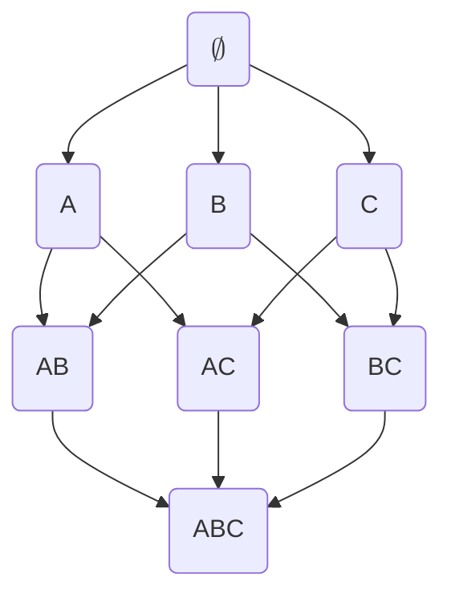

# Slide - aula02-FIM - Mineração de Itens Frequentes

## Aula 02 | 20/03/2025 | Aprendizado descritivo x preditivo

### Introdução - Aula 2

- Hoje iremos focar num dos modelos mais conhecidos de aprendizado descritivo: mineração de regras de associação
- O problema foi inicialmente proposto pelos executivos do Wal-Mart para descoberta de padrões de consumo nos supermercados
- Por essa razão, muitas vezes a área é também conhecida, sobretudo em inglês, como _Market basket analysis_
- Contudo, diversas aplicações podem tirar proveito desse tipo de modelo
- Antes de entrarmos nos detalhes técnicos, vamos analisar um estudo de caso

---

- Kosinski et al. (2013), um grupo de pesquisadores da Universidade de Cambridge, coletaram dados sobre a personalidade e gostos de usuários do Facebook através do aplicativo MyPersonality
- O objetivo do trabalho foi demonstrar que 'curtidas' do Facebook poderiam ser usadas -ara predizer com acurácia informações sensíveis dos usuários
- O app posteriormente foi relacionado ao escândalo do Cambridge Analytica; e os dados em si são carregados de controvérsia
- Embora seja um exemplo negativo, ele ilustra bem a utilidade da tarefa que estudaremos hoje

- [JV]
  - Kosinski (2013) coletavam dados das personalidades através do MyPersonality.
    - Escândalo do Cambridge Analytica
  - Buscava predizer a personalidade baseado nas curtidas feitas no Facebook

---

- Em resumo, os desenvolvedores do app coletaram uma série de dados de voluntários, mas, em particular suas 'curtidas' no site
- Provost e Foster (2013) utilizaram esses dados para demonstrar como a modelagem descritiva traz informações úteis
- Seguem alguns exemplos de regras:

- [JV]
  - Provost e Foster (2013) utilizaram os dados para demonstrar a modelagem descritiva e as informações úteis.
  - Alguns exemplos de regras:
    - Selena Gomez $\to$ Demi Lovato
      - $Support=0.010; Strength=0.419; Lift=27.59; Leverage=0.0100$
    - Linking Park & Disturbed & System of a Down & Korn $\to$ Slipknot
      - $Support=0.011; Strength=0.862; Lift=25.50; Leverage=0.0107$
    - SpongeBob SquarePants & Converse [JV: empresa do All Stars] $\to$ Patrick Star
      - $Support=0.010; Strength=0.654; Lift=24.94; Leverage=0.0097$
    - Skittles & Mountain Dew $\to$ Gatorade
      - $Support=0.010; Strength=0.519; Lift=25.23; Leverage=0.0100$

[JV: Offtopic: o diretor da Google daqui fez doutorado no PPGCC]

---

- Note que a ideia de itens em uma cesta de compras da aplicação original pode ser generalizada para itens virtuais
- O objetivo aqui é encontrar co-ocorrências de itens de análise que sejam interessantes
- O exemplo traz novamente padrões de consumo
  - Majoritariamente de consumo de músicas, mas, como intencionado pelo estudo original, revela traços de personalidade dos usuários
- Respeitados os limites éticos e legais, essas informações são úteis em diversos contextos: campanhas de marketing, desenvolvimento de produtos, ...

- [JV]
  - A ideia de itens em cesta de compra pode ser generalizada para itens virtuais
  - Busca-se encontrar co-ocorrências de itens de análise
  - Dados os limites éticos, pode-se usar essa análise para se atingir diversos objetivos.

### Itemset e Tidsets

- Chamamos os elementos do conjunto $I = \lbrace x_1, x_2, \dots, x_m \rbrace$ de itens
- Esses elementos são as variáveis de análise que estamos considerando
- Um conjunto $X \subseteq I$ é chamado de _itemset_
- Um itemset de tamanho $k$ é chamado de k-itemset
- Denotamos o conjunto de todos os k-itemsets por $I^{(k)}$
- Similarmente, como estamos lidando com 'transações', vamos identificá-las individualmente por IDs, que serão chamados de tids
- Logo, o conjunto $T = \lbrace t_1, t_2, \dots, t_n \rbrace$ é o conjunto de transações consideradas, identificadas pelos seus respectivos tids

- [JV]
  - Os "produtos" da cesta de compras são chamados de "Itens".
    - $I = \lbrace x_1, x_2, \dots, x_m \rbrace$
  - Esses elementos serão as **variáveis de análise**
  - Um conjunto $X \subseteq I$ é chamado de **Itemset**
  - Um itemset de tamanho $k$ é chamado de **k-itemset**
  - Denotamos o conjunto de todos os **k-itemsets** por $I^(k)$
  - Todas as "Transações" serão identificadas por IDs, ou então, **TID** (Transaction ID)
  - O conjunto $T = \lbrace t_1, t_2, \dots, t_n \rbrace$ é o conjunto das transações.

---

- O conjunto $Y \subseteq T$ é chamado de _tidset_
- É conveniente assumir que tanto os itemsets quanto os tidsets são sempre armazenados ordenados pela ordem lexicográfica dos itens e transações (seja ela qual for)
- Cada transação consiste de um identificador (tid) e um conjunto de itens
  - Ou seja, cada transação é um par $(t, X)$ em que $t \in T$ e $X \subseteq I$
- Formalmente, um conjunto de dados será uma tripla $(T, I, D)$

  - T e I são os conjuntos de tids e itens
  - $D \subseteq T \times I$ é uma relação binária em que $(t, i) \in D \leftrightarrow i \in X$ na transação $(t, X)$
  - Dizemos que a transação $t$ **contém** o item $i$

- [JV]
  - O Conjunto $Y \subseteq T$ é chamado de **Tidset**
  - É válido assumir que _itemsets_ e _tidsets_ são ordenados por ordem lexicográfica dos itens e transações. (Não importa qual ordem, mas estão de algum modo ordenados)
  - Cada transação consiste de um identificador (TID) e um conjunto de itens
    - Então, cada transação é um par $(t, X)$ em que $t \in T$ e $X \subseteq I$
  - Formalmente, um conjunto de dados será uma tripla $(T, I, D)$
    - T: Transações ou objetos
    - I: Atributos ou itens
    - D: Relação binária entre eles.
    - $T$ e $I$ são os conjuntos de tids e itens
    - $D \subseteq T \times I$ é a relação binária em que $(t, i) \in D$...

---

- Podemos estender a definição também para conjuntos de itens
- Dizemos que $t$ contém um itemset X sse $\forall i \in X (t, i) \in D$

- Exemplo:
  - $I = {muesli, oats, milk, yoghurt, biscuits, tea}$
  - $T = {1,2,3,4,5,6}$
  - $(1, {muesli, milk, yoghurt, tea})$
  - 5 contém ${milk, tea}$
- [JV] Ou seja: $t$ contém $X$ se $|X - t| = 0$

| TID | Muesli | Oats | Milk | Yoghurt | Biscuits | Tea |
| --: | -----: | ---: | ---: | ------: | -------: | --: |
|   1 |      1 |    0 |    1 |       1 |        0 |   1 |
|   2 |      0 |    1 |    1 |       0 |        0 |   0 |
|   3 |      0 |    0 |    1 |       0 |        1 |   1 |
|   4 |      1 |    0 |    0 |       1 |        0 |   0 |
|   5 |      0 |    1 |    1 |       0 |        0 |   1 |
|   6 |      1 |    0 |    1 |       0 |        0 |   1 |

---

- Dado um itemset $X$, podemos querer saber o conjunto de transações que o contém.
- Esse conjunto é chamado de **extensão** ou **cobertura** de $X$
- Ele é definido pela seguinte função:
  - $c: P(I) \to P(T)$
  - $c(X) = \lbrace t \in T | \forall i \in X(t, i) \in D \rbrace$
- Dado um tidset Y, podemos querer saber o maior conjunto de itens comuns às transações de Y.
- Esse conjunto é chamado de **intensão** (Não é intenção!) de Y.
- Ele é definido por

  - $i: P(T) \to P(I)$
  - $i(Y) = \lbrace x \in I | \forall t \in Y(t, x) \in D \rbrace$

- [JV] O uso de extensão e intensão vêm da ideia filosófica e semiótica de que a extensão é o conjunto de coisas que se encaixam em uma definição, enquanto a intensão é a definição em si.

---

- Exemplos:
  - $i(\lbrace 1, 5, 6 \rbrace) = \lbrace milk, tea \rbrace$
  - $c(\lbrace milk, tea \rbrace) = \lbrace 1, 3, 5, 6 \rbrace$
  - $c(\lbrace muesly, oats \rbrace) = ?$
  - $i({4, 5}) = ?$

| TID | Muesli | Oats | Milk | Yoghurt | Biscuits | Tea |
| --: | -----: | ---: | ---: | ------: | -------: | --: |
|   1 |      1 |    0 |    1 |       1 |        0 |   1 |
|   2 |      0 |    1 |    1 |       0 |        0 |   0 |
|   3 |      0 |    0 |    1 |       0 |        1 |   1 |
|   4 |      1 |    0 |    0 |       1 |        0 |   0 |
|   5 |      0 |    1 |    1 |       0 |        0 |   1 |
|   6 |      1 |    0 |    1 |       0 |        0 |   1 |

- [JV]
  - **Intensão:** conjunto de itens comuns a todos os elementos de um determinado conjunto de transações.
  - **Extensão:** o conjunto de transações que contenham um determinado conjunto de itens.
  - **Intensão:** a interseção das linhas
  - **Extensão:** a interseção das colunas

### Representações de conjuntos de dados

- As funções de intensão e cobertura permitem representar de diferentes formas a definição de conjunto de dados apresentada anteriormente
- Por exemplo, podemos enxergar o conjunto de dados como um conjunto de transações e suas respectivas intensões
  - Ou seja, ele é um conjunto de $(t, i(t))$
  - Essa representação é chamada de **horizontal**
- Similarmente, podemos enxergar o conjunto de dados como um conjunto de itens e suas coberturas
  - Ou seja, como um conjunto de $(x, c(x))$
  - Essa representação é chamada de **vertical**

---

- Horizontal

| **t** |                   **i(t)** |
| ----: | -------------------------: |
|     1 | Muesli, Milk, Yoghurt, Tea |
|     2 |                 Oats, Milk |
|     3 |        Milk, Biscuits, Tea |
|     4 |            Muesli, Yoghurt |
|     5 |            Oats, Milk, Tea |
|     6 |          Muesli, Milk, Tea |

|    **t** | 1                          | 2          | 3                   | 4               | 5               | 6                 |
| -------: | -------------------------- | ---------- | ------------------- | --------------- | --------------- | ----------------- |
| **i(t)** | Muesli, Milk, Yoghurt, Tea | Oats, Milk | Milk, Biscuits, Tea | Muesli, Yoghurt | Oats, Milk, Tea | Muesli, Milk, Tea |

- Vertical

|    **x** |  Muesli | Oats |          Milk | Yoghurt | Biscuits |        Tea |
| -------: | ------: | ---: | ------------: | ------: | -------: | ---------: |
| **t(x)** | 1, 4, 6 | 2, 5 | 1, 2, 3, 5, 6 |    1, 4 |        3 | 1, 3, 5, 6 |

|    **x** |      **t(x)** |
| -------: | ------------: |
|   Muesli |       1, 4, 6 |
|     Oats |          2, 5 |
|     Milk | 1, 2, 3, 5, 6 |
|  Yoghurt |          1, 4 |
| Biscuits |             3 |
|      Tea |    1, 3, 5, 6 |

### Conjuntos de itens frequentes e Regras de Associação

- A identificação de regras tais como as que vimos no exemplo no início da aula, em geral, envolvem duas etapas
  - Mineração de conjuntos de itens frequentes
  - Descoberta de regras de associação interessantes
- A primeira parte é computacionalmente mais intensa e, por esta razão, é a que recebeu mais atenção dos pesquisadores
- Por isso, vamos inicialmente nos concentrar nessa tarefa

### Mineração de Conjuntos de itens frequentes

- Uma das visões sobre o que seria uma regra interessante é que ela deve ocorrer com certa frequência, ou seja, ela não ocorre simplesmente por chance
- Isso implica que o analista deve definir o limiar para separar o que é frequente e infrequente
  - Esse limiar é chamado de suporte mínimo ($minsup$)
- O **suporte** de um itemset é o tamanho de sua cobertura
  - $sup(X) = |c(X)|$
- Como essa definição é dependente do contexto, admite-se também a definição do **suporte relativo**

  - $rsup(X) = |c(X)| / |T|$

- [JV] Uma definição de "regra interessante" é ela ocorrer com certa frequência.

---

- Dessa forma, dizemos que um itemset é frequente sse $sup(X) \geq minsup$
- Exemplos, considerando $minsup=2$:
  - $\lbrace milk \rbrace; sup(\lbrace milk \rbrace) = 5$
  - $\lbrace milk, tea \rbrace; sup(\lbrace milk, tea \rbrace) = 4$
  - $\lbrace muesli, oats, milk \rbrace$?
  - $\lbrace muesli, milk \rbrace$?

| TID | Muesli | Oats | Milk | Yoghurt | Biscuits | Tea |
| --: | -----: | ---: | ---: | ------: | -------: | --: |
|   1 |      1 |    0 |    1 |       1 |        0 |   1 |
|   2 |      0 |    1 |    1 |       0 |        0 |   0 |
|   3 |      0 |    0 |    1 |       0 |        1 |   1 |
|   4 |      1 |    0 |    0 |       1 |        0 |   0 |
|   5 |      0 |    1 |    1 |       0 |        0 |   1 |
|   6 |      1 |    0 |    1 |       0 |        0 |   1 |

---

- O espaço de busca do problema é o conjunto potência do conjunto de itens
- Se considerarmos a relação de subconjuntos como uma relação de ordem parcial, temos que o espaço de busca é estruturado como um reticulado
  - Esse reticulado pode ser visualizado como um grafo, onde somente as relações diretas são representadas
  - Ou seja, se $A \subseteq B \wedge |A| = |B| - 1$, então existe uma aresta entre A e B no diagrama
- Assim, a mineração de conjunto de itens frequentes é resolvida por uma 'simples' busca no reticulado associado
- Essa busca pode ser tanto uma busca em largura quanto em profundidade
  - De fato, existem abordagens baseadas em ambas as buscas
- No entanto, a maioria das abordagens compartilham a mesma estrutura de busca:

  - Identificam candidatos navegando o espaço de busca
  - Computam o suporte desses candidatos, descartando os infrequentes

- [JV]
  - Relação de ordem parcial: $X \subseteq Y \leftrightarrow X \leq Y$
  - **Conjunto potência:** é o conjunto de todos os possíveis subconjuntos de um conjunto.

- [JV]
  - O espaço de busca do problema é o conjunto potência do conjunto de itens
  - Se considerarmos a relação de subconjuntos como uma relação de ordem parcial, temos que o espaço de busca é estruturado como um reticulado
    - Esse reticulado pode ser visualizado como um grafo, onde somente as relações diretas são representadas
    - Ou seja, se $A \subseteq B \land |A| = |B| - 1$, então existe uma aresta entre A e B no diagrama
  - Aquele diagrama explica bastante o que que isso quis dizer. Basicamente, no conjunto potência, cada nível vai ter um elemento a mais que o nível anterior.

### Algoritmo Ingênuo

- Vamos considerar uma abordagem ingênua para a mineração de itens frequentes, antes de explorarmos outros mecanismos
- Independentemente da escolha da forma de busca, devemos enumerar os possíveis candidatos, e, em seguida, computar seu suporte
- Especificamente, devemos enumerar cada itemset possível; e depois verificar no conjunto de dados quais transações contêm esse itemset

---

Complexidade do algoritmo: $O(2^I \cdot T \cdot I)$

- **ALGORITHM 8.1. Algoritm BruteForce**

  - **BruteForce** $(D, \mathcal{I}, minsup)$:

    - $\mathcal{F} \gets \emptyset$ // set of frequent itemsets
    - **foreach** $X \subseteq \mathcal{I}$ **do**
      - $sup(X) \gets ComputeSupport (X, D)$
      - **if** $sup(X) \geq minsup$ **then**
        - $\mathcal{F} \gets \mathcal{F} \cup {(X, sup(X))}$
    - **return** $\mathcal{F}$

  - **ComputeSupport** $(X, D)$:
    - $sup(X) \gets 0$
    - **foreach** $\langle t, i(t) \rangle \in D$ **do**
      - **if** $X \subseteq i(t)$ **then**
        - $sup(X) \gets sup(X) + 1$
  - **return** $sup(X)$

---

- A computação do suporte de um itemset requer uma passada sobre o conjunto de dados, ou seja, requer tempo $O(|T|)$
- Verificar se uma dada transação contém um itemset requer tempo $O(|I|)$
- Portanto, o custo total de computação do suporte é $O(|I \cdot T|)$
- O espaço de busca, por sua vez, é o conjunto potência de $I$. Logo, a complexidade do algoritmo ingênuo é $O(2^I \cdot I \cdot T)$

---

- A complexidade do espaço de busca é inerente ao problema. Contudo o algoritmo é ineficiente mesmo em espaços pequenos
- Note que o conjunto de dados não é mantido em memória, portanto a computação do suporte torna o algoritmo impraticável
- Os algoritmos mais "sofisticados" atacam majoritariamente o problema de computação de suporte, evitando computações desnecessárias, e/ou adotando estratégias mais eficientes para computá-lo.
- [JV] Então temos dois problemas principais: reduzir o espaço de busca e reduzir a complexidade para calcular o suporte.

### Leitura - Aula 02

- Seções 8.1 e 8.2 Zaki e Meira
- Seções 6.1 e 5.2 (Introduction to Data Mining)
