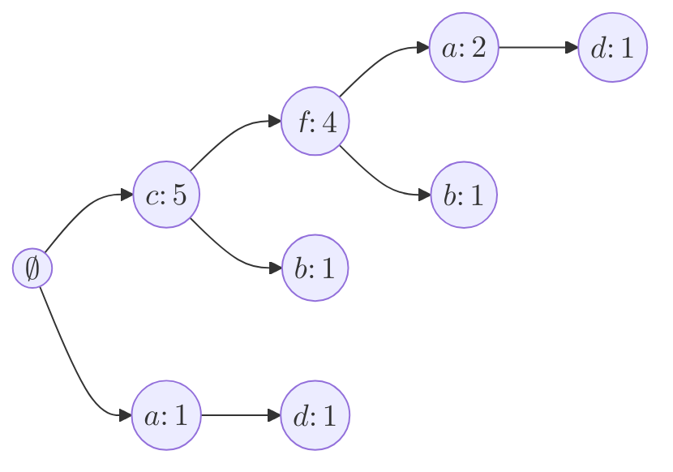

# Slide: aula04-FPGrowth (Aula 5, 6)

## Aula 05 | 01/04/2025 | Mineração de conjuntos de itens

### Recapitulando (Aula 05)

- Apriori: reduzir o número de passadas em disco
- Eclat: trazer pra memória e assim reduzir o número de passadas em disco, tendendo a zero.

### Introdução (Aula 05)

- Nessa aula, veremos outro algoritmo que usa projeções para reduzir o número de passadas para computação dos conjuntos de itens frequentes
- O algoritmo FP-Growth (Frequent Pattern Growth) adota uma estratégia dividir-e-conquistar para reduzir o custo computacional
- Ele, ao contrário do Apriori, não se baseia na geração de candidatos
- Os padrões são construídos ao longo do processamento em profundidade
- Esse algoritmo é, talvez, o algoritmo sequencial mais eficiente para busca de conjuntos de itens frequentes

- [JV] A ideia é evitar ter que computar os candidatos.

### FP-Growth

- O FP-Growth foi proposto em 2000 por Jiawei Han, Jian Pei e Yiwen Yin
- O algoritmo atacou dois problemas presentes nas abordagens iniciais:
  1. Repetidas passadas sobre a base de dados; e
  2. Geração de candidatos [Mais crítico]
- O primeiro problema, como já discutimos, é crítico pelo custo computacional inerente à leitura em memória secundária
- O segundo problema está relacionado à geração de candidatos desnecessários
  - Muitos são descartados pela propriedade do Apriori

#### FP-Tree [Árvore de Prefixos]

- O FP-Growth possui algumas similaridades ao Eclat:
  - Ambos adotam a estratégia de busca em profundidade
  - Ambos adotam projeções dos dados com o intuito de trazê-los para memória principal e reduzir o custo computacional
- O FP-Growth, no entanto, usa uma estrutura de dados diferente para suportar a busca pelos padrões
  - Uma árvore de prefixos chamada FP-Tree
- A busca pelos padrões se dá inteiramente através da árvore sem a necessidade de se voltar à base de dados
- Dessa forma, a primeira tarefa do algoritmo é construir essa estrutura

"A partir da Base de Dados, como fazer a árvore de prefixos?"

---

- A construção da FP-Tree ocorre em duas fases
- Primeiro, o algoritmo varre a base de dados para computar a frequência individual de cada item
  - Itens infrequentes são descartados, uma vez que não podem formar padrões frequentes
- Segundo, o algoritmo percorre novamente a base processando as transações ordenadas pela frequência dos itens
  - Os itens nas transações são ordenados em ordem decrescente de frequência e os infrequentes são filtrados
- As transações são então inseridas na árvore enquanto processadas

  - Itens são nós da árvore
  - Cada nó armazena um item e sua frequência (número de transações que o contém)

- [JV] Basicamente, ele limpa os infrequentes, e depois disso, vai inserindo as transações em uma árvore.

---

- Para facilitar a busca pelos padrões, a árvore é equipada com uma estrutura adicional para localizar a ocorrência dos itens e sua frequência
- Exemplo

| **TID** | **Muesli (a)** | **Oats (b)** | **Milk (c)** | **Yoghurt (d)** | **Biscuits (e)** | **Tea (f)** |
| :------ | :------------: | :----------: | :----------: | :-------------: | :--------------: | :---------: |
| 1       |       1        |      0       |      1       |        1        |        0         |      1      |
| 2       |       0        |      1       |      1       |        0        |        0         |      0      |
| 3       |       0        |      0       |      1       |        0        |        1         |      1      |
| 4       |       1        |      0       |      0       |        1        |        0         |      0      |
| 5       |       0        |      1       |      1       |        0        |        0         |      1      |
| 6       |       1        |      0       |      1       |        0        |        0         |      1      |

- [JV]
  - $minsup = 2$
  - Em ordem de maior suporte pra menor suporte: $cfabd$
    1. cfad
    2. cb
    3. cf
    4. ad
    5. cfb
    6. cfa
  - Obs.: Ignoram-se os itens infrequentes.

### Mineração dos padrões [Aula 05]

- A mineração dos padrões se inicia uma vez que a FP-Tree tenha sido construída
- A construção agora ocorre aumentando-se prefixos dos padrões em ordem crescente de suporte
- As transações que satisfaçam (contém) o padrão sendo construído são projetadas em uma nova árvore
  - Itens podem se tornar infrequentes nessa nova base e são descartados
- Os padrões encontrados nessa nova árvore devem incluir o prefixo que a gerou
- O algoritmo segue com as extensões recursivamente até que um único ramo seja obtido

  - Se a árvore possui um único ramo, os padrões obteníveis são todas as combinações dos nós

- [JV]
  - Para se minerar as transações de volta, percorremos a lista de itens e então subimos dele até a raiz.
  - Partindo do item menos frequente e indo pro item mais frequente, fazemos projeções da árvore.
  - Essas projeções são sub-árvores da árvore original.
  - No caso do d, percorrerei todos os nós da lista encadeada de de d's, indo dele até a raiz. A junção de todos os nós que eu passar, formará uma nova árvore. E essa será a projeção do item d.
  - Mas ainda não entendi o que precisa ser feito após essa primeira projeção.

---

- Exemplo

$$
\begin{bmatrix}
  Item & Freq & Link \\
  c & 5 & \\
  f & 4 & \\
  a & 3 & \\
  b & 2 & \\
  d & 2 & \\
\end{bmatrix}
$$

- [JV]
  - Há também uma lista encadeada para todos os nós com ocorrências de um mesmo item.
  - A lista encadeada serve para podermos percorrer todos os nós de um mesmo item e calcularmos sua frequência.

### Continua na próxima aula

## Aula 06 | 03/04/2025 | Mineração de conjuntos de itens

### FP-Growth (Aula 06)

- O FP-Growth foi proposto em 2000 por Jiawei Han, Jian Pei e Yiwen Yin
- O algoritmo atacou dois problemas presentes nas abordagens iniciais:
  1. Repetidas passadas sobre a base de dados; e
  2. Geração de candidatos [Mais crítico]
- O primeiro problema, como já discutimos, é crítico pelo custo computacional inerente à leitura em memória secundária
- O segundo problema está relacionado à geração de candidatos desnecessários
  - Muitos são descartados pela propriedade do Apriori

#### FP-Tree [Árvore de Prefixos] (Aula 06)

- O FP-Growth possui algumas similaridades ao Eclat:
  - Ambos adotam a estratégia de busca em profundidade
  - Ambos adotam projeções dos dados com o intuito de trazê-los para memória principal e reduzir o custo computacional
- O FP-Growth, no entanto, usa uma estrutura de dados diferente para suportar a busca pelos padrões
  - Uma árvore de prefixos chamada FP-Tree
- A busca pelos padrões se dá inteiramente através da árvore sem a necessidade de se voltar à base de dados
- Dessa forma, a primeira tarefa do algoritmo é construir essa estrutura

- [JV] "A partir da Base de Dados, como fazer a árvore de prefixos?"

---

- A construção da FP-Tree ocorre em duas fases
- Primeiro, o algoritmo varre a base de dados para computar a frequência individual de cada item
  - Itens infrequentes são descartados, uma vez que não podem formar padrões frequentes
- Segundo, o algoritmo percorre novamente a base processando as transações ordenadas pela frequência dos itens
  - Os itens nas transações são ordenados em ordem decrescente de frequência e os infrequentes são filtrados
- As transações são então inseridas na árvore enquanto processadas

  - Itens são nós da árvore
  - Cada nó armazena um item e sua frequência (número de transações que o contém)

- [JV] Basicamente, ele limpa os infrequentes, e depois disso, vai inserindo as transações em uma árvore.

---

- Para facilitar a busca pelos padrões, a árvore é equipada com uma estrutura adicional para localizar a ocorrência dos itens e sua frequência
- Exemplo

| **TID** | **Muesli (a)** | **Oats (b)** | **Milk (c)** | **Yoghurt (d)** | **Biscuits (e)** | **Tea (f)** |
| :------ | :------------: | :----------: | :----------: | :-------------: | :--------------: | :---------: |
| 1       |       1        |      0       |      1       |        1        |        0         |      1      |
| 2       |       0        |      1       |      1       |        0        |        0         |      0      |
| 3       |       0        |      0       |      1       |        0        |        1         |      1      |
| 4       |       1        |      0       |      0       |        1        |        0         |      0      |
| 5       |       0        |      1       |      1       |        0        |        0         |      1      |
| 6       |       1        |      0       |      1       |        0        |        0         |      1      |

### Mineração dos padrões [Aula 05] (Aula 06)

- A mineração dos padrões se inicia uma vez que a FP-Tree tenha sido construída
- A construção agora ocorre aumentando-se prefixos dos padrões em ordem crescente de suporte
- As transações que satisfaçam (contém) o padrão sendo construído são projetadas em uma nova árvore
- Itens podem se tornar infrequentes nessa nova base e são descartados
- Os padrões encontrados nessa nova árvore devem incluir o prefixo que a gerou
- O algoritmo segue com as extensões recursivamente até que um único ramo seja obtido
  - Se a árvore possui um único ramo, os padrões obteníveis são todas as combinações dos nós

---

- Exemplo

$$
\begin{bmatrix}
  Item & Freq & Link \\
  c & 5 & \\
  f & 4 & \\
  a & 3 & \\
  b & 2 & \\
  d & 2 & \\
\end{bmatrix}
$$

- [JV]

  - Há também uma lista encadeada para todos os nós com ocorrências de um mesmo item.
  - A lista encadeada serve para podermos percorrer todos os nós de um mesmo item e calcularmos sua frequência.

- [JV] Explicação do Algoritmo
  - Para se minerar as transações de volta, percorremos a lista de itens e então subimos dele até a raiz.
  - Partindo do item menos frequente e indo pro item mais frequente, fazemos projeções da árvore.
  - Essas projeções são sub-árvores da árvore original.
  - No caso do d, percorrerei todos os nós da lista encadeada de de d's, indo dele até a raiz. A junção de todos os nós que eu passar, formará uma nova árvore. E essa será a projeção do item d.
  - Mas ainda não entendi o que precisa ser feito após essa primeira projeção.
- [JV] Explicação 2
  - Primeiro filtra pelos itens frequentes, removendo os infrequentes.
    - Ex: $minsup = 2$
  - Depois disso, ele faz a... "transposição horizontal(?)", ou seja, para cara transação, ele lista todos os itens frequentes que estão presentes nela.
  - Então ordena cada um desses itens por seu suporte.
    - Ex:
      - Em ordem de maior suporte pra menor suporte: cfabd; Obs.: Ignoram-se os itens infrequentes.
      1. cfad
      2. cb
      3. cf
      4. ad
      5. cfb
      6. cfa
  - Depois disso, ele vai inserindo esses itens em uma árvore de prefixos, em sequência: do primeiro TID até o último TID, depois do primeiro item até o último item.
  - Dúvida JV: Qual é a sequência para se percorrer as transações? Da primeira pra última? Poderíamos ordenar as transações por suporte, e depois fazer a inserção na árvore? Haveria benefício ao fazermos isso?
    - Resposta: Sim, a ideia é percorrer as transações na ordem em que elas aparecem. Porém, existe sim benefício em ordenar, mas não direi agora.
  - À medida em que insere, atualiza a tabela de frequência dos itens.
  - Depois de todos preenchidos, ele percorrerá a tabela das frequências, partindo do item menos frequente
  - Agora, percorrendo a lista encadeada do item menos frequente, ele vai subindo até a raiz, e então vai criando uma nova árvore de prefixos, que será a projeção dos sufixos do item menos frequente.
  - Porém, ao invés de fazer uma lista dos sufixos, ele faz uma sub-árvore que representa todos os sufixos do item que estamos percorrendo. Porém, omitindo o item em si.
  - Após criada essa sub-árvore, podaremos os itens que não são frequentes, segundo a sub-tabela de frequências dessas sub-árvores.
  - Então é feito um merge dos ramos que sobraram, somando os suportes dos itens que sobraram.
    - Eu estimo que esse merge seja feito partindo da raiz, e conferindo se todos os seus filhos não diferentes entre si. Caso sejam iguais, eles são mesclados e seus filhos também, assim somando e unindo recursivamente.
  - Agora sim são gerados os itemsets de padrões frequentes ao gerar todas as possibilidades partindo do conjunto vazio que é a raiz, e parando em cada um dos nós que sobraram.
    - **OBS.: ESSA ETAPA SÓ OCORRE CASO A ÁRVORE TENHA SOMENTE UM RAMO. SE A ÁRVORE TIVER MAIS DE UM RAMO, O ALGORITMO SE REPETE RECURSIVAMENTE, ATÉ QUE A ÁRVORE TENHA SOMENTE UM RAMO.**
    - Suponho também que, na última recursão, o algoritmo, mesmo que sejam podados todos os nós visíveis (não considerando o $\emptyset$), ele ainda assim gere os padrões frequentes, sendo ele o item da qual a árvore é projeção.

### Questões de implementação

- E se a FP-tree não couber na memória?
  - A solução é particionar/projetar a base de dados em memória secundária antes de iniciar a construção da árvore
- Como construir a FP-tree de forma eficiente?

  - Solução proposta por Christian Borgelt otimiza memória e tempo
  - Representação básica dos dados: lista de vetores de inteiros
  - Dados (projeções) são carregados inteiramente para memória
  - Lista é seccionada com base no k-ésimo item; um nó é criado para cada seção
  - Nós têm tamanho fixo (20 bytes em 32bits; 40 em 64bits)
    - 1x identificador de item
    - 1x contador de frequência
    - 1x ponteiro para nó pai
    - 1x ponteiro para próxima ocorrência do item
    - 1x ponteiro para nó auxiliar

- [JV] Explicação da criação
  - Ao invés de fazer a FP-Tree, ele primeiro ordena todos as transações, ele, recursivamente:
    - agrupa elas pelo prefixo inicial. Cada prefixo inicial será um nó apontando ao seu pai. Inicialmente sendo o pai o nó raiz, o $\emptyset$.
    - E então repete isso para cada um dos sufixos que sobraram, até que não haja mais sufixos.

---

- Implementação tradicional, conforme descrição do algoritmo, evita carregar dados para memória
  - Porém, nós terão tamanho variável ou desperdiçam memória (ponteiros para filhos que nunca ocorrem)
  - Melhora gerenciamento de memória; grandes blocos podem ser alocados de uma vez e gerenciados internamente
  - Além disso, ponteiros para pais são mais úteis que ponteiros para filhos durante execução

---

- Projeções são executadas com dois laços
  - Um laço externo percorre o nível mais baixo (elemento condicionante da projeção)
  - Laço interno percorre a os ramos originários do nó folha
- A nova árvore é construída como uma 'sombra da original
  - Nós são duplicados conforme são visitados (ponteiro auxiliar mantém elo de ligação entre original e cópia para atualizações necessárias durante construção)
  - Frequência do nó folha é propagada para cima
- A sombra é destacada da árvore original em uma segunda passada pelos nós
- Nós infrequentes podem ser removidos e nós com mesmo rótulo mesclados

---

[Imagem (a): FP-Growth VS Eclat VS Apriori - Chess]

[Imagem (b): FP-Growth VS Eclat VS Apriori - Mushroom]

Figuras retiradas de Borgelt, C. An Implementation of the FP-growth Algorithm

### Leitura [Aula 05]

- Seção 6.6 Intro to Data Mining
- Seção 8.2.3 Zaki e Meira
- [Borgelt, C. (2005) An Implementation of the FP-growth Algorithm][LinkFPGrowth]

[LinkFPGrowth]: https://borgelt.net/papers/fpgrowth.pdf
