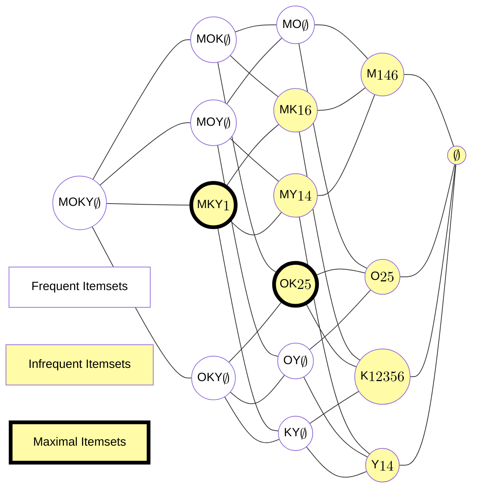
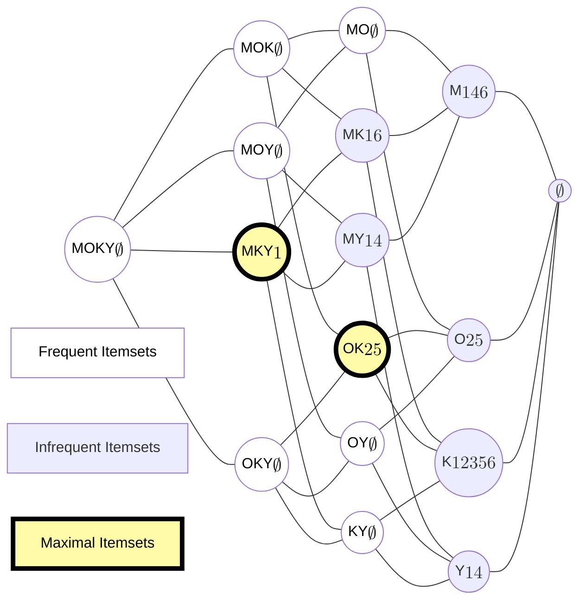

# Slides

## Aula 06 | 03/04/2025 | Mineração de conjuntos de itens

### Slide: aula05-repr-compactadas (Aula 06)

#### Introdução (Aula 06)

- Nessa aula, vamos discutir representações compactas para o conjunto de todos os conjuntos de itens frequentes de uma base de dados
- Representações compactas são subconjuntos a partir dos quais é possível derivar todos os conjuntos de itens frequentes
- Para motivar a necessidade dessas representações, considere uma base de dados com somente duas transações e 100 itens:
  - $D = \{(0, a_{1}, a_{2}, \dots, a_{50}), (1, a_{1}, a_{2}, \dots, a_{100})\}$
- Se considerarmos um $minsup=1$, essa base terá

  - $\binom{100}{1} + \binom{100}{2} + \dots + \binom{100}{100} = 2^{100} - 1 \approx 1.27E^{30}$

- [JV]
  - Podemos considerar que:
    - $TID: 0 = Itens: a_{1}a_{2}\dots a_{50}$
    - $TID: 1 = Itens: a_{1}a_{2} \dots a_{100}$
  - Que seriam representações compactas do conjunto de itemsets frequentes

---

- Nesse caso, o problema se torna incomputável por qualquer das abordagens que vimos anteriormente
- Embora esse seja um caso extremo, não é raro que situações similares a essa ocorram na prática
  - É possível, por exemplo, que um subconjunto das transações e itens apresentem esse comportamento em uma base de dados maior
- Note que podemos particionar os itemsets frequentes em duas classes de equivalência:
  - Os que ocorrem em ambas as transações; e
  - Os que ocorrem somente na segunda

---

- Os que ocorrem em ambas as transações, possuem cobertura $c(X)=\{0, 1\}$, e, portanto, são equivalentes a $a_{1}a_{2}\dots a_{50}$
- Os que ocorrem somente na segunda transação, possuem cobertura $c(X)=\{1\}$, e, portanto, são equivalentes a $a_{51}a_{52}\dots a_{100}$
  - Além disso, se estivéssemos somente interessados nos itemsets frequentes sem a informação da frequência, todos seriam equivalentes a esse itemset
    - [JV] Como assim? Não iríamos querer o suporte?
- Em outras palavras, os mais de $10^{30}$ itemsets que seriam retornados por qualquer dos algoritmos vistos poderiam ser representados somente por esses dois conjuntos
- Esses conjuntos formam, dessa forma, uma **representação compacta** de todo o conjunto de itemsets frequentes
- Em particular, eles estão relacionados a dois tipos de representações compactas que veremos nessa aula
  - Conjuntos frequentes **máximos**
  - Conjuntos frequentes **fechados**

#### Representações compactas

- O particionamento dos itemsets no exemplo anterior se deu pelos tidsets que compunham suas extensões
  - [JV]: Extensão é a mesma coisa que cobertura, ou seja, o conjunto de itens que determinado TID contém, ou a quantidade de TIDs em que um itemset aparece.
- De fato, o raciocínio se aplica a qualquer base de dados. Ou seja, podemos particionar os itemsets conforme sua cobertura
- Dentro de cada classe de equivalência, podemos ordenar os elementos conforme a relação de subconjunto
  - O maior elemento da classe é chamado de conjunto fechado ou **closed itemset**
    - [JV:]
      - O maior item possível dos itemsets. Exemplo: $a_{1}a_{2}\dots a_{50}$ || $P = c(i(P))$
      - Ex.: $J = \{A, B, C\}$ || $\mathcal{P}(J) = \{\varnothing, A, B, C, AB, AC, BC, ABC\}$ || $\max(\mathcal{P}(J)) = ABC$
  - Os menores elementos da classe são chamados de **minimal generators**
    - [JV:]
      - Exemplo: cada um dos itenzinhos que foram concatenados. ($a_{1}, a_{2}, \dots, a_{50}$) || $X = i(c(X))$
      - Ex.: $J = \{A, B, C\}$ || $\mathcal{P}(J) = \{\varnothing, A, B, C, AB, AC, BC, ABC\}$ || $|\mathcal{P}(J)| = 1: \{A, B, C\}$
- Os maiores elementos entre todos os conjuntos fechados são chamados de conjuntos frequentes máximos (**maximal itemsets**)
  - [JV:]
    - O maior itemset possível entre todos os conjuntos fechados. Exemplo: $a_{1}a_{2}\dots a_{100}$ || "São os maiores itemsets frequentes"
    - Ex.:
      - $J_1 = \{A, B\}$
        - $\mathcal{P}(J_1) = \{\varnothing, A, B, AB\}$
      - $J_2 = \{A, B, C\}$
        - $\mathcal{P}(J_2) = \{\varnothing, A, B, C, AB, AC, BC, ABC\}$
      - $\max(\{\mathcal{P}(J_1), \mathcal{P}(J_2)\}) = {ABC}$

---

- Os conjuntos máximos são os maiores itemsets frequentes
- Eles definem a 'borda' entre o que é frequente e infrequente
  - [JV] Isso porque, quando calculamos os candidatos, por exemplo no apriori, em determinado momento em que crescemos os prefixos, determinado item deixa de ser frequente, e ele é então, o **maximal itemset** dessa árvore de criação de prefixos.
- Como, por definição, não existem conjuntos frequentes maiores que eles, **todos os conjuntos frequentes podem ser derivados a partir dos conjuntos máximos**
  - [JV] Consideramos aqui a famosa "Propriedade do apriori" que considera a questão da monotonicidade do suporte, onde quanto mais eu aumentar o itemset, menor o suporte, logo, todos anteriores e menores que ele terão suporte maior, sendo então frequentes.
- No entanto, o cálculo do suporte não pode ser obtido diretamente desses itemsets, sendo necessária uma nova passada na base de dados para computá-lo
- O itemset $a_{1}a_{2} \dots a_{100}$ no nosso exemplo inicial é um conjunto frequente máximo

---

- Essa necessidade de novas passadas na base de dados para computar o suporte dos itemsets frequentes a partir dos máximos torna a representação incompleta
- Os conjuntos fechados, por outro lado, são uma representação completa, já que tanto os itemsets quanto seu suporte podem ser derivados desses conjuntos
- Como dito, todo conjunto fechado dá origem a uma **classe de equivalência**
  - $[X] = \{Y \subseteq I | c(Y) = c(X)\} = \{Y \subseteq I | i(c(Y)) = X\}$
- Assim, podemos verificar o suporte de um itemset frequente a partir dos conjuntos fechados da seguinte forma
  - $sup(𝑋) = max \{sup(Y) | Y \in \mathcal{C} \wedge X \subseteq Y\}$
    - [JV] Não sei se é isso que ele quer dizer, mas todos os itens pertencentes ao conjunto potência do conjunto máximo, então todos os suportes dos seus subconjuntos são pelo menos iguais ao suporte do conjunto máximo.
  - Em outras palavras, basta encontrarmos a classe de equivalência à qual o itemset pertence; todo itemset frequente ou é fechado ou pertence à classe de equivalência de algum conjunto fechado, como o suporte é anti-monotônico, se ele não for fechado, ele pertence à classe do de maior suporte.

---

- Exemplo: $minsup=1$

| TID | Muesli (m) | Oats (o) | Milk (m) | Yoghurt (y) |
| :-- | :--------: | :------: | :------: | :---------: |
| 1   |     1      |    0     |    1     |      1      |
| 2   |     0      |    1     |    1     |      0      |
| 3   |     0      |    0     |    1     |      0      |
| 4   |     1      |    0     |    0     |      1      |
| 5   |     0      |    1     |    1     |      0      |
| 6   |     1      |    0     |    1     |      0      |

---

---

- [JV]
  - Os azuis e verdes são classes de equivalência.
  - Estou com uma dúvida: qual foi o critério de definir os Closed Itemsets?
  - Se a definição de Fechado for:
    - > GPT: **Fechados:** não existe superconjunto com o mesmo suporte (representam completamente uma classe de objetos).
  - Então, o conjunto vazio também deveria ser Fechado.

#### Algoritmos para encontrar representações compactas

- Os exemplos mostram que as representações compactas apresentam vantagens sobre o conjunto de todos os itemsets frequentes
- No entanto, se usarmos os algoritmos vistos anteriormente para encontrar essas representações, não temos ganho computacional algum em relação ao problema anterior
  - Pode ser que a mineração desses padrões continue inviável
- Existem diversos algoritmos específicos para mineração de itemsets máximos e fechados
- Veremos um representante de cada desses algoritmos

"Você consegue encontrar todos ..."

##### DCI_Closed - Próxima aula

## Aula 07 | 08/04/2025 | Mineração de sequências - Faltei pq tava passando mal

### Slide: aula05-repr-compactadas (Aula 07)

#### Algoritmos para encontrar representações compactas (Aula 07)

##### DCI_Closed (Aula 07)

- O algoritmo DCI_Closed foi proposto em 2004 por C. Lucchese, S. Orlando e R. Perego
- Ele também adota uma representação vertical da base de dados para facilitar a verificação dos conjuntos fechados
- O algoritmo explora o espaço de busca usando uma estratégia dividir-e-conquistar
- Os autores demonstraram que o problema pode ser decomposto em subproblemas independentes, permitindo inclusive uma solução paralela

---

- A ideia central do algoritmo é 'escalar' o reticulado de itemsets, percorrendo cada classe de equivalência uma única vez
- Somente um candidato de cada classe é avaliado para computar o seu conjunto fechado
  - [JV] Ora, mas por que só um? E como é definido? Pegando o máximo?
- Novamente, assume-se uma ordem lexicográfica sobre os itens da base, e sua extensão sobre os itemsets
  - Qualquer ordem serve, inclusive a ordem sobre os rótulos dos itens
  - Essa ordem será representado por $\prec$
- Novos candidatos são gerados a partir dos conjuntos fechados obtidos, estendendo-os com itens ainda não investigados
  - Esses candidatos são chamados de **geradores**
  - Formalmente, um gerador é um conjunto $X = Y_i$, para um conjunto fechado $Y$ e um item $i$

---

- Um gerador $X = Y_i$ é dito **ordem-conservante** sse $i \prec (i(c(X)) - X)$
  - [JV] O primeiro $i$ é o item e o segundo é a intensão?
  - Em palavras, $X$ é ordem-conservante se todo item que tiver que ser adicionado a $X$ para obter o conjunto fechado for maior que $i$
- **Teorema 1:** Para todo conjunto fechado $Y \neq i(c(\varnothing))$, existe uma sequência de $n \geq 1$ extensões (items) $i_0 \prec i_1 \prec \dots \prec i_{n-1}$ tais que $gen_0 = Y_0i_0$, $gen_1 = Y_1i_1$, $gen_{n-1} = Y_{n-1}i_{n-1}$, em que todos os $gen_k$ são ordem-conservantes, $Y_0 = i(c(\varnothing))$, $Y_{j+1} = i(c(Y_ji_j))$ e $Y_n=Y$.
- **Corolário:** Essa sequência é única.

---

- O problema agora é verificar se um gerador é ordem-conservante
- **Lema 1:** Seja $gen = Y_i$, para um conjunto fechado $Y$ e item $i$. Se $\exists j \prec i [j \notin gen \wedge c(gen) \subseteq c(j)]$, então $gen$ não é ordem-conservante.
  - Intuitivamente, $c(gen) \subseteq c(j)$ implica em $j \in i(c(gen))$, e como $j \notin gen$, $j \in i(c(gen)) - gen$; ou seja, $i \nprec i(c(gen)) - gen$
- Sendo assim, basta mantermos uma lista de elementos menores que $i$ não pertencentes a $gen$ para verificarmos se ele é ordem-conservante durante a execução do algoritmo
  - Essa lista é chamada de **pre-set**
  - Não há necessidade de manter os conjuntos fechados em memória!
- O espaço de busca pode ser percorrido a partir de $i(c(\varnothing))$ e todos os itens frequentes como possíveis extensões
  - Os geradores são avaliados conforme a ordem lexicográfica
  - Se encontrarmos um gerador não ordem-conservante, podamos o ramo
  - Após explorar o ramo com um item $i$, ele é colocado no **pre-set**

---

- **procedure** $\text{DCI\_Closed}_d (\text{CLOSED\_SET}, \text{PRE\_SET}, \text{POST\_SET})$
  - **while** POST_SET $\neq \varnothing$ **do**
    - $i \gets \min_{\prec}$ (POST_SET)
    - POST_SET $\gets$ POST_SET \ $i$
    - $\text{new\_gen} \gets$ \text{CLOSED_SET} $\cup i$ `\\ Build a new generator`
    - **if** $sup(\text{new\_gen}) \geq minsup$ **then**
      - $\neg$ is_dup (new_gen, PRE_SET) **then** `\\ if $new_gen$ is both frequent and order preserving`
      - $\text{CLOSED\_SET}_{New} \gets \text{new\_gen}$
      - $\text{POST\_SET}_{New} \gets \varnothing$
      - **for all** $j \in \text{POST\_SET}$ **do** `\\ Compute closure of $new_gen$`
        - **if** $g(\text{new\_gen}) \subseteq g(j)$ **then**
          - $\text{CLOSED\_SET}_{New} \gets \text{CLOSED\_SET}_{New} \cup j$
        - **else**
          - $\text{POST\_SET}_{New} \gets \text{POST\_SET}_{New} \cup j$
        - **end if**
      - **end for**
      - **Write Out** $CLOSED\_SET_{New}$ _and its support_
      - $\text{DCI\_Closed}_d (\text{CLOSED\_SET}_{New}, \text{PRE\_SET}, \text{POST\_SET}_{New})$
      - $\text{PRE\_SET} \gets \text{PRE\_SET} \cup i$
    - **end if**
  - **end while**
- **end procedure**

---

- **function** $\text{is\_dup} (\text{new\_gen}, \text{PRE\_SET})$ `\\ Duplicate check`
  - **for all** $j \in \text{PRE\_SET}$ **do**
    - **if** $g(new\_gen) \subseteq g(j)$ **then**
      - **return** TRUE `\\ new_gen is not order preserving`
    - **end if**
  - **end for**
  - **return** FALSE
- **end function**

---

- Exemplo: $minsup = 2$

| **TID** | **Muesli (a)** | **Oats (b)** | **Milk (c)** | **Yoghurt (d)** | **Biscuits (e)** | **Tea (f)** |
| :------ | :------------: | :----------: | :----------: | :-------------: | :--------------: | :---------: |
| 1       |       1        |      0       |      1       |        1        |        0         |      1      |
| 2       |       0        |      1       |      1       |        0        |        0         |      0      |
| 3       |       0        |      0       |      1       |        0        |        1         |      1      |
| 4       |       1        |      0       |      0       |        1        |        0         |      0      |
| 5       |       0        |      1       |      1       |        0        |        0         |      1      |
| 6       |       1        |      0       |      1       |        0        |        0         |      1      |

##### MAFIA: Maximal Frequent Itemset Algorithm - Próxima aula

## Aula 08 | 10/04/2025 | Mineração de sequências

### Slide: aula05-repr-compactadas (Aula 08)

#### Algoritmos para encontrar representações compactas (Aula 08)

##### MAFIA: Maximal Frequent Itemset Algorithm

- O algoritmo MAFIA foi proposto em 2001 por D. Burdick, M. Calimlim e J. Gehrke
- A ideia geral do algoritmo é a de explorar o reticulado de itemsets com uma abordagem best-first/branch-and-bound
- Assim como o Eclat, o MAFIA também assume uma representação vertical dos dados usando vetores de bits
- O algoritmo também assume uma ordem lexicográfica sobre os itens e a ordem parcial de subconjuntos entre os itemsets durante a exploração

Se eu quero minimizar a quantidade de itens mostrados pro usuário, posso mostrar os maximais.

Existem vários algoritmos que encontram os maximais.

Nessa época dos anos 2000, assim como hoje é com IA e Deep Learning, na época era essa mineração de itens frequentes.

"Os maximais estão na fronteira"

"A maioria dos artigos na época costumava usar vetores de bits para representar itemsets" Isso por causa dos benefícios de velocidade de processamento para uniões e interseções.

Na notação vertical, a primeira coluna são os itens, e a segunda é a lista das transações que possuem esse item. Para calcular rapidamente o suporte é manter em uma estrutura auxiliar a quantidade de bits ativos.

---

- Durante a exploração do espaço de busca, o algoritmo divide os itens em dois grupos
  - **Head**: contendo o rótulo do nó corrente (itemset) na exploração
  - **Tail**: os itens que são maiores que o maior elemento do Head (possíveis extensões para o itemset)
- O conjunto de todos os itens que podem aparecer numa dada subárvore é a união entre o head e o tail (chamado de **HUT** - head union tail - pelos autores)
- Ao invés de adotar uma exploração puramente em profundidade, em cada nó, o algoritmo avalia os filhos imediatos para remover possíveis extensões do tail

  - Eles chamam essa estratégia de **reordenamento dinâmico (dynamic reordering)**

- [JV]

  - O conjunto de itens será dividido em dois:
    - Head: itemset que já visitei
    - Tail: itens que ainda vou considerar
  - HUT: Maior itemset que pode ser obtido a partir da sub árvore explorada.
  - "Posso podar se encontrar algum que seja maior do que o já encontrado"

- [JV]
  - Algoritmo
    - No nível que eu tô, ele calcula o suporte de todos os filhos. Então ele pode podar todos os que forem infrequentes.
    - Dúvida: se todos os items de determinado nível fossem infrequentes, isso implicaria na head ser infrequente também?
      - Não. Isso porque sempre estamos indo do mais geral pro menos geral.

---

- Ao explorar o nó P na figura ao lado
  - Head = 1
  - Tail = 234
  - HUT = 1234
- Antes de explorar em profundidade o nó, o algoritmo avalia os filhos 12, 13 e 14
- Como só 12 é frequente, 3 e 4 podem ser removidos do tail porque qualquer candidato dessa subárvore que inclua esses itens será infrequente
  - O ramo de 12 é podado

[Imagem]

- [JV]
  - Sempre descarta os itens que são infrequentes.
  - Se o HUT encontrado é subconjunto de um maximal já encontrado, posso podar todo o HUT.
  - Algoritmo:
    - Começa gerando todas as combinações simples do item do head com os itens do tail.
    - Poda todos os que forem infrequentes.
    - Depois de remover os infrequentes, remove também do tail.
    - Obs.: Mesmo que um item frequente seja composto por diversos conjuntos infrequentes, ainda assim ele permanece sendo frequente.
      - Ex.: Se eu compro AB, compro AC, compro AD. Embora apenas exista uma ocorrência de AB, uma de AC e uma de AD, ainda assim, A foi comprado 3 vezes, logo, é frequente.
    - Obs.: Best-First Search: Procura sempre o melhor. Procura sempre o caminho com maior estimativa de lucro. Parece um pouco com o conceito do algoritmo de Prim.
    - Ao final dessa análise, após podado o que deve ser podado, as folhas representam os conjuntos maximais.

---

- Note que, sempre que uma folha é visitada, um candidato a itemset máximo é encontrado
  - Ele será incluído na solução final somente se não possuir um superconjunto já incluído
  - A visitação em ordem lexicográfica em profundidade garante que conjuntos não tenham que ser removidos da solução final
- Outra poda vem do fato de que itemsets máximos são também fechados e que, portanto, para um itemset $X$ (head) e $y \in X.tail$:
  - Se $c(X) \subseteq c(y)$, então $X_y \subseteq i(c(X))$ (isto é, $y$ pertence ao conjunto fechado da classe à qual $X$ pertence)
  - Nesse caso, $y$ pode ser incorporado ao head e removido do tail
- Essa poda é chamada de Parent Equivalence Pruning (PEP)

- [JV]
  - "Sempre entra, nunca sai"
  - "Todo itemset maximal, é também um itemset fechado"
  - Itemset fechado: O maior itemset de uma classe de equivalência.
    - Ele explicou um pouco mais. Tem algo sobre checar todos os que têm a mesma cobertura e verificar qual o maior ou algo assim.

---

- Finalmente, podemos usar a propriedade do Apriori para descartar um ramo baseado no HUT
  - Lembrando que HUT é a união do head com o tail e representa o maior itemset que pode ser obtido a partir dessa subárvore
- Se o HUT for subconjunto de algum itemset máximo já descoberto anteriormente, sabemos que ele e todos os seus subconjuntos são frequentes, e, além disso, não podem ser máximos. Portanto, podemos podar a subárvore.

---

- Pseudocode: _MAFIA_ (**C**, **MFI**, Boolean **IsHUT**)

  - name **HUT** = **C**.head $\cup$ **C**.tail
  - if **HUT** is in **MFI**
    - Stop generation of children and return
  - Count all children, use PEP to trim the tail, and reorder by increasing support
    - For each item **i** in **C**.trimmed_tail
      - **IsHUT** = whether **i** is in the first item in the trail
      - **newNode** = **C** $\cup$ **I**
      - _MAFIA_ (**newNode, MFI, IsHUT**)
    - if (**IsHUT** and all extensions are frequent)
      - Stop search and go back up subtree
    - if (**C** is a leaf and **C**.head is not in **MFI**)
      - Add **C**.head to **MFI**

- [JV]
  - Algoritmo
    - Faz o HUT
    - Faz a poda do apriori
    - Faz a poda do PEP para poder o Tail
    - E para cada item vai procurando usando o Best-First
  - No artigo tem os pseudo-códigos dos outros sub-códigos.
  - A maior crítica a esse método é que não tem muito uma métrica de qualidade. O que temos é a definição do suporte e se ele é bom o bastante pro usuário.
- [Quadro]
  - $MFI \subseteq FCI \subseteq FIM$
  - Apriori: $FIM =  \{ X \subseteq I | sup (x) \geq minsup \}$
  - DCI: $FCI = \{ X \subseteq I | X = i(c(x)) \wedge sup (x) \geq minsup \}$
  - MAFIA: $MFI = \{ X \subseteq I | sup (x) \geq minsup \wedge \nexists Y \supseteq X \wedge sup (y) \geq minsup \}$

---

- Exemplo: minsup = 2

| **TID** | **Muesli (a)** | **Oats (b)** | **Milk (c)** | **Yoghurt (d)** | **Biscuits (e)** | **Tea (f)** |
| ------: | -------------: | -----------: | -----------: | --------------: | ---------------: | ----------: |
|       1 |              1 |            0 |            1 |               1 |                0 |           1 |
|       2 |              0 |            1 |            1 |               0 |                0 |           0 |
|       3 |              0 |            0 |            1 |               0 |                1 |           1 |
|       4 |              1 |            0 |            0 |               1 |                0 |           0 |
|       5 |              0 |            1 |            1 |               0 |                0 |           1 |
|       6 |              1 |            0 |            1 |               0 |                0 |           1 |

##### Leitura (Aula 08)

- Seção 9.1 Zaki e Meira
- Seção 6.2.6 Han et al.
- Burdick, D., Calimlim, M., & Gehrke, J. (2001, April). Mafia: A maximal frequent itemset algorithm for transactional databases. In Proceedings 17th international conference on data engineering (pp. 443-452). IEEE.
- Lucchese, C., Orlando, S., & Perego, R. (2004, November). DCI Closed: A Fast and Memory Efficient Algorithm to Mine Frequent Closed Itemsets. In FIMI.

- [JV]
  - É interessante, agora que já entendeu como o algoritmo funciona, ler e entender a narrativa do artigo.
