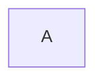
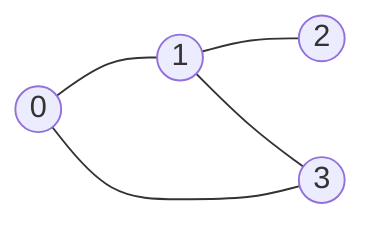

# Slide: aula07-grafos (Aulas 10, 11, 12, 13)

## Aula 10 | 17/04/2025 | Mineração de grafos

### Introdução - Aula 10

- Nessa aula, vamos discutir o problema de mineração de subgrafos frequentes em bases de dadASDos de grafos.
- A mineração de subgrafos frequentes tem ganhado destaque nos últimos anos com aplicações em diversas áreas:
  - Quimioinformática: descoberta de princípios ativos de fármacos
  - Bioinformática: padrões de interação em redes de proteínas
  - Engenharia de Software: análise do fluxo de controle de aplicações

---

- Considerando o contexto de quimioinformática, temos o seguinte exemplo:

Cafeína, Teobromina (chocolate), Teofilina (tratamento de asma), Sildenafil (Viagra)

(Imagens de estruturas químicas omitidas)

### Definições (Aula 10)

- Um grafo é uma quádrupla $(V, E, l, L)$ em que:

  - $V$ é um conjunto de vértices;
  - $E$ é um conjunto de arestas;
  - $l: V \rightarrow \Sigma_v$ é uma função que determina o rótulo dos vértices;
  - $L: E \rightarrow \Sigma_e$ é uma função que determina o rótulo das arestas.

- [JV]
  - Grafo Rotulado/Grafo com atributos
  - Aqui consideramos que esses rótulos são strings

(Imagem de um grafo)

---

- Sejam $G_1$ e $G_2$ dois grafos rotulados com os mesmos alfabetos $\Sigma_v$ e $\Sigma_e$.
- Dizemos que $G_1$ é subgrafo isomorfo a $G_2$, representado por $G_1 \subseteq G_2$, se existe uma função injetora $\upvarphi: V_1 \rightarrow V_2$ tal que:
  - $(u, v) \in E_1 \Leftrightarrow (\upvarphi(u), \upvarphi(v)) \in E_2$
  - $\forall u \in V_1,\ l(u) = l(\upvarphi(u))$
  - $\forall (u, v) \in E_1,\ L(u,v) = L(\upvarphi(u), \upvarphi(v))$
- [JV]
  - É isomorfo se eu consigo mapear tanto os vértices quanto os rótulos.

(Três imagens de grafos: $G_1$, $G_3$ e $G_4$)

Nessa imagem, o $G_3$ é subgrafo isomorfo de $G_1$, mas $G_4$ não.

---

- Uma base de dados $D = \lbrace G_1, G_2, \dots, G_n \rbrace$ é um conjunto de grafos rotulados.
- O suporte de um grafo (padrão) $G$ é o número de grafos em $D$ em que $G$ está contido:

  - $\text{sup}(G) = |\lbrace G_i \in D\ |\ G \subseteq G_i \rbrace|$

- Um padrão $G$ é frequente se $\text{sup}(G) \geq minsup$

(Imagem de vários subgrafos)

- [JV]
  - Esse conceito de conjunto de grafos rotulados tá mais próximo do problema de moléculas.
  - No caso de redes sociais como Facebook e Instagram, é mais parecido com um grafo monolitão.
  - O Suporte é calculado pegando um subgrafo e checando se ele encaixaria em um dos grafos. Ou algo assim.

---

- O problema de mineração de subgrafos frequentes consiste em encontrar todos os **subgrafos conexos** que satisfaçam o suporte mínimo definido pelo usuário.
- Comparado aos problemas vistos até agora, esse é o mais difícil em termos computacionais.
  - O problema de isomorfismo é NP-difícil.
- Um grafo com $m$ vértices possui $O(m^2)$ arestas.
- O número de subgrafos com $m$ vértices é, portanto, $2^{O(m^2)}$.
- Considerando grafos rotulados com $|\Sigma_v| = |\Sigma_e| = s$, $s^m$ rotulações diferentes de vértices e $s^{m^2}$ rotulações de arestas.
- Logo, o espaço de busca do problema é $2^{O(m^2)} \left(s^{O(m)}\right) \left(s^{O(m^2)}\right)$.

- [JV]
  - Ele colocou a mesma quantidade de rotulações de arestas e vértices com o mesmo valor só pra simplificar.
  - Tem gente que vai pra mineração de grafos distribuídos.

## Aula 11 | 22/04/2025 | Regras de associação e métricas de qualidade

### Mineração de subgrafos frequentes

- Assim como aconteceu com os problemas anteriores, existem duas categorias de algoritmos:
  - Baseados no 'Apriori' (geração de candidatos)
  - Baseados no 'FP-Growth' (crescimento de padrões)
- Os algoritmos baseados no Apriori se subdividem em mais grupos:
  - Os baseados no aumento do número de vértices; e
  - Os baseados no aumento do número de arestas.
- Os baseados em crescimento de padrões frequentemente utilizam extensões de arestas para crescê-los.

- [JV]
  - O de Vértices tende a ser pior que o de arestas.

#### Geração de candidatos (AGM)

- A geração de candidatos com aumento do número de vértices é usada no algoritmo AGM (Apriori-based Graph Mining) proposto por Inokuchi et al. em 2000
- A ideia é juntar dois grafos com k vértices que compartilhem um núcleo com k-1 vértices para formar um candidato com k+1 vértices

- [JV]
  - É calculado calcular suporte por ter que procurar isomorfismo de grafos.
    - Automorfismo é mais fácil que isomorfismo
  - Prioridade do apriori: antimonotonicidade
    - Se um grafo é infrequente, qualquer supergrafo dele também será infrequente.
  - Algoritmo
    - Buscar o isomorfismo entre os dois grafos
      - Pega a matriz de adjacência de um grafo e compara com o outro
      - Caso removidas as colunas (i,i), ela não resulte numa matriz de adjacência isomorfa, entre ambos, então tente todas as remanescentes permutações
      - Se for isomorfo
        - remove as últimas linhas e colunas das duas, e cria um novo candidato misturando a linha e coluna do primeiro com a linha e coluna do segundo.
          - Porém, não se sabe qual o rótulo existente, ou não, entre os dois vértices adicionados.
          - Então, criam-se candidatos com todos os possíveis rótulos, inclusive a inexistência de rótulo.
      - Comparam-se também os rótulos, mas isso não ficou tão claro.
    - Pra calcular o suporte, gerando a sub-estrutura, confere se ela é subgrafo de outra
  - Não faz sentido falar de ordem lexicográfica de strings
    - Representação canônica de uma matriz de adjacência
    - Tipo uma identidade, um hash

#### Geração de candidatos (FSG)

- A geração de candidatos com aumento no número de arestas é usada pelo algoritmo FSG, proposto por Kuramochi e Karypis em 2001.
- Dois padrões com $k$ arestas são juntados se eles compartilham um núcleo (possuem um mesmo subgrafo) com $k-1$ arestas.
  - Ou seja, $G_1$ e $G_2$ são juntados se existe uma aresta em $G_1$ e uma aresta em $G_2$ tais que a remoção das duas torna os subgrafos isomorfos entre si.
  - Consequentemente, o candidato terá as arestas de $G_1$ mais essa aresta de $G_2$.
- Ao contrário do que ocorre com o método baseado em vértices, aqui o candidato resultante pode não ter um número maior de vértices que os padrões do qual foi gerado

- [JV]
  - FSG - Frequent Sub Graph (?)

---

- Um conceito importante para a geração de candidatos é o de vértices topologicamente equivalentes
  - [JV]
    - Topologicamente equivalentes:
      - Grafos que mantém a mesma estrutura geral.
      - Pra comparar, pode-se comparar entre possibilidades de novas arestas a novos vértices e/ou a arestas existentes.
      - Lembrando também da comparação dos rótulos.
      - É uma equivalência estrutural entre vértices de dois grafos distintos.
      - É isomorfo se consegue-se fazer um mapeamento 1:1 entre os vértices e arestas de um pro outro.
- Considere os grafos abaixo

(Imagens de grafos)

---

- Para entender o processo de geração de candidatos, vamos considerar dois grafos genéricos $G_1$ e $G_2$ com $k$ arestas que compartilham um núcleo comum com $k-1$ arestas
  - Na figura, o núcleo é omitido e somente as arestas não compartilhadas são ilustradas; os vértices dentro da caixa fazem parte do núcleo.
  - Se $a$ é topologicamente equivalente a $c$, dizemos que $a=c$
  - Se $b$ e $d$ possuem o mesmo rótulo, dizemos que $b=d$
  - [JV]
    - Nesse caso estão sendo definidos dois tipos de igualdades que serão representados com o mesmo símbolo de igualdade.
- Temos 4 possíveis situações
  - [JV]
    - Quando definimos esse núcleo, é como se as arestas que saem dele vão para os vértices externos fossem perdidas.

| X          | $a=c$ | $a \neq c$ |
| ---------- | :---: | :--------: |
| $b=d$      |   1   |     4      |
| $b \neq d$ |   2   |     3      |

---

- Situação 1 [$a \neq c$ e $b \neq d$]: Nesse caso, somente um candidato pode ser gerado, já que a 'nova' aresta incide em vértices distintos
  - [JV]
    - Obs.:
      - A imagem dele é meio confusa. G1 e G2 são os grafos inteiros. O quadradinho apenas representa o núcleo desses grafos. O que eu havia entendido antes e está errado é que o núcleo se chamava G1 e o núcleo se chamava G2.
      - Outro detalhe, os vértices $a$ e $c$ são vértices contidos no núcleo de um grafo grafo omitido;

---

- Situação 2 [$a=c$ e $b \neq d$]: Nesse caso, temos duas possibilidades:
  - A 'nova' aresta incide sobre vértices distintos como na situação 1
  - A 'nova' aresta incide sobre o vértice equivalente a $a$ (ou $c$)
  - [JV]
    - Uma análise interessante é observarmos que se apenas houver um mesmo vértice $a$ que seja topologicamente equivalente a $c$, então, apenas o segundo caso ocorre, visto que não há um segundo vértice para se anexar a aresta.

---

- Situação 3 [$a \neq c$ e $b=d$]: Nesse caso, temos duas possibilidades:
  - A 'nova' aresta incide sobre vértices distintos como na situação 1
  - A 'nova' aresta incide sobre o vértice equivalente a $b$ (ou $d$)

---

- Situação 4 [$a=c$ e $b=d$]: Nesse caso, qualquer das possibilidades anteriores pode ocorrer; ou seja, pelo menos 3 candidatos são gerados.

- [JV]
  - Foi comentado sobre o "pelo menos 3 candidatos". Ele disse não saber porque escreveu assim, e considera que serão sempre 3, ou talvez, "no máximo 3".

---

- Além dessas situações, dois grafos podem compartilhar múltiplos núcleos. Cada um deles pode gerar candidatos distintos.

  - Podem existir até $k-1$ núcleos distintos para dois padrões de tamanho $k$.

[Imagens de grafos]

---

- Naturalmente, muitos desses candidatos serão isomorfos entre si, devendo, portanto, serem descartados exceto uma cópia
- O controle de isomorfismo é feito atribuindo-se um código (string) a partir de cada matriz de adjacências
- Grafos com mesmo código são isomorfos
- Os detalhes são omitidos, mas podem ser consultados no artigo original

- [JV]
  - Geração de versão canônica de string da matriz de adjacência. Feito na força bruta.
    - Da matriz triangular superior, coluna a coluna, lineariza-se todos os rótulos.
    - Gera-se todas as as permutações dessa string e a mais lexicograficamente mais ordenada, é a versão canônica.

## Aula 12 | 24/04/2025 | Aprendizado descritivo supervisionado: padrões emergentes, contrastantes e descoberta de subgrupos

### Mineração de subgrafos frequentes (Aula 12)

#### Crescimento de padrões (gSpan)

- De maneira similar ao que acontece com itemsets, os algoritmos baseados em geração de candidatos possuem desempenho inferior aos baseados em crescimento de padrões, já que muitos candidatos são podados
- Em 2002, Yan e Han (FP-Growth) propuseram o algoritmo gSpan (Graph-based Substructure Pattern Mining)
- O algoritmo estende os padrões acrescentando arestas, uma por vez, de forma similar ao comportamento do FP-Growth
- Os autores também propuseram representar grafos por sequências de strings
  - Isso, de certa forma, mapeia o problema de mineração de grafos para mineração de sequências; levando ao aproveitamento de ideias propostas na última
- Cada aresta do grafo é representada pela string:

  - $\langle v_i, v_j, l(v_i), l(v_j), L(v_i, v_j) \rangle$
    - [JV]
      - $v_i$ e $v_j$ são os vértices que compõem a aresta
      - $l(v_i)$ e $l(v_j)$ são os rótulos dos vértices
      - $L(v_i, v_j)$ é o rótulo da aresta

- [JV]
  - Começa com um grafo vazio e vai aumentando o grafo.
  - Projeta uma Base
  - Analisa todas as arestas possíveis para expandir

---

- A extensão dos padrões proposta por Yan e Han se baseia na árvore geradora da busca em profundidade
  - [JV] Baseado na ordem em que encontrou.
- Os vértices do grafo são ordenados conforme a ordem de visitação de uma busca em profundidade no grafo
  - Vértices visitados no início são menores que os visitados no fim
  - Subscritos dos vértices indicam a ordem de visitação
- O caminho mais curto entre o primeiro vértice e o último é chamado de **caminho mais à direita (rightmost path)**
- Considerando a busca em profundidade, as arestas são divididas em dois conjuntos:
  - **Fordward edges**: arestas que fazem parte da árvore geradora da DFS
  - **Backward edges**: demais arestas
    - [JV]
      - Arestas de retorno que vão para aresta já visitada antes.
      - $\langle v_i, v_j, \dots \rangle$ é uma aresta de retorno se $v_i < v_j$, ou seja, $v_i$ foi visitado antes de $v_j$ na DFS

---

- As arestas podem ser ordenadas dentro dos respectivos conjuntos da seguinte forma:
  - **Forward edges**: $e_1 = \left( v_{i_1}, v_{j_1} \right)$, $e_2 = \left( v_{i_2}, v_{j_2} \right)$, $e_1 \preceq_F e_2 \leftrightarrow j_1 < j_2$
    - [JV]
      - $j_1$ e $j_2$ representam a sequência de visitação dos vértices.
      - $\preceq_F$: é definida a ordem de precedência entre arestas de avanço.
  - **Backward edges**: $e_1 \preceq_B e_2 \leftrightarrow [i_1 < i_2 \lor (i_1 = i_2 \land j_1 < j_2)]$
    - [JV]
      - "Uma aresta (2, 0) vem antes de (3, 1)"; (3, 1) vem antes de (3, 2)
      - $\preceq_B$: é definida a ordem de precedência entre arestas de retorno.
  - [JV]
    - resumindo essa questão de ordenação de arestas: Estamos rodando a DFS e depois ~~ordenando lexicograficamente, primeiro pela origem, depois pela chegada.~~
    - Esse entendimento superior é falso. Na verdade, estamos ordenando justamente a sequência das arestas visitadas. E a sequência de comparações é bem esquisita mesmo.
- Adicionalmente comparamos arestas dos conjuntos da seguinte forma:
  - $e_1 \preceq_{BF} e_2$ sse:
    - $e_1$ é uma aresta de retorno; $e_2$ é uma aresta de árvore; e $i_1 < j_2$
    - $e_1$ é uma aresta de árvore; $e_2$ é uma aresta de retorno; e $j_1 \leq i_2$
- Combinando a ordem dos vértices, com a ordem sobre as arestas e a ordem lexicográfica definida sobre os rótulos (de vértices e arestas), definimos uma ordem total sobre as arestas (códigos)
- Dessa forma, os grafos podem ser representados como sequências de strings (códigos) referentes às suas arestas

---

- [JV]

  - Arestas:

    - $e_x = \langle v_i, v_j, l(v_i), l(v_j), L(v_i, v_j) \rangle$
    - $e_1 = \langle 0, 1, a, a, q \rangle$
    - $e_2 = \langle 1, 2, a, a, r \rangle$
    - $e_3 = \langle 2, 0, a, a, r \rangle$
    - $e_4 = \langle 1, 3, a, b, r \rangle$
    - Ordem: $e_1 \preceq e_2 \preceq e_3 \preceq e_4$

  - Uma comparação que causou muita dúvida, foi:
    - $e_4 = \langle 1, 3, a, b, r \rangle$
    - $e_4 = \langle 0, 3, a, b, r \rangle$
    - Entre elas, qual é menor?
    - Resposta: a primeira

- Exemplo:
  - Retirado da Figura 11.6 Zaki e Meira

(Imagem de grafos com arestas rotuladas)

- [JV] Exercício: fazer as representações de arestas de todos os 3 grafos e ver que o G1 de fato é menor.

## Aula 13 | 29/04/2025 | Descoberta de subgrupos

- [JV] Entender melhor o que significa esse tal caminho "mais a direita"

---

- Note que diferentes buscas geram diferentes representações
- Podemos estender a ordem lexicográfica das arestas para as representações (grafos)
- Chamamos de **representação canônica** a menor dentre todas as representações de um grafo
- Dois grafos são isomorfos se possuem a mesma representação canônica
- Assim, o problema de encontrar subgrafos frequentes é equivalente a enumerar suas representações canônicas
  - Uma vez que as representações são sequências, o problema é essencialmente um problema de mineração de sequências

---

- O gSpan explora em profundidade o espaço de busca estendendo prefixos (subgrafos) com arestas no caminho mais à direita
  - O artigo original demonstra que representações canônicas só podem ser geradas por arestas seguindo o caminho mais à direita
- Ele inicia com o prefixo vazio e o estende com cada uma das arestas em ordem
  - As possíveis extensões são determinadas a partir dos caminhos mais à direita dos grafos em que o prefixo ocorre
- O suporte das extensões são computados e, caso sejam frequentes e canônicas, são exploradas recursivamente

- [JV] Verifica-se o suporte de cada grafo no momento em que são calculados os novos grafos

---

- **ALGORITHM 11.1. Algorithm gSpan**

  - // Initial Call: $C \gets \emptyset$
  - **gSpan** $(C, D, minsup)$:
    - $\epsilon \gets RightMostPath-Extensions(C, D)$ `// extensions and supports`
    - **foreach** $(t, sup(t)) \in \epsilon$ do
      - $C' \gets C \cup t$ `// extend the code with extended edge tuple t`
      - $sup(C') \gets sup(t)$ `// record the support of new extension`
      - `// recursively call gSpan if code is frequent and canonical`
      - **if** $sup(C') \geq minsup$ **and** IsCanonical $(C')$ **then**
        - **gSpan** $(C', D, minsup)$

- [JV]
  - C: Padrão, usa o
  - D: Base projetada

---

- Exemplo: $D = \lbrace G_1, G_2 \rbrace, minsup=2$

- [JV]
  - Começa com $\mathcal{C} = \emptyset$
  - Define onde ocorrem as arestas: $\epsilon = \lbrace $
    - $(\langle 0, 1,a, b, 1\rangle, \lbrace G1, G2 \rbrace),$
    - $(\langle 0, 1,a, b, 1\rangle, \lbrace G1, G2 \rbrace),$
    - $(\langle 0, 1, b, a, 1\rangle, \lbrace G1, G2 \rbrace),$ # Descartado por não ser canônico com o primeiro
    - $(\langle 0, 1, b, b, 1\rangle, \lbrace G2 \rbrace),$ # Descartado por não ter o suporte mínimo
  - $ \rbrace$
  - $\mathcal{C} = (\langle 1, 1, a, a, 1\rangle, \lbrace G1, G2 \rbrace)$
  - $\epsilon = \lbrace $
    - $(\langle 1, 2, a, b, 1 \rangle, \lbrace G1, G2 \rbrace),$
    - $(\langle 0, 2, a, b, 1 \rangle, \lbrace G1, G2 \rbrace),$
  - $ \rbrace$
  - No geral, prefe-se partir do mais profundo
  - $\mathcal{C} = (\langle 0, 1, a, b, 1\rangle, \lbrace G1, G2 \rbrace)$
  - $\epsilon = \lbrace $
    - $(\langle 1, 2, b, a, 1 \rangle, \lbrace G1, G2 \rbrace),$
    - $(\langle 0, 2, a, a, 1 \rangle, \lbrace G1, G2 \rbrace),$ # Não é canônico
    - $(\langle 0, 2, a, b, 1 \rangle, \lbrace G1, G2 \rbrace),$
    - $(\langle 1, 2, b, b, 1 \rangle, \lbrace G1 \rbrace),$ # Infrequente
  - $ \rbrace$
  - Ao analisar quais são os melhores, ao testar novos padrões, podemos re-indexar os vértices, porém um vértice ab sempre será menor que um ba, então mesmo que eu fizesse o a ser 0, ainda assim não o tornaria menor. Eu poderia explicar melhor mas meu celeblotaquenemumpeitimdefrango
  - > Teve um brilhante lá que...

### Extensões do problema

- Assim como ocorre com sequências e itemsets, o número de subgrafos frequentes pode ser bastante elevado em uma base
  - Isso acaba dificultando a análise dos resultados
- Existem abordagens, como o CloseGraph proposto por Yan e Han, que mineram padrões fechados
- Pode-se também buscar padrões contrastantes: com suporte mínimo em um subconjunto e máximo em outro
  - Exemplo: subgrafos que ocorrem com frequência no conjunto de moléculas que potencializam um efeito desejado; e que sejam infrequentes no conjunto de moléculas que apresentem efeitos adversos
  - Essa abordagem foi sugerida por Borgelt e Berthold no algoritmo chamado MoFa
  - Suporte mínimo é usado para podar o espaço de busca, enquanto o máximo usado para filtrar padrões indesejados
- Na linha de algoritmos, existem abordagens heurísticas para o problema, dado seu alto custo computacional
- Outras linhas de pesquisa incluem uso de abordagens distribuídas como o Fractal proposto por Dias et al. em 2019

### Leitura

- Capítulo 11 Zaki e Meira
- Seção 7.5 Tan et al.
- Capítulo 5 Mining Graph Data, Diane Cook e Lawrence Holder
- Akihiro Inokuchi, Takashi Washio, and Hiroshi Motoda. 2000. An Apriori-Based Algorithm for Mining Frequent Substructures from Graph Data. In Proceedings of the 4th European Conference on Principles of Data Mining and Knowledge Discovery (PKDD '00). Springer-Verlag, Berlin, Heidelberg, 13-23.
- Michihiro Kuramochi and George Karypis. 2001. Frequent Subgraph Discovery. In Proceedings of the 2001 IEEE International Conference on Data Mining (ICDM '01). IEEE Computer Society, USA, 313-320.
- Xifeng Yan and Jiawei Han. 2002. GSpan: Graph-Based Substructure Pattern Mining. In Proceedings of the 2002 IEEE International Conference on Data Mining (ICDM '02). IEEE Computer Society, USA, 721.
- Xifeng Yan and Jiawei Han. 2003. CloseGraph: mining closed frequent graph patterns. In Proceedings of the ninth ACM SIGKDD international conference on Knowledge discovery and data mining (KDD '03). Association for Computing Machinery, New York, NY, USA, 286-295. <https://doi.org/10.1145/956750.956784>
- Christian Borgelt and Michael R. Berthold. 2002. Mining Molecular Fragments: Finding Relevant Substructures of Molecules. In Proceedings of the 2002 IEEE International Conference on Data Mining (ICDM '02). IEEE Computer Society, USA, 51
